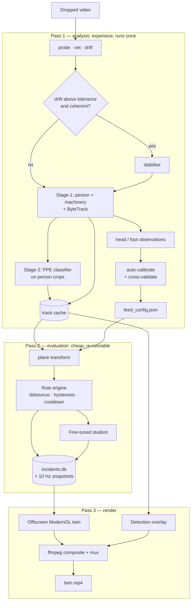

# AI Powered Construction Safety Digital Twin
### Project plan — v6

*Computer Vision · LLM Reasoning & Fine-Tuning · Computer Graphics*

> **v6 changelog — the product is now one action: drop a video in, get a twin video out.**
>
> v5 described a console that a trained operator configures per camera: pick four coplanar points, measure their real-world spacing in the field, draw zone polygons, set structural booleans, then run. §4.6 then admitted that nobody had taken those measurements on any feed and that the resulting assumed scale was the dominant error in the whole system. That is a research rig with a confessed hole in it, not a product, and it does not survive contact with the user it is built for.
>
> 1. **Calibration is automatic.** §4.6 replaces hand-picked reference points with auto-calibration from the workers themselves. Head and foot observations accumulated across the whole clip give the vertical vanishing point and the horizon; a standing-height prior supplies absolute scale.
> 2. **The scale error is self-reported.** Fit on half the observations, then measure the other half: a correct plane makes every worker the same height wherever they stand in the frame. The spread **is** the error bound, computed per feed with no site visit (§4.7). v5's "dominant error source, unmeasured on every feed" becomes a number in the output.
> 3. **Processing is offline batch, and that is architectural rather than a concession.** Auto-calibration needs a population of detections spanning the clip, so it cannot run causally — there is no calibration at frame 1 (§5.2).
> 4. **Three passes, with detections cached between them.** Analysis, evaluation, render. Changing a config and re-rendering costs seconds instead of a full re-detection (§5.3).
> 5. **Zones are derived where they can be derived.** Metric proximity to detected machinery replaces v5's authored `machinery` polygon for R2, collapsing it into the same primitive R4 already uses (§4.8).
> 6. **Rules the video cannot answer say so out loud.** R3 and R5 rest on facts no camera observes. They now report `not_evaluated` with a named reason, and an optional config unlocks them. A run never fails for want of configuration (§6.1).
> 7. **The primary artifact is a video.** Split-screen — source with detection overlay beside the 3D twin, violation cards appearing as they fire, a coverage line stating what was *not* checked (§12.2).
> 8. **The interactive console is not replaced.** One ModernGL renderer, two sinks: the live window and the offscreen recorder (§12.1).
> 9. **The entry point is a drag-and-drop window.** No command line anywhere in the user's path (§5.1).
> 10. **Feed configs are outputs, not inputs.** `config/feeds/<feed_id>.json` is *written* by the analysis pass. Hand-editing it is an override that unlocks opt-in rules, never a prerequisite for a run.
>
> Every v5 finding stands unchanged in the body: the drift measurements, the PTZ diagnosis of videos 1 and 6, the SARD provenance finding, the two-stage detector, and the BOCW citation verification.

> **v5 changelog (retained) — the deployment target is fixed CCTV, and that invalidated two things v4 asserted.**
>
> 1. **Neither v4 feed is static.** Measured drift is **145 px** on `slab_pour` and **156 px** on `yard_truck`. v4 claimed both were "static-camera, verified by frame comparison at 8% and 92%" — that method cannot see it, because 142 px at 3840 wide becomes 19 px once downscaled for a visual comparison. Every metric claim in v4 rested on a false premise. §4 now measures drift instead of eyeballing it, and adds a stabilisation pass that brings `slab_pour` to **3.39 px** on the working plane.
> 2. **Real CCTV feeds are now the metric feeds.** SARD ComplementarySet supplies genuine construction-site DVR footage at 2560×1440, 25 fps, with measured drift of **0.15 px** and **0.52 px**. §3 is rebuilt around them.
> 3. **The detector is now two-stage.** At CCTV scale a worker is ~120 px tall, so a helmet is 15–25 px. A flat six-class detector cannot resolve that. §8 splits into a `person` + `machinery` detector and a PPE classifier over upscaled person crops, with the one-stage model retained as an ablation.
> 4. **The CCTV domain gap is now a named, measured risk** rather than an unstated assumption, with in-domain training sources listed in Appendix D.
> 5. **Lens distortion is addressed.** A homography maps a plane only after undistortion; v4 never mentioned it.
> 6. **Live ingest is demonstrated, not deferred.** §5 introduces a frame-source abstraction with file and RTSP implementations. v4's "live camera is future work" is untenable when the product is a CCTV console.
> 7. **Phase 4's labelling is rescoped, not removed.** The two usable feeds align with only 0.7% and 1.5% of SARD's annotations, so rule-engine ground truth is hand-labelled from seeds.
>
> **Added after all nine SARD videos were examined:**
>
> 8. **Videos 1 and 6 are PTZ patrols, not fixed cameras.** They looked like the best assets in the set — 100% annotation alignment, 2.7 M boxes between them, near-exhaustive labelling. They are unusable as twin feeds and are repurposed as the **in-domain detection test set**, where camera motion is irrelevant. Caught by `tools/cctv.py segments` before any calibration effort was spent.
> 9. **SARD's provenance is settled: recorded public livestreams.** Videos 1 and 6 carry a "Bahria Sky Live" watermark. The CC-BY-4.0 label does not cover the footage, so SARD frames are **display and evaluation only, never training**. This makes MJCSD critical path, and it also improves the experimental design by forcing a held-out-site evaluation.
> 10. **Annotation coordinate spaces differ by video group** — ×4/3 for the 2560×1440 feeds, ×1.0 for the 1920×1080 test set. Both verified by rendering boxes onto frames.
>
> Appendix A's verified BOCW citations are unchanged from v4.

---

## 1. Overview

A safety analysis system for the **person running a construction company**, and the whole of their interaction with it is this:

> Drop a site video onto the window. Some minutes later, get back a video — the footage on the left with every worker boxed and their PPE state marked, the digital twin of the site on the right, and a card appearing each time a hazard rule is violated: what was breached, which statutory rule, and what to do about it. Beside the video, an incident log and a report.

**Nothing is configured.** No reference points are picked, no polygons are drawn, no site dimensions are measured, no command is typed. The system calibrates itself from the workers standing in the frame, and tells you how accurate that calibration turned out to be.

Four ideas hold the project together:

- **A hazard is a person, plus an attribute, inside a zone.** Nearly every rule reduces to that.
- **The workers are the calibration target.** A standing person is a vertical stick of roughly known length with one end on the working plane. A clip carrying a few hundred tracked people carries a few hundred such sticks, spread across the image, and that is enough to recover the plane and its scale without anyone visiting the site (§4.6).
- **Silence beats guessing.** A rule that depends on a fact no camera can observe reports `not_evaluated` and names the missing fact. The output states what was checked *and what was not*, because a safety tool that quietly skips half its rules is worse than no tool (§6.1).
- **The reasoner is a small local model distilled from a larger local one.** No network in the runtime path, no API terms-of-service exposure, and a genuine fine-tuning experiment rather than an API integration.

### Who it is for

A supervisor or owner, not a worker on the floor, and not an engineer. Consequences:

- **They will not configure anything.** This is the constraint that shapes §4, §5 and §6, and the one v5 violated on every page.
- Primary question is *"where are my problems, and how bad?"* — the twin optimises for **triage**, not realism.
- Alerts must be **actionable and attributable**.
- There must be a **record** — the incident log is a first-class deliverable.
- The output must state that it reports **observable state only** and is not a compliance certificate (see Appendix B).

---

## 2. Objectives

- Take an **arbitrary, unseen site video with zero configuration** through to a finished twin video, incident log and report.
- **Calibrate the working plane and its metric scale automatically**, from the tracked workers rather than from field measurements, and report the resulting accuracy as a cross-validated error bound rather than an assumption.
- Detect workers, helmet and hi-vis compliance, and machinery from **fixed CCTV** footage, at the pixel scales CCTV actually delivers.
- Maintain a **regulation catalogue** of video-detectable hazards with verified statutory citations, and an explicit register of what a vision system cannot verify.
- Evaluate hazard rules in metres on a calibrated working plane, **with a stated error budget** covering camera drift, lens distortion and recovered scale.
- Debounce raw detections into confirmed **incidents** — one violation, one alert.
- Report **rule coverage** on every run: which rules were evaluated, which were not, and precisely what was missing.
- Build a supervised corpus by distilling an openly-licensed teacher, then **LoRA fine-tune a 3B student** to emit grounded severity, reasoning and citation.
- Demonstrate that fine-tuning eliminates schema violations and citation hallucination relative to few-shot prompting.
- Ship a demonstrable end-to-end system from week one.

---

## 3. Feeds

**The product accepts any video; this section is the curated set used for the demo and for every measurement in §15.** The distinction matters and v6 keeps it sharp. A tiered feed list exists because reproducible evaluation needs known footage with known properties, not because the pipeline refuses unknown footage — §7's gate degrades rules rather than rejecting clips. Tier 1 versus Tier 2 now describes *what was measured on these feeds*, not *what the system requires of an input*.

Stable identifiers. **Integer clip numbers are not used anywhere** — they caused contradictions in v3.

Every figure below is measured by `tools/cctv.py vet`, not asserted. Drift is peak corner displacement in native pixels across 24 frames sampled over the timeline, estimated by ORB features with RANSAC so that moving workers fall out as outliers.

### Tier 1 — metric feeds, twin-rendered

Native fixed-camera CCTV. These carry every rule including the metric ones.

| `feed_id` | Source | Resolution | Duration | Drift | Working plane |
|---|---|---|---|---|---|
| `deck_rebar` | SARD `9.mp4` | 2560×1440, 25 fps | 173.1 s | **0.15 px** | rebar/formwork deck |
| `deck_wide` | SARD `8.mp4` | 2560×1440, 25 fps | 349.9 s | **0.52 px** | site slab |

Both are genuine DVR exports with a burned-in timestamp OSD, elevated rigid mounts, downward oblique views over active sites carrying 30+ workers with visibly mixed helmet compliance.

**Why only these two.** All nine ComplementarySet videos were examined. Seven were rejected, and the reasons divide into two kinds.

| Video | Length | Camera | Annotations aligned | Verdict |
|---|---|---|---|---|
| `9.mp4` | 2.9 min | **fixed, 0.15 px** | 1.5% (2,414 frames) | **Tier 1 feed** |
| `8.mp4` | 5.8 min | **fixed, 0.52 px** | 0.7% (769 frames) | **Tier 1 feed** |
| `1.mp4` | 156.5 min | **PTZ patrol** | 100% (201,618 frames) | test set only (§8.3) |
| `6.mp4` | 365.8 min | **PTZ patrol** | 100% (419,470 frames) | test set only (§8.3) |
| `2.mp4` | 94.2 min | panning, 374.8 px | — | rejected |
| `3.mp4` | 68.8 min | panning, 170.9 px | — | rejected |
| `4.mp4` | 29.3 min | panning, 656.9 px | — | rejected |
| `5.mp4` | 175.6 min | suspect, 15.7 px | — | not downloaded |
| `7.mp4` | 72.1 min | unmeasurable — no long-lived static object | — | not vetted |

**Videos 1 and 6 are PTZ cameras on continuous patrol.** This was the most expensive finding of the revision, because on paper they looked like the best assets in the set — full annotation coverage, 843 K and 1.88 M boxes, dense labelling where nearly every visible worker is boxed. They measured 1,327 px of drift end to end. Scanning for fixed-view windows with `tools/cctv.py segments` found **1,322 runs in video 1 with none lasting even 20 s** at 5 s sampling and 8 px tolerance. Frame grids confirm it: consecutive samples 5 s apart differ by a mean of 56–72 grey levels, and the view sweeps across the site continuously. There is no dwell period to cut a feed from. A PTZ patrol admits no fixed homography, so they cannot be twin feeds — but camera motion is irrelevant to per-frame detection, which is why they become the in-domain test set instead.

**The trade this forces.** The two usable feeds have the *opposite* property to the two richest videos: fixed cameras with almost no usable annotation, against dense annotation with no fixed camera. Consequence: rule-engine ground truth on `deck_rebar` and `deck_wide` must be hand-labelled, seeded by the 2,414 and 769 aligned frames. Phase 4 keeps its week (§14).

**Annotation coordinate spaces differ between the two groups and must not be confused.**

| Group | Video | Annotation space | Scale to apply |
|---|---|---|---|
| Tier 1 feeds | `8.mp4`, `9.mp4` — 2560×1440 @ 25 fps | 1920×1080 | **×4/3** |
| Test set | `1.mp4`, `6.mp4` — 1920×1080 @ 30 fps | 1920×1080 | **×1.0** |

Both verified by rendering boxes onto frames. Applying the wrong scale displaces every box by roughly a person's width, which looks like a plausible detection error rather than an obvious bug.

### Tier 2 — non-metric feeds, detection and demo only

Stock footage. Usable for rules that need no geometry, which in practice means **R1 only**.

| `feed_id` | Source | Resolution | Duration | Native drift | Stabilised drift | Serves |
|---|---|---|---|---|---|---|
| `slab_pour` | `data/source/slab_pour.mp4` | 3840×2160, 30 fps | 30.0 s | 145 px | **3.39 px** on plane | R1, R2; R3/R5 only with the residual stated |
| `yard_truck` | `data/source/yard_truck.mp4` | 2160×3840, 30 fps | 29.4 s | 156 px, non-uniform | not attempted | R1 |

**`slab_pour`** — roughly 20 workers on an elevated concrete deck with **mixed helmet compliance** and almost no hi-vis. Mixed compliance is the single most valuable property in the stock set: it proves the system *discriminates* rather than flagging every human. Its 20-worker crowd is also the only genuine tracking stress test available, since the CCTV feeds run 1–3 concurrent workers typically and peak at 11.

Its drift is a coherent translation (dx ≈ −130, dy ≈ −53, consistent across five independently template-matched background patches at scores up to 0.996), which is the tractable case. `tools/cctv.py stabilise` locks it to a reference frame and brings working-plane drift to 3.39 px, at the cost of a 141 px border inset (3840×2160 → 3558×1878). Any metric claim from this feed must state the 3.39 px residual as an error bound.

**Confirmed by frame inspection:** `slab_pour` is an **elevated deck with an inadequately guarded edge**. A bare-headed worker stands at the perimeter with only a single bamboo pole at hip height behind him — no mid-rail, no toe board, no secure uprights, and treetops and a streetlamp head visible at his shoulder height. Under Rule 2(u) a guardrail is *"a horizontal rail **secured to uprights**… to prevent persons from falling"*; a loose pole does not qualify. That worker is simultaneously R1 and R5 in one frame, which remains the strongest single demo moment available.

**`yard_truck`** — single worker in a red beanie (no helmet), no hi-vis, hand-unloading scrap formwork from a flatbed truck on a flat yard. Portrait, which no CCTV camera is, so it is centre-cropped to 16:9 and conditioned to 1920×1080 @ 15 fps by `tools/cctv.py condition --crop-16x9` (2160×3840 @ 25,257 kbps → 1920×1080 @ 2,194 kbps, 8.1 MB).

Two consequences of that crop, both accepted: the painted yard markings v4 named as calibration references are **mostly cropped away**, and the clip's drift is non-uniform across the frame (43 px to 124 px), indicating zoom rather than pan, so stabilisation is not attempted. Both point the same way — this feed makes no metric claim. It serves **R1 only**, and **R4 is withdrawn from it** on legal grounds (§6.4).

### Deleted

`roof_mixer.mp4`, `facade_scaffold.mp4` and `pit_follow.mp4` were removed (113 MB). All three failed v4's own geometry test and none resembles a CCTV view: `roof_mixer` spans two planes at 7.5 s, `facade_scaffold` points up at a facade with no calibratable plane, `pit_follow` is a moving multi-shot edit. The frame comparisons that condemned them are reproducible from `tools/cctv.py vet` and need no stored footage.

---

## 4. Geometry — one working plane per feed

### 4.1 The constraint

A homography maps **one plane**. A pixel-to-metre transform is valid only for points lying on the calibrated plane. v3 proposed calibrating a ground plane then tagging elevated zones with a height; that is wrong — a worker standing on a slab does not project onto the ground plane, so no amount of post-hoc elevation tagging recovers their position.

### 4.2 The rule

**Calibrate the plane the workers' feet are on, whatever its height.** That plane's elevation above surrounding grade is a *scene* fact used for rendering and for R5, never for the transform.

A feed qualifies for metric rendering only if:

1. Camera drift is **≤ 2.0 px** natively, or **≤ 5.0 px** after stabilisation with the residual stated.
2. **All** workers of interest stand on a single plane.
3. Enough distinct workers are tracked, at enough distinct depths, for §4.6's estimator to converge — and the fit passes its plausibility and cross-validation gates.
4. Lens distortion is corrected, or zones are confined to where it is negligible (§4.5).

**Every one of these is now measured automatically rather than asserted by a person.** Criterion 3 replaces v5's *"the plane contains ≥4 identifiable points with known real-world spacing"*, which was the only criterion in the plan that no feed ever satisfied. Criterion 2 was also unfalsifiable as written; §4.7's positional trend test turns it into an observation.

**A feed that fails is not discarded, it is degraded.** Non-metric feeds still carry R1 and still render, on an unlabelled projective plane. v5 deleted three clips for failing this test; v6 would have processed all three and reported what it could not claim about them.

### 4.3 Measuring drift, and why v4 got it wrong

v4 verified the static-camera claim by extracting frames at 8% and 92% of the timeline, downscaling them to 380–520 px wide, and comparing them side by side. **That method cannot detect the drift that was actually present.** `slab_pour` shifts 142 px at 3840 px wide; downscaled to 520 px that is 19 px, which is invisible in an `hstack`. Both v4 feeds passed a test that could not fail them.

Drift is now measured, by two independent methods that agree:

| Method | `slab_pour` | Notes |
|---|---|---|
| ORB features + RANSAC partial affine, peak corner displacement | 145.0 px | `tools/cctv.py vet` |
| Template matching on static background patches | 141.7 px median, 5 patches, scores to 0.996 | independent check |

Two earlier attempts were discarded for producing wrong answers, and the reasons are worth recording because both are easy traps. **Phase correlation** reported 2,203 px — it latches onto false peaks when the scene has repeating texture such as rebar grids and treelines. **Reading the translation term of the affine matrix** reported inflated values, because translation is measured from the origin, so a slow zoom about the frame centre produces a large `tx` even when nothing has shifted. The metric that survives is peak displacement of the image corners under the estimated transform, which folds pan, rotation and zoom into the one quantity that matters: how far a world point moves in the image.

### 4.4 Stabilisation

For a drifting clip whose motion is a coherent global transform, `tools/cctv.py stabilise` estimates each frame's transform onto one reference frame and warps it, then insets the border by the worst-case displacement to remove warped-in edges.

Design choices, both settled empirically:

- **Lock to a reference, do not smooth.** The goal is one valid homography for the whole clip, not pleasant-looking video.
- **4-DoF partial affine, not an 8-DoF homography.** A homography relates two views of a *single* plane. These scenes mix the working deck, rebar cages and a distant treeline at different depths, so RANSAC fits an inconsistent model and over-warps: the homography left **12.0 px** residual where partial affine left **4.1 px**. The constrained model wins on multi-depth scenes.
- **The middle frame is the reference**, halving worst-case warp relative to anchoring on the first frame.

Result on `slab_pour`: 141.7 px → **3.39 px** measured on the working plane, a 42× reduction, in 81 s of processing for 900 frames at 4K.

**Parallax sets a floor.** No single transform can hold a near working plane and a distant background simultaneously. Residual drift is therefore measured over the rows containing the working plane (`vet --region 0.45 1.0`), not the whole frame. Whole-frame residual on the stabilised clip is 4.11 px against 3.39 px on the plane; the difference is parallax, not a correction failure.

### 4.5 Lens distortion

Wide-angle CCTV — commonly 110–130° horizontal field of view — carries barrel distortion that a plane homography cannot absorb. A straight site edge images as a curve, and radial error grows toward the frame corners. v4 did not mention this at all.

Two acceptable treatments, in order of preference:

1. **Estimate and remove it.** Fit `k1`, `k2` from imaged straight lines that are known to be straight (kerbs, formwork edges, building lines), then `cv2.undistort` before calibrating the homography.
2. **Confine zones to the low-distortion region.** Restrict rule-evaluation polygons to the central ~70% of the frame, where radial error is typically under 2%, and state the restriction.

The two Tier 1 feeds are 2560×1440 DVR exports whose field of view appears moderate rather than fisheye, so treatment (2) is the planned default with (1) as an upgrade. Either way the choice is recorded per feed in `config/feeds/<feed_id>.json` and the untreated error is reported.

### 4.6 Calibration is automatic

v5 required four coplanar points with measured real-world spacing, and then conceded in the same paragraph that no feed had them — *"assumed scale dominates, drift residual is secondary, lens distortion is third"*, with the assumed scale unquantified on every feed. A product cannot ship a setup step its own author was unable to complete, and a supervisor is never going to walk a deck with a tape measure to make the software work.

**The workers are the calibration target.** A standing person is a vertical segment of roughly known length with one end on the working plane. A clip that tracks two hundred distinct workers across the image supplies two hundred such segments at varying depths, which over-determines the plane, the camera pose and the scale.

**Observations.** For every tracked person, the analysis pass records the bounding-box top-centre (head) and bottom-centre (foot), keeping only samples that clear an uprightness gate:

| Filter | Threshold | Rejects |
|---|---|---|
| Stage-1 confidence | ≥ 0.60 | uncertain boxes whose extents are unreliable |
| Box aspect ratio `h/w` | 1.8 – 4.5 | crouching, bending, sitting, and merged boxes |
| Foot point clearance from frame edge | ≥ 8 px | truncated people, whose foot point is the frame border |
| Box-height stability over ±5 frames | CoV ≤ 0.08 | transitions, partial occlusion, tracker drift |
| Track length | ≥ 15 frames | flicker detections |

Each surviving track contributes its **median** head and foot point, so one worker counts once regardless of how long they are on screen. This matters for the error analysis in §4.7: the effective sample size is distinct workers, not detections.

**Geometry, in five steps.**

1. **Vertical vanishing point `v_z`.** Every head-foot segment images a world-vertical line. RANSAC over their pairwise intersections gives `v_z`, robust to the people who were leaning despite the gate.
2. **Horizon line `l_h`.** Two people of equal height standing on a common plane have a defining property: the line through their two head points and the line through their two foot points meet **on the horizon**. RANSAC over detection pairs, weighted toward pairs well separated in depth, fits the line.
3. **Intrinsics.** Assuming square pixels, zero skew and the principal point at the image centre — all reasonable for a CCTV DVR export — `v_z` together with `l_h` determines the focal length, and the camera's roll and tilt follow.
4. **Scale.** The assumed standing height is the only metric input in the entire chain. It fixes the camera's height above the plane, and with it metres per unit on the plane. Everything before this step is projective and assumption-free.
5. **Homography.** The plane-to-image homography falls out of the recovered pose. Everything downstream — `cv2.perspectiveTransform`, bottom-centre as the worker's position, world-space rule evaluation — is unchanged from v5.

**The height prior, stated precisely.** A detection box spans helmet crown to boot sole, not anatomical stature. The working figure is therefore **1.78 m** — adult stature plus helmet shell and footwear — and not the 1.70 m usually quoted for bare stature. Getting this wrong is a pure multiplicative bias on every metre in the system, so it is stated in the output rather than buried.

**Failure is detected, not silently absorbed.** Degenerate configurations exist and must be caught: too few distinct workers, feet near-collinear in the image, or everyone standing at the same depth all leave the horizon ill-conditioned. Three gates:

| Gate | Requirement | On failure |
|---|---|---|
| Sample count | ≥ 30 distinct tracks | non-metric mode |
| Depth spread | tracks spanning ≥ 3 distinct depth bands, by foot-point image row | non-metric mode |
| Horizon conditioning | RANSAC inlier ratio ≥ 0.5 and horizon angular uncertainty ≤ 1.5° | non-metric mode |
| Physical plausibility | recovered camera height 2–20 m, tilt 5–60° | non-metric mode, and the recovered values are printed |

The plausibility gate is cheap and catches a whole class of silent failures: a CCTV camera is bolted 3–12 m up at a downward oblique (§7), so an estimate placing it 400 m above the site at 2° is a bad fit announcing itself.

**Non-metric mode is a normal outcome, not an error.** The run continues; R1 needs no geometry at all, the twin renders on a projective plane with an unlabelled grid, and R4 and R5 report `not_evaluated: calibration_underdetermined` (§6.1).

### 4.7 The error bound comes for free

The estimator can grade its own work, which is the part v5 had no mechanism for.

**Cross-validation.** Fit the calibration on a random half of the observations, then use it to *measure* the other half. Every held-out worker should come back at the assumed standing height regardless of where in the frame they stand. They will not, and the ways in which they fail are diagnostic:

| Statistic | What it measures |
|---|---|
| Median measured height vs. the 1.78 m prior | systematic scale bias |
| Interquartile spread of measured heights | random error — bbox noise, posture, tracker jitter |
| Measured height regressed on image row and column | residual plane tilt and uncorrected lens distortion |
| Agreement between a first-half and second-half temporal split of focal length, camera height and tilt | stability, and an independent check on residual camera drift |

That yields a per-feed statement of the form *"scale accurate to ±8% (95% CI), no significant positional trend"*, which propagates into every metre-based rule. R4's verdict stops being `2.8 m` and becomes **`2.8 m ± 0.22 m against a 3.0 m threshold`**, with the console showing the band rather than a false-precision number.

**This is strictly stronger than what v5 promised.** Four hand-measured points produce one homography and no way to check it — a single unverifiable number, which is exactly how the drift error in §4.3 survived two plan revisions. Cross-validated auto-calibration produces a *distribution*, and the distribution is the honest answer to §4.6's own confession.

**A measured dimension is now an upgrade, not a prerequisite.** If a real spacing on the working plane is ever measured, it replaces the height prior as the scale source and tightens the bound. The pipeline accepts it as an optional config field and reports which source it used. Nothing blocks on it.

### 4.8 Zones — derived where possible, authored only to unlock opt-in rules

v5 authored every zone by hand in image space. Most of them do not need to be.

| Type | Source in v6 | Serves |
|---|---|---|
| `working_plane` | **derived** — concave hull of all accepted foot points, which is by construction the region where people actually walk | rendering, R5 geometry |
| `machinery` | **derived** — metric radius around each tracked machinery detection, re-evaluated per frame so it follows the plant rather than sitting where the plant was parked at setup | R2, R4 |
| `restricted` | **not derivable** — an operator's policy decision about a place, with no visual signature. Optional config | R3 (opt-in) |
| `traffic` | **not derivable** — requires knowing a road carries public traffic. Optional config | R2 statutory basis, R9 |
| `excavation`, `lift` | optional config; the rules they serve are unscheduled anyway (§6.2) | R6–R8 |

A derived `machinery` zone is a real improvement on an authored one, not just an automation: v5's static polygon is wrong the moment an excavator tracks twenty metres, and R4 already computes exactly this distance. Collapsing R2's zone test into R4's proximity primitive removes a config field *and* a class of stale-config errors.

Authored polygons, when supplied, keep v5's semantics exactly: image-space vertices, transformed to world space by the feed homography at config load, all rule evaluation in world coordinates.

**Boolean site conditions remain authored, and remain absent by default.**

| Field | Meaning | Default |
|---|---|---|
| `plane_elevation` | metres above grade — rendering and R5 only | `null` |
| `edge_protection` | compliant guardrail present? (Rule 2(u) definition) | `null` |
| `safety_net` | net present? | `null` |
| `barricaded` | barricading and warning signs present? | `null` |
| `safe_access` | ladder / stair / ramp present? | `null` |

These are **static site conditions**, not per-frame detections — the reasoning is in §6.3 and is unchanged. What changes is the default. v5 assumed they would be filled in; v6 assumes they will not, and `null` propagates to `not_evaluated` rather than to a fabricated verdict in either direction. Treating an unknown guardrail as absent would invent violations; treating it as present would hide them. Neither is acceptable, so the system declines.

---

## 5. Architecture

### 5.1 The user's path

A window. Drop a video on it. That is the whole interface.

| Stage | What the user sees |
|---|---|
| Accept | Filename, duration, resolution, and a first frame |
| Vetting | The §7 criteria checked automatically, each with its measured value. A failure is a warning with a reason, not a refusal — the run proceeds with the affected rules degraded |
| Analysis | A single full-width preview of the source with detections drawing onto it, and a progress bar with an honest remaining-time estimate. **No twin is shown, because none exists yet** |
| Calibration | **The view splits.** The preview slides left and the twin fades in beside it, carrying one line: *"Calibrated from 214 workers. Scale accurate to ±8%."* On failure the view stays single and says why: *"Not enough workers standing at different distances to measure scale — proximity rules will be skipped."* |
| Evaluation | Incident count climbing |
| Render | Progress bar, then the finished video opens |

Output is a folder per run:

```
output/2026-09-21_deck_rebar/
├── twin.mp4            # the split-screen artifact (§12.2)
├── incidents.json      # full incident records, schema in §11
├── report.pdf          # incidents, citations, coverage, error bounds, provenance
├── evidence/           # one JPEG per incident
└── feed_config.json    # what the analysis pass derived — editable, then re-run
```

No command line, no configuration file to write first, no step where the user is asked a question they cannot answer.

**The split arriving late is deliberate, and it is the most legible thing in the interface.** Auto-calibration is non-causal (§5.2) — the plane the twin is drawn on does not exist until the whole clip has been observed, so there is genuinely nothing to render in a second pane during pass 1. Rather than hide that behind a placeholder, the window shows one pane while one pane is all that is true, and splits at the moment the geometry is recovered. The user learns, without being told, that the twin is *derived from* the footage rather than displayed alongside it. A greyed-out box promising a twin that cannot exist yet would teach the opposite.

### 5.2 Why processing is offline batch

The primary artifact is a **file**, so nobody is watching pixels arrive, and there is no latency requirement to meet. But the deeper reason is that the v6 pipeline **cannot** run causally:

- **Auto-calibration is non-causal by construction.** It needs a population of tracked workers spread across the clip and across the image. At frame 1 there is no calibration, at frame 100 there is a bad one, and the good one only exists once the clip has been watched. A streaming pipeline would have to evaluate its metric rules using a calibration that improves underneath them, producing incidents whose positions change depending on when they fired. Batch sidesteps this entirely: calibrate on everything, then evaluate everything.
- **Determinism becomes free.** With no frame dropping and no wall-clock dependence, the same input yields byte-identical incidents on every run. Every number in the evaluation (§15) is reproducible by a marker.
- **Quality is no longer rationed.** Full-resolution two-stage inference, a larger `imgsz`, test-time augmentation if it helps, and the 3B student given full context on every incident rather than a token budget sized to keep up.
- **Tracks can be smoothed both directions.** An offline tracker can look forward as well as back, which repairs the ID switches §6.6 has to mitigate, and lets an incident be revised before it is committed instead of retracted after.

The cost is honest and small: a 173 s feed takes minutes rather than 173 s. The mitigation is §5.3's cache, which makes everything after detection cheap to repeat.

**The live path is kept as a separate, openly reduced-quality path.** `RtspSource` feeds the interactive console at a smaller `imgsz` with a fixed calibration carried over from a prior batch run on the same camera. Reporting *"offline 0.4× real time at full quality; live 12 fps at reduced `imgsz` with borrowed calibration"* is a better result than pretending one configuration does both jobs, and it is what a real deployment would do anyway — calibrate once per camera, then stream.

### 5.3 Three passes, with detections cached between them



The teacher is **absent from this diagram entirely** — it runs offline in Phase 4 and has no runtime role and no escalation path. v3 contradicted itself on this point; the escalation flag is removed.

**The cache is the reason this design is workable.** Pass 1 writes every frame's tracks, boxes, PPE states and observation points to a compact columnar file keyed by a hash of the video and the model versions. Passes 2 and 3 read it and never touch the detector.

| Change the user makes | What re-runs | Cost |
|---|---|---|
| Add a `restricted` zone to unlock R3 | passes 2 and 3 | seconds |
| Supply a measured dimension to tighten scale | passes 2 and 3 | seconds |
| Adjust a threshold in §6.5 | pass 2 and 3 | seconds |
| Swap the detector or re-encode the video | all three | minutes |

That is also what makes the opt-in rules in §6.1 usable rather than theoretical: a user who reads *"R5 not evaluated — edge protection unknown"* can answer the question and see the result immediately, instead of paying for a full re-analysis.

### 5.4 Frame sources

The deployment target is fixed CCTV, so v4's position that "live input is future work, not a configuration flag" is untenable — it concedes the product's whole premise. But v3's claim that it is a one-line swap was also wrong. The resolution is a **frame-source abstraction** with two implementations behind one interface:

| Implementation | Purpose | Timestamps | Behind-real-time policy |
|---|---|---|---|
| `FileSource` | the drop-a-video product path and all evaluation | video time, deterministic | process every frame; never drop |
| `RtspSource` | proving CCTV ingest works | wall clock | drop to latest frame |

`RtspSource` is exercised once, against a phone acting as an IP camera or a public HLS stream, and the result is a screenshot plus a latency figure in the report.

What genuinely does **not** transfer, and is stated as a limitation rather than hidden: a live feed cannot auto-calibrate until it has accumulated enough observations, so it borrows a calibration from a prior batch run on the same camera and says so; it has no seekable history, so the rewind path works only over the session's own persisted snapshots; and evidence capture must write frames as they arrive rather than seeking back. The abstraction isolates these to one module instead of scattering them through the pipeline.

### 5.5 Rewind

Snapshots are persisted at 10 Hz alongside incidents, so the twin can replay history **without re-running the video** — which matters because seeking and re-tracking would produce fresh track IDs and duplicate incidents. Storage cost is trivial. The scrubber UI remains a stretch item; neither the output video nor the demo script depends on it.

| Loop | Cadence |
|---|---|
| Detection and tracking (pass 1) | every frame, no dropping |
| Rule evaluation (pass 2) | every frame |
| Reasoning | on confirmed incident only |
| Snapshot write | 10 Hz of video time |
| Offscreen render (pass 3) | one frame per source frame |
| Live console render | 60 fps, interpolating between snapshots |

---

## 6. Hazard rules

All citations verified against the **BOCW (RE&CS) Central Rules, 1998** by locating the enclosing `NN. Title` heading. See the warning in Appendix A.

### 6.1 Core rules

Rules are now classified by **what a zero-config run can supply them with**, which is a sharper axis than v5's metric/non-metric split and subsumes it.

| ID | Rule | Trigger | Needs | Zero-config? | Verified citation |
|---|---|---|---|---|---|
| **R1** | `no_helmet` | person without helmet | nothing beyond detection | **always** | **Rule 54**; Rule 46(1) |
| **R2** | `no_hi_vis` | person without hi-vis within **5.0 m** of operating machinery | machinery detection + calibration | **when plant is present and calibration succeeds** | **Rule 92(c)**; Rule 48(1) |
| **R3** | `restricted_intrusion` | person inside a `restricted` polygon | authored polygon | **no** — opt-in | Rule 42(5) |
| **R4** | `machinery_proximity` | person within **3.0 m** of operating machinery | machinery detection + calibration | **when plant is present and calibration succeeds** | **Rule 125(h)**; **Rule 130** |
| **R5** | `missing_fall_protection` | person within **1.5 m** of a `working_plane` edge where `plane_elevation ≥ 2 m` and required protection absent | calibration + `plane_elevation` + `edge_protection`/`safety_net` | **no** — opt-in | Rule 42(5); Rule 42(6); Rule 2(u); **Rule 179** |

**R1 is the only rule with no dependency of any kind**, so every run produces something. It is also the rule with the strongest statutory footing (§6.4), which is a fortunate alignment rather than a designed one.

**R2 is re-founded on proximity rather than an authored polygon.** v5 asked whether a person stood inside a hand-drawn `machinery` zone; v6 asks how far they are from the machinery that was actually detected, at a 5.0 m threshold chosen wider than R4's 3.0 m because the vest's purpose is conspicuity at approach distance rather than protection at strike distance. The rule's legal character is unchanged — still a documented **heuristic** outside genuine traffic contexts, still labelled as such in the output (§6.4). What changes is that it tracks a moving excavator instead of a polygon drawn where an excavator once stood.

**R5 absorbs v3's R10.** One incident carries a `missing: ["edge_protection", "safety_net"]` list rather than firing twice for the same worker at the same edge.

**R5 no longer cites Rule 178(b).** 178(b) requires that a worker *uses* a supplied belt and lifeline — and §6.3 states harness detection is infeasible. Citing a rule the system cannot evaluate was a contradiction. R5 now rests on the guardrail and safety-net duties, which are properties of the structure and therefore knowable — by a human, and recorded in config.

#### `not_evaluated` is a first-class outcome

Every rule, on every run, resolves to `evaluated` or `not_evaluated` with a machine-readable reason. It never silently does nothing.

| Reason code | Raised when | Affects |
|---|---|---|
| `calibration_underdetermined` | §4.6's gates failed; no metric scale exists | R2, R4, R5 |
| `no_machinery_detected` | stage-1 found no plant in the clip | R2, R4 |
| `machinery_not_operating` | plant detected but stationary for the whole clip — see §6.4's legal reasoning | R4 |
| `zone_not_configured` | no `restricted` polygon supplied | R3 |
| `site_condition_unknown` | `edge_protection`, `safety_net` or `plane_elevation` is `null` | R5 |
| `feed_criteria_failed` | the §7 gate that a rule depends on did not pass | varies |

**The output states its own coverage**, in the report, in `incidents.json`, and as a persistent line on the video itself:

> *Checked: no-helmet, hi-vis near plant, plant proximity. **Not checked:** restricted-area intrusion (no restricted area defined), fall protection (guardrail status unknown).*

This is the single most important product decision in v6 and it is worth being explicit about why. A supervisor shown a clean result will conclude the site is safe. If the system quietly skipped fall protection because nobody told it about a guardrail, that conclusion is dangerous and the system caused it. Naming the gap converts a silent failure into a prompt — the user now knows there is a question only they can answer, and §5.3's cache means answering it costs seconds. An unanswered rule is a to-do item, not an error.

### 6.2 Stretch rules — no footage exists

| ID | Rule | Verified citation | Blocker |
|---|---|---|---|
| **R6** | `under_suspended_load` | **Rule 64(g)** | needs crane footage + a load class |
| **R7** | `spoil_setback` — pile within **0.65 m** of excavation edge | **Rule 125(f)** | needs trench footage + `material_pile` class |
| **R8** | `excavation_no_safe_access` — depth > 1.5 m, `safe_access = false` | Rule 127; Rule 128 | needs trench footage |
| **R9** | `unbarricaded_traffic` | Rule 48(1) | needs roadside footage |

These are documented but **unscheduled**. Footage acquisition criteria are in §7; none of these rules enter the timeline until footage passes them.

### 6.3 Why static conditions are authored, not detected

`edge_protection`, `safety_net`, `barricaded`, `safe_access` cannot be derived from the video. Deliberate, not a shortcut:

- They are **properties of the structure**, invariant across frames. A guardrail does not flicker.
- Detecting them is genuinely hard — thin, occluded, visually similar to scaffolding, absent from public datasets.
- It mirrors real practice: site configuration is registered at setup and audited by a human.

The same reasoning settles the hardest case. **Harness detection is not feasible** — small, occluded by the torso, rarely labelled. R5 therefore asks whether *required structural protection is absent where a person is near an elevated edge*, which is a configuration fact plus a detection that already exists.

**What v6 changes is the consequence of not knowing.** v5 treated these as fields an operator fills in before the first run. v6 defaults them to `null` and lets the run complete without them, because the alternative is a product that refuses to start. The cost is that R5 — which carries the best demo moment in the project (§3, §18) — is off by default on unseen video, and the report says so. That is the correct trade: a fall-protection verdict derived from a guessed guardrail state is worse than no verdict, in whichever direction it is guessed.

**The upgrade path, if the schedule allows it.** A guardrail/edge segmenter over the derived `working_plane` hull would move R5 into the zero-config tier. It needs a third model and a labelling effort that Phase 4 has no room for, so it is recorded here as future work rather than scheduled — see §16's risk entry.

### 6.4 Notes on specific rules

**R1 has the strongest basis.** Rule 54 is unconditional: *"all persons who are performing any work or services … wear safety shoes and helmets conforming to the national standards."* Two caveats now recorded in Appendix B: it also mandates **safety shoes**, which the system does not detect, and "conforming to the national standards" implies IS certification, which is not visually verifiable. The system detects *presence of a helmet*, not compliance of that helmet.

**R2 is deliberately narrow.** BOCW has **no general hi-vis requirement**. Rule 92(c) covers workers with mobile asphalt layers on public roads; Rule 48(1) covers barricading work near roads. Neither is a site-wide vest duty. Applying R2 near machinery is therefore a **documented heuristic, not a statutory violation**, and the output labels it as such with `basis: heuristic`. Traffic-zone scoping is defensible; machinery-proximity scoping is safety practice.

**R2's automation does not launder its legal basis.** Deriving the machinery zone from detections instead of a drawn polygon (§4.8) makes the rule easier to run, not better founded. It remains `heuristic` unless a `traffic` zone is configured, in which case that specific worker's alert carries `basis: statutory` under Rule 48(1). Automating a rule must never quietly promote it.

**R4 was miscited in v3** to Rule 75(c), which governs *vacuum and magnetic lifting gear* — the wrong instrument. The correct authorities are Rule 125(h) (no worker where they may be struck by excavation machinery) and Rule 130, which requires machinery be positioned so as not to endanger *"any other person in the vicinity."*

**R4 is withdrawn from `yard_truck`.** Frame inspection shows the "machinery" there is a **parked flatbed truck** being hand-unloaded of scrap formwork — no engine running, nothing in operation. Rule 125(h) addresses being struck by *excavation machinery* and Rule 130 governs the *positioning and use* of machinery. Neither reaches a stationary trailer, so firing R4 on that clip would be a fabricated violation with a real citation attached, which is the worst failure mode this project has. v4 built R4 on this feed and on COCO's `truck` class detecting it; the detection would have worked and the legal claim would not.

R4 therefore needs footage with plant actually operating. SARD's Tier 1 feeds carry `hook` and `hopper` (lifting gear, not plant), so R4's footing now depends on either a SARD video with visible excavators or MJCSD's 6,720 excavator and 184 crane instances (Appendix D). Until that footage is confirmed, **R4 stays on the cut list** — where v4 already placed it fourth, for different reasons.

**v6 has to decide "operating" automatically, because there is no operator to ask.** v5 resolved `yard_truck` by human inspection; an unseen video gets no such review. The test is the machinery track's own displacement on the calibrated plane: plant that has moved ≥ 2.0 m over the clip, or ≥ 1.0 m within any 10 s window, is in operation. A stationary detection raises `not_evaluated: machinery_not_operating` for R4 and is excluded from R2's proximity test.

This is a **deliberately conservative proxy** and its failure mode is chosen. An excavator slewing its boom without tracking its base is operating and would be missed — a false negative. A truck merely being driven across the yard would be caught — a false positive on "operating", though R4 would still need a worker within 3.0 m of it to fire. Missing a hazard is bad; fabricating a statutory violation against a named worker beside a parked vehicle is worse, and §6.4's whole argument is that the second failure is the one this project must not commit. Boom articulation would need a pose or part model, which is out of scope, so the limitation is stated rather than papered over.

**R6 was miscited in v3** to Rule 65(g). Rule 65 is *Hoists*; the "no person standing or passing under the load" duty is **Rule 64(g)**, *Operation of lifting appliances*.

### 6.5 Thresholds

Every value fixed. v3 left these unspecified.

| Parameter | Value |
|---|---|
| Stage-1 detection confidence floor for rule evaluation | 0.45 |
| Stage-2 PPE classifier confidence floor | 0.60 |
| Debounce — violation must hold | 1.5 s |
| Resolution — violation must be absent (hysteresis) | 3.0 s |
| Re-alert cooldown, same worker + rule | 30 s |
| R2 machinery proximity threshold | 5.0 m |
| R4 proximity threshold | 3.0 m |
| R5 edge proximity | 1.5 m |
| R5 minimum elevation to trigger | 2.0 m |
| R7 spoil setback | 0.65 m (statutory) |
| Machinery counted as *operating* — track displacement over the clip | ≥ 2.0 m, or ≥ 1.0 m in any 10 s window |
| Minimum feed duration | 60 s — debounce + hysteresis + cooldown with headroom |
| Drift tolerance, native feed | 2.0 px |
| Drift tolerance, stabilised feed | 5.0 px, residual reported |

**Calibration gates** (§4.6), all of which must pass for metric rules to be evaluated:

| Parameter | Value |
|---|---|
| Standing-height prior — helmet crown to boot sole | 1.78 m |
| Minimum distinct tracks contributing observations | 30 |
| Minimum distinct depth bands spanned | 3 |
| Horizon RANSAC inlier ratio | ≥ 0.50 |
| Horizon angular uncertainty | ≤ 1.5° |
| Plausible camera height above the plane | 2–20 m |
| Plausible camera tilt | 5–60° |
| Cross-validated scale error above which metric verdicts are suppressed | ±25% |

The stage-2 floor is higher than stage-1 deliberately: a missed *person* costs a missed hazard, but a wrongly classified *helmet state* produces a false allegation against a specific worker with a statutory citation attached. The asymmetry in consequences justifies the asymmetry in thresholds.

**Metric thresholds now carry a measured budget rather than a nominal one.** R4's 3.0 m and R5's 1.5 m are compared against a position whose error is the combination of recovered scale (cross-validated per feed, §4.7), drift residual (3.39 px on `slab_pour`, 0.15–0.52 px on Tier 1) and lens distortion (bounded by confining zones to the central region). A verdict is reported as an interval, and a distance whose interval straddles the threshold is reported as **borderline** rather than as a violation — the debounce in §9 then decides, which is the same discipline applied to detector flicker.

The ±25% suppression threshold exists because a proximity claim carrying ±0.75 m on a 3.0 m rule is not a claim. Below that confidence the rule is `not_evaluated: calibration_underdetermined` rather than reported with an apologetic error bar.

`site_risk` = the maximum severity among currently-unresolved incidents in the feed, or `none`.

### 6.6 Incident identity and track churn

Track IDs key incidents, but ByteTrack **will** switch IDs among the ~20 overlapping workers on `slab_pour`. Mitigation: when a new track raises the same rule within **2 m and 5 s** of a recently resolved incident, it is recorded as a continuation rather than a new incident. ID-switch rate is reported as a tracking metric.

### 6.7 Out of scope

Floor clutter and trip hazards are cut — they need a debris class no PPE dataset provides and concern objects rather than people.

---

## 7. Intake gate — criteria applied automatically

These began as **CCTV plausibility** criteria used to accept or reject candidate footage by hand. In v6 they are the first stage of every run, and their role changes: a failure no longer rejects a video, it **degrades specific rules and says which**. A user who drops a phone recording of a site deserves a result with caveats, not a refusal.

| Criterion | Threshold | Consequence of failure | Rationale |
|---|---|---|---|
| Camera drift | ≤ 2.0 px native, ≤ 5.0 px stabilised | auto-stabilise; if still failing, metric rules `not_evaluated` | single homography validity (§4.3) |
| Landscape orientation | aspect ≥ 1.3 | auto centre-crop to 16:9, and the crop is recorded | **CCTV is never portrait** |
| Duration | ≥ 60 s | run proceeds; report states that the 30 s cooldown was not exercised | must outlast 1.5 s debounce, 3.0 s hysteresis **and** a 30 s cooldown |
| Resolution | ≥ 1280 px wide | warning; stage-2 PPE confidence floor raised | below this, a 120 px worker loses the helmet region |
| Person height | 40–200 px, measured from stage-1 output | detections outside the band excluded from calibration observations | the CCTV working range |
| Distinct tracked workers | ≥ 30, spanning ≥ 3 depth bands | metric rules `not_evaluated: calibration_underdetermined` | §4.6's gate |
| Recovered camera height and tilt | 2–20 m, 5–60° | metric rules `not_evaluated`; recovered values printed | plausibility check on the fit (§4.6) |
| Cross-validated scale error | ≤ ±25% | metric rules `not_evaluated` | §4.7 |

**Two criteria from v5 are gone.** *"All workers on one plane"* was never checkable by tool and is now measured instead of asserted — a multi-plane scene shows up as a positional trend in §4.7's cross-validation, so it is detected rather than assumed away. *"≥4 coplanar reference points with measurable dimensions"* is obsolete: §4.6 no longer needs them, which removes the one criterion in v5 that no feed in the project actually satisfied.

The same checks remain available standalone, which is how feeds were vetted during planning:

```bash
python3 tools/cctv.py vet data/source/CLIP.mp4
python3 tools/cctv.py vet data/source/CLIP.mp4 --region 0.45 1.0   # working plane only
```

`vet` reports each criterion with its measured value and a pass/fail. The drift test is the one that matters and the one v4's `hstack` comparison could not perform; see §4.3 for why, and for two measurement approaches that give confidently wrong answers.

**Avoid timelapse** — inter-frame motion is far too large for a tracker. **Avoid PTZ cameras**, which is how SARD videos 2, 3 and 4 were caught at 171–657 px drift.

**Licensing is now three separate stories and the report must keep them separate.** Full provenance is in Appendix D. Pexels and SARD clips are **display and evaluation only**, never training data; Ultralytics Construction-PPE is AGPL-3.0; MJCSD is released for research use; SteelBench is CC-BY-NC. SARD's "Bahria Sky Live" watermark settles its provenance as recorded public livestream footage, so its CC-BY-4.0 Zenodo label is not relied upon for training.

---

## 8. Computer vision

**Model.** Ultralytics **YOLO26**, package 8.4.0, released 14 Jan 2026 — natively end-to-end, NMS-free. Verified. **AGPL-3.0**: acceptable for academic work, material if published.

**Hardware.** Apple M1 Pro, 16 GB unified memory, 10 cores, PyTorch MPS.

### 8.1 The CCTV scale problem

Measured on the Tier 1 feeds and on SARD's annotation set, a worker occupies **p10 76 px, p50 ~120 px, p90 ~200 px** of frame height. A helmet is roughly a fifth of a standing person's height, so **a helmet is 15–25 px** and a hi-vis vest perhaps 40–70 px.

v4's flat six-class detector asks a single model to localise 15 px objects and 120 px objects in the same forward pass. Small-object AP collapses in that regime, and the collapse would land precisely on `no-helmet` — the class R1 depends on, and the one whose false negatives are the safety-critical direction.

### 8.2 Two-stage architecture

| Stage | Model | Classes | Input |
|---|---|---|---|
| 1 — detect | YOLO26 fine-tuned | `person`, `machinery` | full frame, rectangular imgsz per feed aspect |
| 2 — classify | small CNN classifier | `helmet` / `no-helmet`, `vest` / `no-vest` | each person box, upscaled to 128×128 |

Why this is the right split:

- **Stage 1 detects only classes that survive the scale.** A person at 76 px is comfortably detectable; a helmet at 15 px is not.
- **Stage 2 sees the whole worker.** Upscaling a 120 px crop to 128×128 gives the classifier the full torso and head in context, so it learns appearance rather than relying on geometry.
- **It resolves a contradiction in v4.** §8 of v4 correctly rejected the "is a helmet box in the top quarter of the person box" heuristic because it fails when workers bend, crouch or overlap — constant on `slab_pour`. A learned crop classifier has no such assumption baked in; it never reasons about position at all.
- **Two independent heads.** `helmet` and `vest` are separate binary outputs on one backbone, so a worker in a vest but no helmet is a single forward pass, not two detections to reconcile.

**The one-stage six-class model is still trained**, as the ablation. Reporting per-class AP for one-stage against two-stage on the same CCTV test split is a cleaner CV contribution than a single mAP number, and it makes the architectural decision evidence-based rather than asserted.

**Machinery.** Swing-zone orientation is **not** modelled — R4 uses radial distance only, and the report states this. COCO's `truck` class is no longer treated as sufficient, for the legal reason in §6.4 rather than a detection reason.

**Tracking.** Built-in ByteTrack via `model.track(persist=True)` on stage-1 person detections. PPE state attaches to the track, so a single classifier misfire does not flip a worker's compliance — state is held with the same debounce discipline as the rules.

### 8.3 The domain gap, and how it is closed

This is the single largest CV risk and v4 did not name it. A detector trained on web-scraped PPE imagery sees workers at 400–900 px, sharp, well-lit and centred. Deployment sees 120 px workers in 5,800 kbps DVR footage. Training on the former and testing on the latter is the standard way this class of project fails.

Three mitigations, in order of value:

1. **Train on CCTV-domain data.** MJCSD is downloaded and verified: 10,000 frames from five fixed security cameras, 33,277 workers and 6,720 excavators. **83.0% of worker boxes are inside the 40–200 px CCTV band**, with p10/p50/p90 heights of 45/92/200 px. SARD frames remain excluded from training on licence grounds.
2. **Degrade the out-of-domain data.** Roboflow PPE imagery remains the only source with explicit `no-helmet`/`no-vest` negative classes, so it stays in the mix — downscaled to CCTV person heights, re-encoded to comparable bitrate, with motion blur and mild barrel distortion applied.
3. **Measure the gap and report it.** Per-class AP on an in-domain CCTV test split *and* on the web-imagery split. The delta between them is a result worth reporting, and it is a more honest headline than a single flattering mAP.

**The in-domain test set is SARD videos 1 and 6.** Their PTZ patrol disqualifies them as twin feeds (§3) but is irrelevant to per-frame detection, and they are the strongest evaluation asset available:

| Property | Value |
|---|---|
| Annotated boxes | 843,220 (video 1) + 1,876,113 (video 6) |
| Annotation alignment | 100% — these are full recordings, not excerpts |
| Density | near-exhaustive; nearly every visible worker is boxed |
| Resolution / rate | 1920×1080 @ 30 fps, annotations at ×1.0 |
| Classes | `person`, `helmet`, `vest`, plus `scaffold` (53,518 in video 1), `hook`, `hopper`, `rebar` |
| Viewpoint diversity | a PTZ sweep yields many angles of one site — good for detection, and the single-site limit must be stated |

Because training never touches these frames, the test is a genuine held-out-site evaluation. Two limitations to state in the report: **both videos are the same site**, so scene diversity is limited; and derived `no-helmet` labels come from helmet-to-person association, so the negative-class test carries the association's own error, which must be quantified on a hand-audited subset.

**Negative classes remain the open problem, but their size is now measured.** MJCSD has no explicit `no-helmet` class; spatial association finds 4,308 of 33,277 workers (12.9%) without an associated helmet. Those are candidate negatives, not trusted labels, and must be audited. Ultralytics Construction-PPE adds 485 explicit `no_helmet` boxes and 800 `none` boxes, but is strongly out of domain: median person height is 439 px and only 13.8% of workers fall inside the CCTV band. It therefore supplies negative semantics after aggressive downscaling, while MJCSD supplies the deployment geometry.

**Resolution.** Working copies are conditioned by `tools/cctv.py condition` to a single profile so training and inference share one domain. Rectangular inference sizes per feed aspect — `yard_truck` is 9:16 portrait and is centre-cropped to 16:9 rather than squashed into a square input.

---

## 9. Rule engine

Detection answers *"is there a person without a helmet."* The rule engine answers *"is this reportable yet."* Separating them keeps the reasoner from being flooded and lets new hazards be plain testable Python.

Debounce, hysteresis and cooldown values are in §6.5. Detections below the confidence floor are ignored entirely, so detector flicker cannot become a legal allegation.

**Three input states, not two.** With measured error bounds (§4.7), a metric rule's per-frame verdict is `violating`, `clear`, or `borderline` — the latter when the distance interval straddles the threshold. Borderline frames neither advance the debounce timer nor reset the hysteresis timer; they are treated as missing observations. A worker genuinely walking the 3.0 m line therefore produces no alert until they are unambiguously inside it, which is the behaviour a supervisor wants from a tool whose alerts carry statutory citations.

**The engine is pure and re-runnable.** It consumes the pass-1 track cache plus the feed config and emits incidents, with no access to frames, models or wall-clock time. That is what makes §5.3's seconds-not-minutes re-runs possible, and it also makes every rule unit-testable against a synthetic track sequence with no video involved.

---

## 10. LLM reasoning — distillation and fine-tuning

### 10.1 Teacher and student

| Role | Model | Licence | Where |
|---|---|---|---|
| **Teacher** | Qwen2.5-7B-Instruct (4-bit, local) | Apache 2.0 | offline, Phase 4 only |
| **Student** | Qwen2.5-3B-Instruct (4-bit) + LoRA | Apache 2.0 | in-process at runtime |

**Why the teacher changed from Gemini.** Training a model on a commercial API's outputs is a terms-of-service grey area that an examiner can reasonably question. An Apache-2.0 model run locally removes the question entirely, costs nothing, needs no API key, and is fully reproducible by anyone marking the work. If teacher quality proves insufficient, the upgrade path is a larger Apache-licensed model (Qwen2.5-32B) — not a commercial API.

**Honest consequence.** A 7B→3B gap is narrower than a frontier-model→3B gap, so *"the student matches its teacher"* is a weaker claim than v3 implied. The experiment's headline therefore shifts to what fine-tuning genuinely fixes: **schema compliance and citation accuracy**. This task is narrow and templated — the teacher's real job is selecting the right citation and formatting valid JSON, which a 7B does adequately, and the validation gate catches what it does not.

**Why 3B for the student.** Measured against 16 GB: 4-bit 3B LoRA trains at roughly **5 GB peak** with batch 2 and 1024-token sequences, completing in minutes, so many iterations are affordable. 7B training is marginal with real OOM risk.

**Tooling.** `mlx-lm`. Requires **safetensors** — GGUF serves inference but not training.

### 10.2 Corpus construction

1. **Enumerate** incident permutations from the rule catalogue: rule × zone context × PPE state × worker count × severity modifier. Target 2,000–4,000 records, generated programmatically from the §11 schema.
2. **Label** with the teacher, prompting with the incident record plus the matching regulation text from Appendix A.
3. **Gate** every example. Discard failures; never repair them:
   - JSON parses and validates
   - `cited_standard` exists in the catalogue — no invented rule numbers
   - hazard named in the reasoning matches the record
4. **Split** 85/15 stratified by rule, plus two holdouts: **real incidents** hand-labelled from the Tier 1 feeds, and an **out-of-domain set built from SteelBench** (Appendix D). SteelBench carries per-worker PPE assessments and safety-rule citations across 1,345 fixed-CCTV clips under six visibility conditions including dust, glare and low light. It is a steel plant rather than a construction site, so its rules are not BOCW — which is precisely what makes it useful: it tests whether the student reasons from the evidence and the supplied regulation text, or has merely memorised this project's rule catalogue. That is a sharper answer to "is the synthetic corpus representative" than any in-domain holdout can give.

**Prompt budget.** Incident record plus regulation excerpt plus target JSON must fit 1024 tokens. Regulation excerpts are stored pre-trimmed to the operative sentence; any example exceeding the budget is dropped at generation time, not truncated.

### 10.3 Fine-tuning

`mlx_lm lora` on `Qwen2.5-3B-Instruct-4bit`: batch 2, 16 layers, sequence 1024, prompt masked so loss falls only on the completion, gradient checkpointing if memory tightens.

### 10.4 The experiment

| Arm | Purpose |
|---|---|
| Base 3B, few-shot prompted | what fine-tuning bought |
| **Fine-tuned 3B** | the deployed system |
| 7B teacher | reference ceiling |

| Metric | Why |
|---|---|
| **Schema compliance rate** | an unparseable response is a system failure |
| **Citation accuracy + hallucination rate** | headline result; a fabricated rule number is worse than none |
| Severity agreement with teacher | *reported with the caveat that teacher judgment is the label, so this is consistency, not correctness* |
| Human rubric on actionability, blind, 50 samples | the only non-circular quality measure |
| Median / p95 latency | local inference vs baseline |
| Synthetic-to-real transfer gap | does it generalise off the generator |

**Hypothesis.** Fine-tuning drives schema compliance to ~100% and hallucinated citations to near zero, because the output space is constrained by training rather than by instruction-following. The base-model arm is expected to fail primarily on exactly those two axes.

### 10.5 Runtime

The student runs on confirmed incidents only. **No response cache** — v3 cached by hazard signature, which meant every `no_helmet` reused one completion, directly contradicting the promise of context-specific reasoning. Local inference is cheap enough that caching buys nothing worth that cost. **No escalation path** to any external model.

### 10.6 Grounding

Appendix A as structured data: `rule_id → citation → verbatim text → detectability tier`. Three uses — teacher grounding context, citation validation gate, and the text the console displays beside each alert.

### 10.7 Output schema

```json
{
  "severity": "low | medium | high | critical",
  "reasoning": "why this is dangerous in this specific context",
  "recommended_fix": "the concrete action to take now",
  "cited_standard": "BOCW Central Rules 1998, Rule 54",
  "basis": "statutory | heuristic"
}
```

`basis` is `heuristic` for R2 near machinery and `statutory` for R2 inside a configured `traffic` zone, per §6.4.

---

## 11. Data contracts

### Run manifest — written once per run, and the source of the coverage line

```json
{
  "type": "run",
  "run_id": "2026-09-21_deck_rebar",
  "feed_id": "deck_rebar",
  "source": { "path": "9.mp4", "sha256": "…", "duration_s": 173.1,
              "resolution": [2560, 1440], "fps": 25 },
  "intake": {
    "drift_px": 0.15, "stabilised": false, "cropped_to_16x9": false,
    "criteria_failed": []
  },
  "calibration": {
    "status": "ok",
    "source": "worker_height_prior",
    "standing_height_m": 1.78,
    "distinct_tracks": 214,
    "depth_bands": 5,
    "focal_px": 1834.2,
    "camera_height_m": 8.4,
    "tilt_deg": 27.6,
    "scale_error_pct_95": 8.1,
    "positional_trend": "none",
    "temporal_split_agreement_pct": 96.4
  },
  "rule_coverage": [
    { "rule_id": "R1", "status": "evaluated" },
    { "rule_id": "R2", "status": "evaluated", "basis": "heuristic" },
    { "rule_id": "R3", "status": "not_evaluated", "reason": "zone_not_configured" },
    { "rule_id": "R4", "status": "not_evaluated", "reason": "no_machinery_detected" },
    { "rule_id": "R5", "status": "not_evaluated", "reason": "site_condition_unknown",
      "missing_config": ["plane_elevation", "edge_protection"] }
  ],
  "models": { "stage1": "…", "stage2": "…", "student": "…" },
  "timing_s": { "analysis": 412, "evaluation": 6, "render": 88 }
}
```

`calibration.status` is `ok`, `underdetermined` or `implausible`. `missing_config` names exactly what a user would have to supply to unlock the rule — it is what §5.1's message and §12.2's coverage line are generated from, so the product text and the machine record cannot drift apart.

### Snapshot — broadcast at 10 Hz and persisted

```json
{
  "type": "snapshot",
  "feed_id": "slab_pour",
  "video_time": 12.43,
  "site_risk": "high",
  "workers": [
    {
      "track_id": 7,
      "world": [12.4, 8.1],
      "plane_elevation": 3.2,
      "confidence": 0.82,
      "zones": ["deck_north"],
      "helmet": false,
      "vest": false,
      "active_hazards": ["no_helmet", "missing_fall_protection"],
      "risk": "high"
    }
  ],
  "machinery": [
    { "track_id": 101, "class": "truck", "world": [30.2, 4.5], "confidence": 0.91 }
  ]
}
```

`world` is 2D on the calibrated plane; `plane_elevation` places it in the twin.

### Incident

```json
{
  "type": "incident",
  "incident_id": "uuid",
  "feed_id": "slab_pour",
  "rule_id": "R5",
  "hazard": "missing_fall_protection",
  "track_id": 7,
  "continuation_of": null,
  "missing": ["edge_protection", "safety_net"],
  "first_seen": 10.20,
  "confirmed_at": 11.70,
  "resolved_at": null,
  "world": [12.4, 8.1],
  "zones": ["deck_north"],
  "measurement": { "quantity": "edge_distance_m", "value": 1.12, "ci95": 0.18 },
  "evidence_frame": "evidence/inc_0031.jpg",
  "severity": "high",
  "reasoning": "...",
  "recommended_fix": "...",
  "cited_standard": "BOCW Central Rules 1998, Rule 42(5)",
  "basis": "statutory"
}
```

`measurement` is present only on metric rules and is `null` elsewhere — a non-metric rule must never carry a number that implies one was taken. `ci95` propagates §4.7's calibration error and §4.4's drift residual, and it is what the console and the report render as a band rather than a point.

### Storage

SQLite: `incidents`, `snapshots`, `runs`. Evidence frames as JPEGs on disk.

**Feed configuration moves from input to output.** `config/feeds/<feed_id>.json` is *written* by the analysis pass, carrying the recovered homography, calibration block and derived zones. A user may edit it — adding a `restricted` polygon, setting `edge_protection`, supplying a measured dimension — and re-run passes 2 and 3 in seconds (§5.3). Each field records its `source` as `derived` or `authored`, so the report can state which of its claims rest on a human's assertion.

The **track cache** sits alongside: a columnar file of per-frame boxes, track IDs, PPE states and calibration observations, keyed by a hash of the video bytes and the model versions. It is regenerable, gitignored, and the reason the config is worth editing at all.

---

## 12. The twin — one renderer, two sinks

### 12.1 Renderer

**Stack: Python + ModernGL + Dear ImGui + GLFW.** One language, real OpenGL 3.3+ core profile work (own shaders, camera and projection matrices, scene graph), with ImGui supplying panels, lists, tables and text at about a line per widget through the same GL context.

The renderer is written once and driven by two sinks:

| Sink | Target | Clock | Camera |
|---|---|---|---|
| **Live console** | GLFW window | wall clock, 60 fps, interpolating between snapshots | orbit under mouse control, plus jump-to-incident |
| **Offscreen recorder** | framebuffer object → raw frames → ffmpeg | video time, one render per source frame | scripted (§12.2) |

The offscreen sink is the same scene graph rendering into an FBO instead of the default framebuffer — a few dozen lines, not a second renderer. Keeping both is what preserves the interactive-graphics deliverable while making the batch artifact the product.

**One layout, two modes.** Source and twin are **equal side-by-side panes in both sinks**, not just in the video:

| Region | Live console | Output video |
|---|---|---|
| Left pane | Source with detection overlay, scrubbable | Source with detection overlay, playing |
| Right pane | The twin, orbit camera under the mouse | The twin, scripted camera (§12.2) |
| Below | Dockable ImGui panels — alert feed, incident list, incident detail | The card rail: incidents entering and collapsing on a timer |
| Ribbon | Interactive timeline with incident marks | The same ribbon, non-interactive |
| Footer | Coverage line and Appendix B disclaimer | Identical |

**The output video is therefore a scripted, non-interactive rendering of the console's own layout**, which is what makes the two artifacts read as one product rather than two tools that happen to share a colour palette. It also means layout work is done once: a change to pane proportions or the ribbon lands in both.

**Twin-only view is an explicit console mode, not merely a resizable pane.** A maximise control on the twin pane — also available by double-clicking the pane or pressing `F` — switches between:

| View mode | Source footage | Twin | Panels |
|---|---|---|---|
| `compare` — default | equal left pane | equal right pane | docked beneath both |
| `twin_only` | **hidden completely** | fills the whole content area | hidden; active hazard cards remain as compact overlays |

The timeline and persistent coverage/disclaimer footer remain visible in `twin_only`, because hiding provenance when the twin is largest would make the most persuasive view the least trustworthy one. `Escape`, `F`, or the restore control returns to `compare` at the same video timestamp and camera state; switching modes never restarts playback or analysis.

The mode affects **viewing only**. The exported `twin.mp4` remains permanently side by side so the file shown to the boss always carries its visual evidence. If a twin-only presentation file is later needed, pass 3 can render it as a separate optional export from the same cached frames without rerunning detection or replacing the evidence-bearing default.

The cost is accepted rather than unnoticed. Giving the source an equal pane halves the twin's screen area for interactive orbiting, which matters most on `slab_pour`'s twenty-worker scene. The panel stack absorbs it by docking below rather than beside, and `twin_only` provides the full-detail view — but `compare` stays the default, because a boss who saw the video and then sees the console should recognise it immediately.

**macOS caveats, previously unlisted.** Apple deprecated OpenGL and caps it at **4.1 core** — adequate here but it must be requested explicitly, and forward-compatible core profile hints are mandatory. Retina displays make framebuffer size differ from window size, so viewport and mouse-picking must use framebuffer coordinates. **The side-by-side console raises the stakes on that**: with two viewports in one window, picking must be scoped to the twin pane's rect *and* scaled by the framebuffer ratio, and getting either wrong produces a ray that misses by half the window — a bug that looks like broken 3D maths rather than a coordinate mistake. The offscreen path sidesteps Retina entirely by rendering at a fixed pixel size, which is one more reason it is the reproducible one. All handled at Phase 0.

*Open: confirm the CGVR course does not mandate Unity. ModernGL is genuine OpenGL and should satisfy an OpenGL requirement. If Unity is mandatory, the snapshot boundary means only the renderer is rewritten — both sinks with it.*

**Scene.** Working plane with grid at its true elevation, structural blockout, machinery placeholders, zone volumes, worker markers coloured by risk. Under `calibration.status != "ok"` the grid is drawn unlabelled and the twin is watermarked *"uncalibrated — positions are relative"*, so the render can never imply a metric claim the geometry does not support.

**Panels** (live console, docked beneath the two panes). Alert feed; incident list filterable by rule and severity; incident detail showing reasoning, fix, verbatim regulation text and `basis`. The source frame is no longer a panel — it is the left pane, at parity with the twin, and selecting an incident seeks *both* panes to its timestamp so the footage and the twin never disagree about what moment is being examined.

**Visual identity.** ImGui's default grey-blue developer theme is replaced: industrial concrete and graphite neutrals, saturation reserved *only* for hazard states, so amber and red are the only things that draw the eye. Risk colours follow ISO 3864 / ANSI Z535 convention. The same palette drives the output video, so the two artifacts are recognisably one product.

### 12.2 The output video

This is what the boss watches, so it is a deliverable in its own right rather than a screen recording. It uses §12.1's shared layout with the interaction removed and a script in its place.

**It is composited into a single file, not two videos played in sync.** Side-by-side is therefore a property of the artifact rather than of whatever plays it — it opens that way in QuickTime, in a browser, in a screen-share, on a phone, with nothing installed and nothing to synchronise. That is the whole reason the video exists rather than a "launch the console and I'll walk you through it."

**Layout**, 1920×1080, H.264 yuv420p at source frame rate:

| Region | Content |
|---|---|
| Top-left pane, 940×529 | Source footage, letterboxed. Person boxes coloured by risk, helmet and vest state as small glyphs on the box, machinery boxed distinctly. Violating workers get a thicker stroke |
| Top-right pane, 940×529 | The 3D twin at the same video time. Camera is scripted: a slow orbit at rest, easing to frame a worker when an incident confirms, holding through its dwell, easing back |
| Card rail, beneath the panes | Incident cards enter as they confirm: hazard, worker, the statutory citation, the recommended fix, `basis`, and the measurement with its band. Dwell 6 s, then collapse into a running counter per rule |
| Timeline ribbon | Whole-clip scrubber with incident marks, so a viewer sees where they are and that violations cluster |
| Footer | The coverage line from the run manifest, and Appendix B's disclaimer, both persistent |
| End card | Totals per rule, the calibration statement, what was **not** checked, and the model/dataset/date provenance block required by Appendix D |

**The split-screen is a claim about faithfulness, and it is the right one to make.** A twin shown alone asks to be trusted. A twin shown beside the footage it was derived from can be checked, frame by frame, by anyone in the room — a viewer who sees a marker in the twin move as the worker moves in the footage needs no explanation of what a homography is. It also makes the system's mistakes visible rather than hidden, which is the correct default for a safety tool.

**The camera script is generated from the incident timeline**, not hand-animated, so a new video needs no editing work. Ease-in and ease-out are cubic, the orbit rate is slow enough not to induce motion sickness over a five-minute clip, and simultaneous incidents pull the camera to their centroid rather than fighting over it.

**Composition is ffmpeg, not OpenGL.** The renderer emits twin frames; the overlay compositor emits annotated source frames; the card rail, ribbon and footer are drawn per-frame into a separate layer. ffmpeg's `filter_complex` stacks and muxes them. Keeping layout out of the GL code means the video layout can change without touching the scene graph, and the same twin frames serve both sinks.

---

## 13. Project structure

```
Project_Sem7/
├── app/                 # the drop-a-video window: job runner, progress, result view
├── pipeline/
│   ├── sources/         # FileSource, RtspSource
│   ├── intake/          # probe, vet, auto-stabilise, condition  (wraps tools/cctv.py)
│   ├── vision/          # stage-1 detect + track, stage-2 PPE classifier
│   ├── calibration/     # observations, VP/horizon fit, cross-validation
│   ├── rules/           # engine, R1–R5, coverage reporting
│   ├── reasoning/       # student inference over confirmed incidents
│   ├── cache/           # track-cache read/write
│   └── render/          # offscreen twin, overlay, card rail, ffmpeg composite
├── twin/                # ModernGL renderer + ImGui console — shared by both sinks
├── shared/              # JSON schemas, event types
├── regulations/         # rule catalogue: citations, text, tiers
├── config/feeds/        # written by the analysis pass; hand-editable overrides
├── llm/
│   ├── corpus/          # generated + gated data, splits
│   ├── teacher/         # local generation scripts
│   ├── adapters/        # LoRA weights
│   └── eval/            # three-arm harness and results
├── data/
│   ├── source/          # stock clips: slab_pour.mp4, yard_truck.mp4
│   ├── external/        # downloaded datasets, gitignored
│   │   └── sard/        # 8.mp4, 9.mp4, 1.mp4 + annotation .txt
│   ├── working/         # stabilised and CCTV-conditioned copies
│   ├── cache/           # track caches keyed by video + model hash, gitignored
│   └── incidents.db
├── output/              # one folder per run: twin.mp4, incidents.json, report.pdf
├── evidence/
├── models/
├── tools/
│   ├── cctv.py          # vet | segments | stabilise | condition
│   ├── fetch_sard.py    # selective extraction from the 35 GB archive
│   ├── profile_sard.py  # rank candidate videos from annotation data
│   ├── profile_yolo.py  # class balance + CCTV pixel-scale audit
│   └── (labelling — to come)
├── eval/
└── run.sh               # launches the window; also accepts a path for scripted runs
```

`data/external/` holds tens of gigabytes of dataset downloads and must be gitignored; only `data/source/` is version-controlled. Working copies, track caches and run outputs are regenerable and gitignored too.

**Two entries from v5's structure are gone.** A *zone authoring tool* and a *calibration tool* were listed as "to come"; §4.6 and §4.8 remove the need for both on the default path. `config/feeds/` survives but changes direction — it is now a directory the pipeline writes into and the user optionally edits, which is why it is no longer described as version-controlled input.

### Tooling already built

| Tool | Purpose |
|---|---|
| `cctv.py vet` | measure a clip against §7 criteria, including the drift test |
| `cctv.py segments` | find contiguous fixed-view windows inside a long recording; this is what exposed videos 1 and 6 as PTZ patrols |
| `cctv.py stabilise` | lock a drifting clip to a reference frame (§4.4) |
| `cctv.py condition` | transcode to the working CCTV profile, with 16:9 crop for portrait source |
| `fetch_sard.py` | pull individual members from the 35 GB SARD archive by HTTP byte range, avoiding a full download |
| `profile_sard.py` | rank candidate videos by drift, person scale, crowding and duration from annotation data alone |
| `profile_yolo.py` | count each YOLO class, flag explicit negative PPE labels, and measure person-box pixel heights against the 40–200 px CCTV band |

`segments` samples the timeline at a fixed interval, matches each sample against the anchor frame of the current run, and closes the run when displacement exceeds tolerance or matching fails. Runs surviving a minimum length are printed with ready-to-use `ffmpeg -ss/-t` cut arguments. It was validated against the known-fixed `9.mp4`, where it correctly reports a single run spanning the whole 170 s at 0.13 px, matching `vet`'s independent 0.15 px.

**The negative result it produced is worth more than the positive one.** Run-count alone diagnoses camera behaviour: a fixed camera yields one long run, while video 1 yielded 1,322 runs averaging 7 s. Raising tolerance from 2 px to 30 px barely changed the count (822 → 771), which ruled out slow drift and pointed at genuine view changes — confirmed by frame grids. Without this tool the project would have cut feeds from a patrolling camera and discovered it during calibration in Phase 1.

`fetch_sard.py` exists because Zenodo serves byte ranges: the annotation files total 58 MB on the wire against 35 GB for the archive, so all nine videos can be profiled before any video is downloaded. That is how videos 2, 3 and 4 were rejected without spending 9 GB on them.

---

## 14. Timeline — 12 weeks

Principle, unchanged from v5: **a running end-to-end system exists in week one**; each phase deepens a layer. v6 sharpens what "end to end" means — from Phase 0 it is *a video in and a video out*, with fake detections behind it. Every later phase replaces one fake with something real, and the artifact never regresses to a screenshot.

| Phase | Weeks | Deliverable state |
|---|---|---|
| 0 | 1 | Schemas and run manifest; drag-and-drop window; `FileSource`; **fake detector** emitting plausible tracks; ModernGL scene with grid, instanced markers and orbit camera; **the §12.1 side-by-side layout established once and driven by both sinks**; ffmpeg composite to a single file. macOS GL profile, Retina handling and two-viewport mouse picking resolved. **Drop a video, get a side-by-side twin video, on day seven.** |
| 1 | 2–3 | Intake pipeline wired to `tools/cctv.py`: probe, vet, auto-stabilise, auto-crop. YOLO26 person detection + ByteTrack replacing the fake detector. Track cache. **Auto-calibration (§4.6) with its cross-validated error bound (§4.7)** — the critical path item, and the one that unblocks every metric claim. The progress view's split-on-calibration moment (§5.1). Real metres in the twin |
| 2 | 4–5 | Stage-1 detector (`person`, `machinery`) on CCTV-domain data; stage-2 PPE crop classifier; one-stage six-class ablation trained; in-domain **and** out-of-domain AP reported (§8.3) |
| 3 | 6 | Regulation catalogue; R1–R5 with thresholds from §6.5; derived zones (§4.8); `not_evaluated` coverage reporting end to end; SQLite incidents, snapshots and runs; config round-trip so an edited config re-runs passes 2–3 |
| 4 | 7 | **Seeded labelling** — correct and extend SARD's sparse boxes on a sampled frame subset, producing both stage-2 training crops and incident GT; teacher corpus generated and gated |
| 5 | 8–9 | LoRA fine-tune; three-arm evaluation including the 50-sample blind rubric and the SteelBench out-of-domain holdout; student wired into pass 2 |
| 6 | 10 | Output video completion — card rail, timeline ribbon, scripted camera, coverage line, end card, visual identity. Live console completion — docked panels beneath the panes, incident list, detail panel, incident selection seeking *both* panes together, and the reversible `compare` ↔ `twin_only` maximise control. `RtspSource` live-ingest proof |
| 7 | 11 | End-to-end evaluation including the zero-config success rate on held-out clips; memory-residency measurement (§16); bug fixing |
| 8 | 12 | Demo script, report, presentation |

**Auto-calibration moved into Phase 1 and is the schedule's new pivot.** v5 spent Phase 1 on a manual calibration tool and per-feed distortion decisions; v6 spends it on the estimator that replaces both. If it lands, every metric rule and every error bound follows from it. If it does not, §4.6's non-metric degradation is already the designed fallback and the project ships R1 with honest coverage reporting rather than stalling — which is precisely why the fallback was designed before the estimator was written.

**Phase 4 is rescoped, not shortened.** v4 budgeted a week to label both feeds from scratch. SARD supplies sparse seed boxes — measured at 3 annotated people against roughly 30 visible, with 1,779 of 2,415 annotated frames carrying no person box at all — so the work becomes *correcting and extending* rather than *creating*. v6 removes zone authoring from this week's load as well. The week stays, because incident ground truth did not get cheaper.

**Cut list, in order:** timeline scrubber → scripted twin camera, falling back to a fixed overview shot → R3 (opt-in, least footage-grounded) → base-model arm of the LLM experiment → R4, whose footing is legal rather than technical (§6.4) → the one-stage detector ablation. **Never cut:** auto-calibration's cross-validated error bound, `not_evaluated` coverage reporting, Phase 4's validation gate and seeded labelling, Phase 7's evaluation, or the §8.3 domain-gap measurement.

---

## 15. Evaluation

| Area | Metric |
|---|---|
| Detection | stage-1 AP@0.5 / @0.5:0.95 for `person`, `machinery` on the **in-domain CCTV test split** |
| Detection | stage-2 PPE classifier accuracy, precision and recall per head, on hand-audited crops |
| Detection | **domain gap**: the same metrics on the web-imagery split, reported as a delta (§8.3) |
| Detection | **architecture ablation**: two-stage against one-stage six-class, per class, same split |
| Detection | false-negative rate on missed violations — the safety-critical direction |
| Geometry | **residual drift per feed**, and the metric error it implies at the working plane |
| **Calibration** | cross-validated held-out height error per feed: median bias and IQR (§4.7) |
| **Calibration** | positional trend — measured height regressed on image row and column, which is the test for residual plane tilt and uncorrected distortion |
| **Calibration** | temporal-split agreement on focal length, camera height and tilt between the first and second half of each clip |
| **Calibration** | agreement with a hand-authored 4-point homography on `slab_pour`, where the structural column grid gives coplanar points — compared on **plane shape**, since the grid spacing is still unmeasured (§4.6) |
| **Calibration** | plausibility-gate pass rate and `underdetermined` rate over a corpus of unseen clips |
| **Automation** | **zero-config success rate**: fraction of held-out clips producing a complete output video with no human input, and the distribution of rule coverage achieved |
| Tracking | ID switches per minute on `slab_pour` (20 workers) and on Tier 1 feeds; continuation-merge rate |
| Rule engine | incident precision against hand-labelled GT on Tier 1 feeds |
| Rule engine | alert volume reduction: raw detections vs confirmed incidents, over a **≥60 s** window so the 30 s cooldown actually participates |
| Rule engine | **coverage accuracy**: every `not_evaluated` reason audited against the clip, because a rule that skips for the wrong stated reason is a bug the user cannot see |
| Reasoning | three-arm comparison per §10.4, plus the SteelBench out-of-domain holdout |
| Twin | live-console render fps; offscreen render throughput |
| End-to-end | wall-clock per minute of input video, broken down by pass; pass 2+3 re-run time after a config edit; `RtspSource` latency |

Four measurement disciplines, each guarding against a specific way this project could mislead itself:

**PPE accuracy is measured on the dataset test split, never on the demo feeds.** The feeds measure rule-engine precision. Conflating the two is the most common error in this class of project.

**Detection accuracy is reported twice, in-domain and out-of-domain.** A single flattering mAP from web imagery would say nothing about CCTV performance. The delta is the honest number.

**Every metric claim carries its geometric error bound.** `slab_pour` contributes a 3.39 px residual; recovered scale contributes more. A proximity verdict of "2.8 m, under the 3.0 m threshold" is meaningless without knowing the error is ±0.2 m or ±1.5 m. v4 reported thresholds to three significant figures with no error analysis at all.

**The calibration is validated without ground truth, and the absence of ground truth is stated.** Cross-validation, positional trend and temporal-split agreement between them catch a wrong *plane*; none of them can catch a wrong *prior*. If the 1.78 m standing height is off by 5%, every distance in the system is off by 5% and every self-check still passes cleanly. That is a genuine blind spot, it is reported as a stated systematic term separate from the random one, and the only thing that closes it is one measured dimension on one feed — which §4.6 accepts as an optional input precisely so that it can be closed cheaply if anyone ever gets to a site.

---

## 16. Risks

| Risk | Severity | Mitigation |
|---|---|---|
| **Auto-calibration fails or is underdetermined on real clips** | **high** | The new critical-path risk. Four gates detect it (§4.6) and non-metric degradation is the designed fallback, not an afterthought — R1 needs no geometry, so a run always produces an artifact. Measured as an `underdetermined` rate over held-out clips (§15) |
| **The 1.78 m standing-height prior is systematically wrong for a site's population** | **high** | A pure multiplicative bias that every self-check in §4.7 passes cleanly — the one error the system cannot detect. Stated separately from the random term in every report; closed by one measured dimension, which §4.6 accepts as optional input |
| **CCTV domain gap collapses detection** | **high** | §8.3: train on in-domain CCTV data, degrade out-of-domain data, and report the gap as a metric rather than hiding it |
| **Helmets are 15–25 px at CCTV scale** | **high** | §8.2 two-stage architecture; one-stage retained only as an ablation |
| Two fine-tuning efforts solo in 12 weeks | **high** | Two Tier 1 feeds; four rules footage-grounded; inverted timeline; explicit cut list |
| CGVR course mandates Unity | **high** | Verify week 1; the snapshot boundary isolates the renderer, and both sinks move with it |
| Ungated corpus teaches citation hallucination | **high** | Hard gate; discard, never repair |
| **PyTorch MPS and MLX in one process on 16 GB** | **high** | Both allocate Metal buffers; measured residency task in Phase 7. Batch processing helps — passes 1 and 2 are sequential, so the detector can be released before the student loads. Fallback: student in a third process |
| **Bounding-box foot point is not the worker's feet** | medium | Occlusion, clipping and posture all displace it, and it is the single input auto-calibration depends on most. Uprightness gate (§4.6); one median observation per track; residual surfaces directly in §4.7's cross-validated spread |
| **R3 and R5 are never evaluated in practice, so the system silently checks less than it appears to** | medium | The coverage line makes the gap loud rather than silent (§6.1); §5.3's cache makes answering it cheap; demo feeds ship configs. Accepted cost of the zero-config default |
| Guardrail detection would move R5 into the zero-config tier | medium | Recorded as future work, not scheduled — a third model plus labelling that Phase 4 has no room for (§6.3) |
| Machinery "operating" proxy misses boom-only articulation | medium | Conservative by design (§6.4): the failure is a missed hazard rather than a fabricated citation, and the limitation is stated |
| Offline batch is too slow to iterate on | medium | Track cache (§5.3): passes 2 and 3 re-run in seconds, so config edits and threshold changes never pay for re-detection |
| Split-screen implies the twin is a faithful 3D reconstruction | low | The twin is labelled a triage view; an uncalibrated run is watermarked; Appendix B's disclaimer is persistent (§12) |
| **Assumed scale invalidates every metre claim** | **superseded** | v5's dominant unquantified error. §4.6 recovers scale automatically and §4.7 cross-validates it, converting the confession into a per-feed number. The residual concern is now the height prior, listed above |
| **MJCSD is the sole primary CCTV training source** | medium | Downloaded and verified: 10,000 frames, five cameras, 83% of workers at deployment scale. Preserve an independent site-level split and supplement with MOLIT to reduce single-dataset bias |
| **The two usable feeds have almost no aligned annotation** | medium | `deck_rebar` and `deck_wide` align 1.5% and 0.7%. Rule-engine GT is hand-labelled, seeded by 2,414 and 769 frames. Phase 4 keeps its week |
| Only two fixed-camera feeds exist, from the nine examined | medium | `5.mp4` and `7.mp4` remain unvetted and could add a third. `slab_pour` stabilised covers the crowding case |
| Both detection test videos are the same site | medium | State the single-site limit; the PTZ sweep at least yields many viewpoints |
| **SARD provenance** | resolved | Recorded public livestreams — "Bahria Sky Live" watermark on videos 1 and 6. Display and evaluation only, never training (Appendix D) |
| **Videos 1 and 6 looked like the best feeds and are not** | resolved | PTZ patrols, caught by `cctv.py segments` before any calibration work. Repurposed as the in-domain detection test set (§8.3) |
| Negative PPE classes absent from CCTV datasets | medium | Derive by association for *labelling* only, under human audit; stage-2 trains on audited crops, never on silent association (§8.3) |
| Stabilisation residual leaks into metric rules | medium | 3.39 px measured and reported as an error bound; Tier 1 feeds at 0.15–0.52 px carry the metric rules instead |
| Lens distortion breaks the plane homography | medium | §4.5: undistort, or confine zones to the central 70% and state the restriction |
| ByteTrack ID switches corrupt incident identity | medium | Continuation merge (§6.6); ID-switch rate reported on both a 20-worker feed and the Tier 1 feeds |
| R4 has no footage with operating plant | medium | Withdrawn from `yard_truck` on legal grounds (§6.4); needs MJCSD excavators or a SARD video with visible plant; cut-list item four |
| Synthetic corpus unrepresentative | medium | Real-incident holdout **plus** SteelBench out-of-domain holdout (§10.2) |
| 7B teacher ceiling lower than a frontier model | medium | Experiment headline reframed to schema and citation accuracy (§10.1) |
| macOS OpenGL deprecation / Retina scaling | low | 4.1 core profile requested explicitly; framebuffer coords throughout |
| **v4's feeds were not static and the test could not detect it** | resolved | Measured at 145 px and 156 px. Drift is now measured two ways (§4.3), gated by `tools/cctv.py vet`, and stabilisation exists for the tractable case |
| **Clips too short to exercise the 30 s cooldown** | resolved | Minimum duration raised from 15 s to 60 s; Tier 1 feeds run 173 s and 350 s |
| **Portrait footage treated as acceptable** | resolved | v4 said landscape "preferred"; now a hard gate, since CCTV is never portrait |
| Teacher licence / ToS exposure | resolved | Apache-2.0 local model; no commercial API anywhere |
| Miscited BOCW rules | resolved | 64(g), 92(c), 125(h)+130, 179 verified by enclosing heading |
| Harness detection infeasible | resolved | R5 rests on structural protection, not harness use |
| Clips without a calibratable plane | resolved | v5 deleted them. v6 processes them in non-metric mode and states what it cannot claim (§4.2) — a strictly better answer, since a user's clip cannot be deleted |
| Rewind had no data | resolved | Snapshots persisted at 10 Hz |
| Runtime cache contradicted context-specific reasoning | resolved | Cache removed |
| Escalation flag contradicted offline claim | resolved | Removed |
| Pexels footage used as training data | resolved | Display only; training data per Appendix D |
| Live CCTV ingest deferred while claiming a CCTV product | resolved | `FrameSource` abstraction with a file and an RTSP implementation (§5) |
| No network at presentation | resolved | Entire runtime path is local |

**The lesson from the drift finding, recorded deliberately.** v4 asserted a property, described a verification method, and the method was incapable of falsifying the assertion. Two plan revisions built metric claims on top of it. Every remaining "verified" claim in this document should be read with that in mind.

**v6 applies that lesson to its own headline change.** Auto-calibration is the kind of claim that could fail the same way, so it ships with a falsification method attached (§4.7) rather than an assertion — and §15 states explicitly which error the method *cannot* falsify. The weakest link is no longer an unmeasured dimension; it is a 1.78 m assumption whose self-checks are blind to it. That is a smaller weak link, and unlike v5's it is named in the output the user reads.

---

## 17. Deliverables

- **Computer vision** — two-stage detector (stage-1 `person`/`machinery`, stage-2 PPE crop classifier) with the one-stage six-class ablation; per-class AP in-domain and out-of-domain with the gap reported; false-negative evaluation. **Plus auto-calibration from pedestrian observations with its cross-validated error bound** — the feed-vetting and stabilisation tooling and the measured geometry error budget sit under it.
- **LLM** — regulation catalogue; corpus generation and gating pipeline; LoRA adapter; three-arm comparative evaluation; prompt and schema design writeup.
- **Computer graphics** — one ModernGL renderer with two sinks: the interactive twin console, and the offscreen recorder that produces the split-screen output video with its scripted camera.
- **Combined** — the zero-config product path demonstrated on unseen video, integrated results across the Tier 1 CCTV feeds and the stock feeds, a live `RtspSource` proof, incident log with statutory citations and coverage reporting, report and presentation.

---

## 18. Demo plan

`run.sh` opens the window. Everything after that is drag and drop.

**The demo leads with a clip the system has never seen**, because the claim being demonstrated is zero configuration, and running only pre-configured feeds would prove nothing about it.

1. **Drop an unseen clip.** Nothing is configured, nothing is asked. Watch the progress: vetting, detections appearing live, then one line — *"Calibrated from N workers, scale accurate to ±x%."* Then the finished video opens.
2. **`deck_rebar`** — real site CCTV with a DVR timestamp visible, 30+ workers, mixed helmet compliance. The deployment domain rather than stock footage, showing discrimination rather than blanket flagging. The footer coverage line names R3 and R5 as not checked, and says why.
3. **Answer one of those questions.** Set `plane_elevation` and `edge_protection` in the run's config, re-run. Seconds, not minutes — §5.3's cache. R5 comes alive and the coverage line shrinks. This is the moment that shows configuration is an option the user exercises rather than a toll they pay.
4. **`slab_pour` stabilised** — twenty workers, the tracking stress case, now with R5 enabled. The bare-headed worker at the unguarded deck edge gives **one worker, two rules, one frame**, citing Rule 54 and Rule 42(5), with the edge distance shown as an interval rather than a point.
5. **`yard_truck`** — single worker, no helmet, no hi-vis. Alert cites Rule 54; the hi-vis alert is visibly labelled `heuristic`. R4 reports `not_evaluated: machinery_not_operating` on a parked truck, which is the legal argument in §6.4 executing automatically rather than being asserted in a slide.
6. **Incident log** — drill into reasoning, recommended fix, and verbatim regulation text.
7. **Live console and `RtspSource`** — the same renderer driving a window, thirty seconds of live ingest, to show the pipeline is neither file-bound nor batch-bound.

Runs with the network cable unplugged for steps 1–6 — the point of the local-teacher, local-student design. No step depends on the scrubber, and no step requires a person to pick a point on a frame.

---

## Appendix A — Regulation catalogue

Source: **BOCW (RE&CS) Central Rules, 1998**. Excavation and tunnelling are Rules 119–168.

> ⚠️ **Citation method.** The source PDF carries running page headers (`Rule 92`, `Rule 131`, …) naming the *next* rule, not the content on the page. v3 miscited four rules by reading those headers. **Every citation must be confirmed by locating the enclosing `^NN. Title` heading.** All entries below were verified that way.
>
> Note also that *Chapter VII* means different things in the two instruments: Chapter VII of the **Act** covers safety, while Chapter VII of the **Rules** is Lifting Appliances and Gear. Cite the instrument explicitly.

### Tier 1 — video-detectable

| Rule | Title / basis | Used by |
|---|---|---|
| **54** | Use of safety helmets and shoes — *"all persons who are performing any work or services… wear safety shoes and helmets conforming to the national standards"* | R1 |
| **46(1)** | Head protection where hazard of being struck by falling objects | R1 |
| **42(5)** | *"Every open side or opening into or through which a building worker… may fall… shall be covered or guarded suitably"* | R3, R5 |
| **42(6)** | Workers exposed to fall-from-height hazards to be provided adequate equipment or means | R5 |
| **2(u)** | Definition — guardrail is *"a horizontal rail **secured to uprights**… to prevent persons from falling"* | R5 |
| **2(zzl)** | Definition — toe board prevents workers and materials falling from a platform | R5 |
| **179** | Safety net and its use | R5 |
| **64(g)** | Operation of lifting appliances — *"precaution is taken to prevent any person from standing or passing under the load"* | R6 |
| **125(h)** | Stability of structure — no worker permitted where they may be *"struck or endangered by the excavation machinery"* | R4 |
| **130** | Positioning and use of machinery — machinery must not endanger *"any other person in the vicinity"* | R4 |
| **125(f)** | Excavated material kept **0.65 m** clear of an open excavation edge | R7 |
| **125(g)** | Warning signs at excavations to prevent persons falling in | R7, R8 |
| **127** | Safe access where excavation depth exceeds **1.5 m** | R8 |
| **128** | Trench fall protection above **1.5 m**; engineered protection above **4 m** | R8 |
| **48(1)** | Work near roads to be *"barricaded and suitable warning signs and lights displayed"* | R2, R9 |
| **92(c)** | Mobile asphalt layers and finishers — reflecting jackets on public roads. **Narrow scope** | R2 |

### Tier 2 — static site conditions, authored per feed

| Rule | Subject |
|---|---|
| **41** | Overhead protection along periphery of buildings ≥15 m, ≥2 m wide |
| **37** | Fencing of motors and dangerous parts of machinery |
| **115** | Floor openings — enclosure; barricade within 6 m where debris is dropped |
| **2(u)**, **2(zzl)** | Presence and adequacy of guardrails and toe boards |

### OSHA 29 CFR 1926 parallels

Context only. **Paragraph letters to be verified against the current CFR before citing.**

| Topic | Section |
|---|---|
| Head protection | 1926.100 |
| Fall protection duty | 1926.501 |
| Fall protection systems criteria | 1926.502 |
| Excavations, general | 1926.651 |
| Excavation protective systems | 1926.652 |
| Keeping clear of crane loads | 1926.1425 |
| Signaling and traffic control | 1926.201 |

---

## Appendix B — System boundaries

Requirements **no vision system can verify**. Stating these is part of the deliverable, and the console carries a persistent footer to this effect.

| Rule | Requirement | Why undetectable |
|---|---|---|
| **54** | **Safety shoes** | not visible at working distance; system detects helmets only |
| **54** | Helmets *"conforming to the national standards"* | IS certification is not visually verifiable — presence ≠ compliance |
| 48(3) | Valid driving licences | administrative record |
| 125(c) | Excavation re-inspected after every rain or storm | a scheduling duty, not a visible state |
| 126 | Adequacy of shoring and bracing | engineering judgment |
| 64(f) | Appliances not loaded beyond safe working load | needs load and rating data |
| 36 | Emergency action plan for sites over 500 workers | document |
| 178(b)–(c) | Workers *use* belts and lifelines, and are trained in them | harness use not detectable; training is a record |
| 121 | Designated responsible person carrying out inspections | organisational role |
| 46(2)–(5) | Waterproof boots, gloves, eye protection for specific tasks | task context not visually inferable |

**Console disclaimer.** *"Reports observable state only. Not a compliance certificate. Alerts are prompts for human inspection."*

---

## Appendix C — Decisions

### Locked

| Decision | Choice |
|---|---|
| Primary user | Company owner / supervisor |
| **User experience** | **Drop a video on a window. No configuration, no command line, no question the user cannot answer** |
| **Primary artifact** | **Split-screen video — annotated source beside the 3D twin, violation cards, coverage line** |
| Deployment target | **Fixed CCTV** |
| Input | `FrameSource` abstraction; `FileSource` for the product path and all evaluation, `RtspSource` demonstrated once |
| **Processing model** | **Offline batch, three passes, detections cached between them (§5.2, §5.3)** |
| **Calibration** | **Automatic, from worker head/foot observations. 1.78 m standing prior; cross-validated error bound; four failure gates; non-metric degradation on failure** |
| **Feed config** | **An output of the analysis pass. Hand-editing is an optional override that unlocks opt-in rules, never a prerequisite** |
| **Unanswerable rules** | **`not_evaluated` with a named reason and the exact missing config; coverage stated in the report and on the video** |
| Feeds — Tier 1, metric | `deck_rebar` (SARD 9), `deck_wide` (SARD 8) — native CCTV, 0.15 and 0.52 px drift |
| Feeds — Tier 2, non-metric | `slab_pour` (stabilised, 3.39 px residual), `yard_truck` (16:9 crop, R1 only) |
| Geometry | One working plane per feed; drift measured not assumed; stabilisation for coherent drift; distortion treated per feed |
| Drift tolerance | ≤ 2.0 px native, ≤ 5.0 px stabilised with the residual reported |
| Zones | `working_plane` and `machinery` derived from detections; `restricted` and `traffic` optional config only |
| Process model | Analysis and evaluation in one batch process; the live console remains a separate process over the snapshot boundary |
| Detector | **Two-stage**: YOLO26 for `person` + `machinery`, CNN classifier for PPE on upscaled person crops. One-stage six-class kept as an ablation |
| Tracker | ByteTrack with continuation merge; PPE state attaches to the track |
| Renderer | One ModernGL scene graph, two sinks: live GLFW window and offscreen FBO recorder |
| **Layout** | **`compare` defaults to equal side-by-side panes in both sinks. The live console can switch to `twin_only`, which completely hides the source and fills the content area with the twin; the evidence-bearing output video remains side by side** |
| **Progress view** | **Single source pane during pass 1, splitting to side-by-side at the moment calibration lands — because the twin does not exist before then (§5.1)** |
| Regulatory basis | BOCW Central Rules 1998, citations verified by enclosing heading |
| Rules | R1, R2, R4 zero-config; R3, R5 opt-in; R6–R9 documented but unscheduled pending footage |
| Hi-vis basis | Heuristic near machinery, statutory inside a configured traffic zone; labelled in output |
| Machinery in operation | Decided automatically by track displacement; conservative, with the failure mode stated (§6.4) |
| Teacher | Qwen2.5-7B-Instruct, Apache 2.0, local, offline only |
| Student | Qwen2.5-3B-Instruct + LoRA via `mlx-lm`, ~5 GB peak |
| Runtime reasoning | Per incident; no cache; no external escalation |
| Storage | SQLite incidents + 10 Hz snapshots; evidence JPEGs on disk |
| Budget | Zero — open source and free tiers only |

### Open

| Question | Deadline |
|---|---|
| Does the CGVR course mandate a Unity submission? | Week 1 — blocks the renderer decision |
| **Does auto-calibration converge on the Tier 1 feeds, and what error bound does it report?** | Phase 1 — the new critical path; everything metric depends on it |
| What is the `underdetermined` rate on unseen clips, and is 30 distinct tracks the right floor? | Phase 1 — sets how often the product degrades to non-metric |
| Are `deck_rebar` / `deck_wide` wide-angle enough to need undistortion? | Phase 1 — sets the §4.5 treatment, and shows up as a positional trend in §4.7 |
| Is a measured real-world dimension obtainable on any feed? | Optional — would replace the height prior as the scale source and close §15's stated blind spot. No longer blocks anything |
| Does SARD `5.mp4` vet as fixed? Annotation analysis says 15.7 px | Phase 1 — the only remaining candidate for a third fixed feed; 175 min if it passes |
| Does SARD `7.mp4` vet as fixed? No static object made it unmeasurable from annotations | Phase 1 — 72 min, cheap to check at 101 MB |
| Which feed carries R4? Needs plant in operation, not a parked truck | Phase 2 — otherwise R4 is cut |
| How accurate is helmet-to-person association for deriving `no-helmet`? | Phase 2 — bounds the negative-class test on videos 1 and 6 |
| Can PyTorch MPS and MLX share one process on 16 GB? | Phase 7 measurement; fallback is a third process |

### Closed in v6

| Question | Answer |
|---|---|
| How does a user who cannot measure a site get a metric calibration? | **They do not measure anything.** The workers in the frame are the calibration target (§4.6), and the estimator reports its own accuracy (§4.7) |
| What happens when a rule's prerequisites are missing? | **`not_evaluated` with a named reason and the exact missing config field.** A run never blocks on configuration, and the gap is stated in the output rather than hidden (§6.1) |
| Real-time or batch? | **Batch, because auto-calibration is non-causal** — there is no calibration at frame 1. The live path is kept separately and openly reduced in quality (§5.2) |
| Does the output video replace the interactive console? | **No.** One renderer, two sinks. The console remains the graphics deliverable; the video is the product artifact (§12.1) |
| Who draws the zone polygons? | **Nobody, for the rules that ship enabled.** `working_plane` and `machinery` are derived from detections; `restricted` and `traffic` are optional (§4.8) |

### Closed since v5 was drafted

| Question | Answer |
|---|---|
| Is MJCSD available and in domain? | **Yes.** Google Drive archive downloaded and passed ZIP integrity checks. 10,000 images + 10,000 JSON files; workers measure p10/p50/p90 = 45/92/200 px, with 83.0% inside the CCTV band |
| SARD ComplementarySet provenance | **Recorded public livestreams.** `1.mp4` and `6.mp4` carry a "Bahria Sky Live" watermark. Display and evaluation only; no training on its frames |
| Does `1.mp4` vet as fixed? | **No — PTZ patrol.** 1,327 px end to end; 1,322 runs with none reaching 20 s |
| Does `6.mp4` vet as fixed? | **No — PTZ patrol.** Same site, same behaviour, 1,906 runs |
| Are SARD annotations usable as ground truth? | **Depends on the video.** Videos 1 and 6 align 100% and are densely labelled; videos 8 and 9 are excerpts aligning 0.7% and 1.5%, sparsely labelled |
| Which annotation scale applies? | **×4/3** for `8.mp4`/`9.mp4` (2560×1440); **×1.0** for `1.mp4`/`6.mp4` (1920×1080) |

---

## Appendix D — Data provenance

Three uses, kept separate because their licences differ. Conflating them is how a project acquires a licence problem it cannot undo.

### Feeds — displayed in the demo

| Source | Content | Licence | Status |
|---|---|---|---|
| SARD ComplementarySet, Zenodo [10.5281/zenodo.19926448](https://zenodo.org/records/19926448) | 9 videos. `8.mp4`/`9.mp4` at 2560×1440 @ 25 fps, fixed mount; `1.mp4`/`6.mp4` at 1920×1080 @ 30 fps, PTZ patrol | CC-BY-4.0 **claimed; not reliable** | `8.mp4`, `9.mp4` are the Tier 1 feeds. `1.mp4`, `6.mp4` are the detection test set. `2`–`4` rejected as panning. `5`, `7` unvetted |
| Pexels | `slab_pour`, `yard_truck` | Pexels licence | **Display only.** Pexels prohibits bulk or API collection for ML training |

Downloaded locally: `1.mp4` (4.8 GB), `6.mp4` (11 GB), `8.mp4` (249 MB), `9.mp4` (120 MB), plus all nine annotation files (262 MB uncompressed, 58 MB on the wire).

**A container quirk worth recording.** `8.mp4` and `9.mp4` are **MPEG-PS** streams carrying an `.mp4` extension — a DVR export habit. `ffprobe` reports `format_name=mpeg`, and QuickTime and most editors refuse them. Remux losslessly before anything expects a real MP4:

```bash
ffmpeg -i data/external/sard/9.mp4 -c copy data/external/sard/9_playable.mp4
```

`1.mp4` and `6.mp4` are genuine ISO-MP4 and need no remux. OpenCV reads all four either way, so this only bites on manual inspection.

**The SARD licence question is settled, and not in the project's favour.** The Zenodo record is labelled CC-BY-4.0, but:

- `CoreSet.zip` member filenames are YouTube video IDs (`5uXSwxx50Tw_0_53_0_55.mp4`, `avxer2BZZA4.webm`), so that subset is scraped web video.
- `ComplementarySet` videos `1.mp4` and `6.mp4` carry a burned-in **"Bahria Sky Live"** watermark and logo alongside a wall-clock timestamp. Bahria Sky is a development in Lahore, Pakistan, and the watermark is a live-stream overlay. These are **recorded public construction livestreams**, not private site CCTV.

So the footage shares CoreSet's provenance and the CC-BY-4.0 label cannot be taken to cover it. No author email is needed; the watermark answers the question.

**Adopted position: display and evaluation only, never training.** SARD footage sits on the same footing as the Pexels clips. The annotations are a different matter — they are the SARD authors' own labelling work and rest on firmer ground than the video, so they are used for evaluation and as labelling seeds with citation.

| Permitted | Not permitted |
|---|---|
| Twin feeds in the demo | Fine-tuning detector weights on its frames |
| Detector **testing** — per-class AP on its frames | Training the stage-2 PPE crop classifier on its crops |
| Tracking evaluation against ground-truth track IDs | |
| Rule-engine precision against derived incident GT | |
| Calibration and zone authoring | |
| Evidence frames in the report, with attribution | |

**This constraint improves the methodology rather than weakening it.** Training comes from one set of sites and evaluation from a completely held-out site. Training and testing on Bahria Sky footage would have inflated every number through site-specific memorisation — the camera angles, scaffolding layout and even individual workers repeat across a six-hour recording. The licence forces the correct experimental design.

**Its cost is that MJCSD becomes the primary CCTV-domain training source.** That dependency is now verified rather than hypothetical: the 11 GB archive downloaded successfully, passed ZIP integrity checks, and extracted to exactly 10,000 images plus 10,000 JSON annotations.

### Detector training

| Source | Content | Licence | Role |
|---|---|---|---|
| [MJCSD](https://github.com/MaJia-Cons/MaJia-Construction-Site-Dataset) | 10,000 frames, 1920×1088, **5 fixed security cameras** over 21 days. 33,277 `worker`, 30,362 `helmet`, 6,720 `excavator`, 184 `crane` | research use | **Downloaded and verified.** Primary in-domain source: worker p10/p50/p90 = 45/92/200 px; 83.0% inside CCTV band |
| [Ultralytics Construction-PPE](https://docs.ultralytics.com/datasets/detect/construction-ppe) | 1,416 images, 11,614 boxes. Includes 485 `no_helmet`, 800 `none`, and other explicit missing-PPE classes | AGPL-3.0 | **Downloaded and profiled.** Negative-class supplement only: median person height 439 px and just 13.8% inside CCTV band, so aggressive downscaling is mandatory |
| [jhboyo/ppe-dataset](https://huggingface.co/datasets/jhboyo/ppe-dataset) | 15,500 images, 60,991 boxes; `helmet` 39,157, `vest` 16,049, `head` (= no helmet) 5,785 | MIT | **Downloaded and profiled.** Split 9,999 / 2,750 / 2,751. No `person` class, so stage 1 still needs MJCSD. Helmet/head box height p10/p50/p90 = 19/46/130 px — far closer to CCTV scale than Ultralytics. No `no-vest` class |
| [MOLIT Korea](https://www.data.go.kr/data/15125681/fileData.do) | 4,006 labelled CCTV frames, 2 sites, YOLO format | Korean public data | In-domain supplement |
| [MOCS](http://www.anlab340.com/Archives/IndexArctype/index/t_id/17.html) | 41,668 frames, 174 sites, 13 machinery categories, boxes + masks | non-commercial, [request form](https://www.wjx.cn/vm/wWGwSOc.aspx) | Machinery only — **no PPE classes** |
| Roboflow PPE sets | Web imagery with explicit `no-helmet` / `no-vest` | CC-BY-4.0 | **The only source of negative classes.** Out of domain, so CCTV-degraded before use (§8.3) |

**SARD frames are absent from this table deliberately** — they are excluded from training on licence grounds. Its *annotations* are used for evaluation and as labelling seeds, with citation.

**SARD annotation format, measured.** Whitespace-separated `frame_id track_id class [action] x1 y1 x2 y2`, where the action field may be empty or contain parenthesised codes such as `walk(J)` or `wood(E2b)` — so coordinates must be read from the right, not by field index. Naive field-index parsing raises `ValueError` on roughly every file. Coordinates are always in 1920×1080 space, so the scale to apply depends on the video (see §3).

**Annotation alignment and density vary sharply between videos, and this determines what each is good for.**

| Video | Aligned | Density | Usable as |
|---|---|---|---|
| `1.mp4`, `6.mp4` | 100% — full recordings | near-exhaustive; nearly every visible worker boxed | detection test set with real ground truth |
| `8.mp4`, `9.mp4` | 0.7%, 1.5% — short excerpts of long recordings | sparse and actor-focused | labelling seeds only |

For videos 8 and 9 the frame IDs index continuous ~259,000-frame and ~275,000-frame source recordings while the published MP4s run 4,326 and 8,747 frames. Within video 9's excerpt, 1,779 of 2,415 annotated frames carry no person box at all, and the densest labels 3 people against roughly 30 visible. So for those two: not complete detection ground truth, unusable for full-frame training without teaching the model that unlabelled workers are background, and any compliance rate computed from them describes annotated actors rather than the site.

**An earlier draft of this plan generalised video 9's sparsity to the whole dataset and wrongly concluded the annotations were useless as ground truth.** They are excellent for videos 1 and 6. The lesson is to measure per-video rather than sampling one file and extrapolating.

### LLM evaluation

| Source | Content | Licence | Role |
|---|---|---|---|
| [SteelBench](https://huggingface.co/datasets/steelbench/SteelBench) | 1,345 × 15 s clips, **64 fixed CCTV cameras**, per-worker PPE across 5 items, safety-rule citations, 6 visibility conditions | CC-BY-NC-4.0 | Out-of-domain holdout for the reasoner (§10.2) |

Industrial rather than construction, and its rules are not BOCW — which is what makes it a real test of whether the student reasons from supplied regulation text or has memorised this catalogue.

### Rejected, with reasons

| Source | Reason |
|---|---|
| CSOD-24 | 100 clips with helmet/excavator labels described in the paper, but **no public download exists** |
| SARD videos 2, 3, 4 | Panning cameras — 374.8, 170.9 and 656.9 px drift measured from static-object track spread |
| SARD videos 1, 6 **as feeds** | PTZ patrols. Retained as the detection test set (§8.3), rejected only as twin feeds |
| SARD CoreSet | YouTube-sourced clips; handheld and varied, not CCTV, and licence-laundering risk |
| Public construction webcams (Femern, ProRail Nijmegen, A100 Berlin) | Genuine fixed mounts, but project-overview framing puts workers far below the 40 px floor |
| Mendeley Korean machinery set (87,766 frames) | Machinery only, no PPE; MJCSD covers the same need at a fraction of the size |
