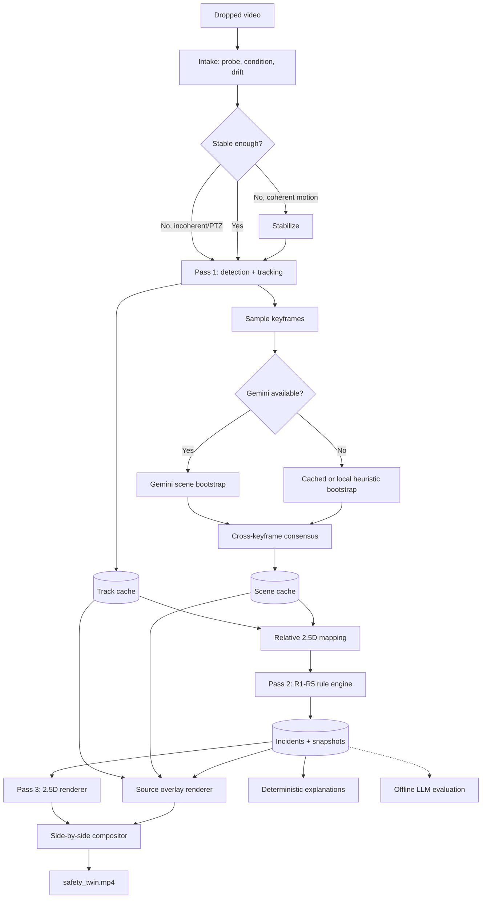

# AI-Powered Construction Safety 2.5D Twin
## Fresh project plan — v7

*Computer Vision · 2.5D Computer Graphics · Rule-Based Safety Analysis · LLM Fine-Tuning Experiment*

---

## 1. Product in one sentence

Drop a fixed-camera construction-site video into a desktop application; after offline processing, receive a synchronized side-by-side video showing the annotated source and a 2.5D site twin, with approximate R1–R5 hazard alerts, evidence frames, explanations, and a run report.

## 2. Locked constraints

- College project, not a production safety system.
- Solo developer, 12 weeks.
- Apple M1 Pro, 16 GB unified memory.
- Primary input: prerecorded fixed-camera video.
- Primary output: one 1920×1080 side-by-side MP4.
- Interactive console supports:
  - `compare`: source and twin side by side.
  - `twin_only`: source hidden; twin maximized.
- The twin is explicitly **2.5D**, not a surveyed 3D reconstruction.
- R1–R5 are all implemented.
- R3–R5 may use approximate or heuristic geometry.
- Distances are shown as relative risk bands, not metres.
- Gemini is optional and called only during scene bootstrap on sampled keyframes.
- Gemini results are cached; the demo does not depend on network availability.
- LLM fine-tuning is a graded experiment, not the authority for rules or citations.
- Privacy, authentication, encryption, and enterprise deployment are out of scope.
- API keys still remain outside source control.

## 3. What “2.5D twin” means

The twin is a camera-derived situational map:

- a single approximate ground/deck plane;
- relative worker and machinery positions;
- flat or lightly extruded zone polygons;
- simple worker markers and machinery footprints;
- optional scene blocks inferred from visible regions;
- no claim to reconstruct hidden geometry, exact dimensions, structural integrity, or BIM-grade geometry.

Every twin view displays:

> **Approximate 2.5D visualization — positions and zones are inferred from video.**

The twin exists for triage and visual explanation, not measurement certification.

## 4. User experience

### 4.1 Default workflow

1. User launches the desktop app.
2. User drops a video into the window.
3. The app probes codec, duration, resolution, orientation, and camera drift.
4. The app conditions or stabilizes the video when required.
5. Detection and tracking run offline.
6. Sampled keyframes are analyzed for static scene zones.
7. R1–R5 are evaluated over cached tracks and inferred scene state.
8. The 2.5D twin and annotated source are rendered.
9. The app opens the completed result and output folder.

No command-line interaction is required for the normal workflow.

### 4.2 Processing view

- During detection: full-width source preview with boxes and progress.
- After scene bootstrap: preview splits into source and 2.5D twin.
- Progress shows the current pass and estimated remaining time.
- Cancellation preserves completed pass-one detections where possible.

### 4.3 Result view

Default `compare` mode:

- left: annotated source video;
- right: synchronized 2.5D twin;
- below: incident cards and timeline;
- footer: heuristic disclaimer and rule coverage.

`twin_only` mode:

- hides the source and lower panels;
- expands the twin to the content area;
- retains compact active-alert overlays, timeline, disclaimer, and restore control;
- returns to the same timestamp and camera state.

### 4.4 Output folder

```text
output/<run_id>/
├── safety_twin.mp4
├── incidents.json
├── run_manifest.json
├── report.html
├── scene_cache.json
└── evidence/
    └── <incident_id>.jpg
```

HTML is the first report format. PDF export is optional if time remains.

---

## 5. System architecture



## 6. Three-pass processing model

### Pass 1 — expensive, cached

- decode and preprocess frames;
- stage-1 person/machinery detection;
- multi-object tracking;
- stage-2 helmet and vest classification;
- save per-frame tracks and confidences.

### Pass 2 — cheap, repeatable

- infer relative 2.5D positions;
- load static scene proposals;
- evaluate R1–R5;
- debounce and merge incidents;
- generate deterministic descriptions.

### Pass 3 — rendering

- render 2.5D frames;
- render annotated source frames;
- render incident cards and timeline;
- composite and encode the final MP4.

Changing thresholds or scene proposals reruns passes 2 and 3 without repeating detection.

## 7. Video intake and coordinate spaces

### 7.1 Supported inputs

- MP4, MOV, AVI, or MKV readable by local ffmpeg/OpenCV.
- Fixed or nearly fixed camera preferred.
- Landscape preferred, but portrait input is letterboxed rather than destructively cropped.
- Recommended minimum: 1280 px width and 30 seconds.

### 7.2 Intake outcomes

| Condition | Action |
|---|---|
| Native drift ≤ 0.1% of frame diagonal | Use directly |
| Coherent drift above 0.1% | Attempt stabilization |
| Residual drift ≤ 0.2% of frame diagonal | Allow provisional 2.5D mapping |
| PTZ, cuts, severe zoom, or unstable motion | Run R1/R2 where possible; mark geometry-dependent rules unsupported while keeping them visible in coverage |
| Low resolution | Run with raised uncertainty and retain evidence crops |

After person detection, the geometry gate is repeated in worker-relative units over the working region:

```text
residual_drift_wh = residual_drift_px / median_reliable_person_height_px
```

R3–R5 require `residual_drift_wh ≤ 0.05`. The run stores both normalized measures. Fixed native-pixel thresholds are retained only as diagnostics for the known 2560×1440 feeds.

### 7.3 Mandatory transform chain

Every detection and polygon records its coordinate space:

```text
raw → orientation/letterbox → undistortion (optional)
    → stabilization → model input → reference frame → relative plane
```

Every transform and inverse transform is saved in `run_manifest.json`.

No raw-frame point, stabilized point, or model-input point may be mixed without an explicit conversion.

## 8. Computer vision

### 8.1 Stage 1 — people and machinery

Model:

- Ultralytics YOLO26 small model, pinned to a tested package revision.
- Classes: `person`, `excavator`, `crane`, `truck`, `other_machinery`.
- Tracker: ByteTrack initially; BoT-SORT becomes the fallback if ID switching is excessive.

Training sources:

- MJCSD for CCTV-scale workers and machinery.
- Existing open PPE datasets only where their exact license and provenance are recorded.
- SARD footage is evaluation/display only.

Dataset splitting:

- split by camera or site, never random image only;
- remove near-duplicate adjacent frames across splits;
- report per-camera results and aggregate results.

### 8.2 Stage 2 — PPE crop classifier

Each tracked person crop is classified with two independent heads:

- head: `helmet`, `no_helmet`, `unknown`;
- torso: `vest`, `no_vest`, `unknown`.

`unknown` is required for:

- occluded head or torso;
- severe blur;
- truncated crop;
- confidence below threshold.

Training set:

- create an explicit person-crop dataset;
- seed crops from MJCSD and the PPE datasets;
- manually audit a bounded subset;
- do not silently treat “no associated helmet box” as a trusted negative;
- split by source dataset and site.

The first target is approximately 2,000 audited person crops, not a large unverified dataset.

### 8.3 Temporal PPE smoothing

- Maintain an exponential moving average per track and PPE head.
- Require a minimum number of accepted observations.
- Do not let `unknown` vote as negative.
- Confirm an R1/R2 condition only after debounce.

Smoothing reduces flicker. It does not correct a model that is consistently wrong.

### 8.4 Evidence magnification

Because the source pane is downscaled in the final 1080p composition:

- every confirmed PPE incident includes a magnified person crop inset;
- the original-resolution evidence JPEG is retained;
- confidence and `unknown` state remain visible.

---

## 9. Automatic scene bootstrap

### 9.1 Purpose

Scene bootstrap proposes static information needed by R3 and R5:

- candidate restricted polygons;
- candidate elevated/open edges;
- visible barrier or warning-sign regions;
- visible guardrail regions;
- machinery operating regions;
- cross-keyframe agreement score and textual rationale.

These are heuristic proposals, not surveyed facts.

### 9.2 Gemini usage

Gemini is called once per new video, not per frame.

Process:

1. Select 8–12 keyframes distributed across the clip.
2. Include event-rich frames containing people or machinery.
3. Send reduced-resolution keyframes to a pinned Gemini model.
4. Request structured JSON containing normalized boxes or polygons.
5. Map all proposals into the stabilized reference frame.
6. Cluster proposals by type and spatial overlap.
7. Retain only proposals supported by at least 60% of eligible keyframes, with at least 5 supporting frames, or by strong local evidence.
8. Cache the final result using:
   - video SHA-256;
   - Gemini model identifier;
   - prompt version;
   - preprocessing version.
   - keyframe-selector version and selected-frame hashes;
   - stage-1 detector hash;
   - stabilization-transform hash.

Gemini supports normalized object boxes and structured JSON. Its output is still treated as an untrusted proposal. Gemini's own verbal confidence is ignored; the application computes confidence from cross-keyframe agreement, spatial consistency, and available local evidence.

An eligible keyframe must expose the candidate region at sufficient resolution without a cut, severe blur, or dominant occlusion. The cache stores support numerator, eligible denominator, and rejection reasons.

### 9.3 Local fallback

When Gemini is unavailable:

1. Use an existing compatible cache if hashes match.
2. Otherwise run local heuristics:
   - long-line and contour candidates for open/deck edges;
   - barrier/sign detections when available;
   - tracked machinery envelopes;
   - worker footpoint density only as walkable-area context, never as a physical edge.
3. Mark weak scene properties `inconclusive`.

Bundled demo videos include Gemini-generated caches, so presentation does not require internet.

### 9.4 Consensus is not proof

Cross-frame agreement removes unstable proposals. It cannot make a systematically wrong proposal correct.

Therefore every inferred zone stores:

```json
{
  "source": "gemini_consensus | local_heuristic | bundled_cache",
  "agreement_score": 0.75,
  "supporting_keyframes": [],
  "heuristic": true
}
```

---

## 10. Relative 2.5D mapping

### 10.1 Worker position

- Worker anchor: bottom-centre of the detected person box.
- Prefer ankle keypoints when a pose model is available and visible.
- Smooth anchor positions over the track.

### 10.2 Machinery footprint

- Do not reduce machinery to one centre point.
- Approximate a ground-contact footprint from the lower box region.
- Inflate the footprint by a class-specific uncertainty margin.
- Proximity uses minimum worker-to-footprint distance.

### 10.3 Perspective-normalized worker-height units

The product does not display metres.

Preferred mapping:

1. Retain paired, same-frame head/ankle or head/foot observations—never independently aggregated endpoints.
2. Estimate the vertical vanishing point and ground-plane horizon using RANSAC.
3. Reject solutions with weak inlier support, implausible horizon/vertical geometry, or unstable temporal estimates.
4. Build a relative plane transform.
5. Set only the relative scale using the standing-worker prior `1 WH`; do not convert it to metres.
6. Measure minimum worker-to-footprint or worker-to-zone distance in the rectified plane.

If this fit fails, an image-space normalized distance may be displayed for visualization only, but it cannot trigger R4 or R5. Those rules return `inconclusive` rather than comparing distances that are not spatially comparable.

The run manifest records the observation pairs, fit diagnostics, transform, and mapping mode.

### 10.4 Optional relative plane

If enough reliable vertical/person observations exist:

- use the §10.3 horizon and relative plane transform;
- use it to improve layout consistency;
- set relative scale through the paired vertical-segment model so the standing-worker prior equals `1 WH`;
- report only relative coordinates.

If estimation fails:

- render an image-aligned 2.5D map;
- continue R1;
- run R2/R3 only when their non-distance observations remain available;
- report R4/R5 as `inconclusive` because their distance bands require the relative plane.

### 10.5 Geometry uncertainty

Bootstrap the accepted observation pairs and perturb worker anchors, machinery footprints, scene polygons, and stabilization transforms within measured error. This produces a relative-distance interval.

- A band is assigned only when the full interval lies inside that band.
- An interval crossing a threshold returns `inconclusive_distance`.
- R4/R5 never compare a single unqualified point estimate.

---

## 11. Hazard rules

All alerts are **visual safety observations**, not legal determinations.

### R1 — apparent missing helmet

Trigger:

- person track classified `no_helmet`;
- confidence ≥ 0.70;
- condition persists for ≥ 1.5 seconds.

Output:

- “Possible missing helmet.”
- Reference: BOCW Rule 54 and Rule 46(1).
- Caveat: helmet presence only; certification and safety shoes are not evaluated.

### R2 — apparent missing hi-vis near machinery or traffic

Trigger:

- the joint predicate remains true for ≥ 1.5 seconds:
  - person track classified `no_vest`;
  - person remains in a machinery caution band, inferred traffic zone, or operating-area proposal.

Basis:

- heuristic near general machinery;
- statutory reference only when the inferred/configured context actually corresponds to road work covered by the cited rule.

Output:

- “Worker may lack visible hi-vis clothing in a higher-risk movement area.”

### R3 — restricted-zone intrusion

Trigger:

- worker anchor enters an automatically proposed restricted polygon;
- polygon has sufficient cross-keyframe support;
- condition persists for ≥ 1.0 second.

Candidate zone sources:

- visible barriers;
- warning signs;
- active plant operating area;
- clearly separated exclusion region;
- Gemini consensus proposal.

R3 is always labeled `heuristic` unless the zone is explicitly associated with a verified rule type.

The app does not attach Rule 42(5) to an arbitrary restricted polygon.

### R4 — approximate machinery proximity

Trigger bands:

| Relative distance | State |
|---|---|
| ≤ 1.5 WH | `near` — alert candidate |
| > 1.5 WH and ≤ 3.0 WH | `caution` |
| > 3.0 WH | `clear` |

Additional conditions:

- machinery operating state is `active`;
- worker and machinery are on compatible visible planes;
- the full distance interval lies inside `near`;
- `near` persists for ≥ 1.0 second.

Operating state is inferred from:

- base/footprint displacement;
- class-specific box or mask articulation;
- repeated motion over a time window;
- cached scene evidence.

Possible operating states are `active`, `stationary`, and `unknown`. `unknown` makes R4 `inconclusive_operating_state`; it is never treated as active.

Output:

- “Worker is approximately within the near-machine risk band.”
- Display risk band prominently.
- Do not display metres.
- References to Rules 125(h) and 130 are contextual references; the WH threshold is project-defined.

### R5 — possible missing fall protection near an elevated/open edge

Trigger:

- candidate elevated/open edge has cross-keyframe support and positive visible-drop/open-edge evidence;
- worker is within ≤ 0.8 WH of that edge;
- the scene bootstrap positively identifies the edge as visibly unguarded or inadequately guarded;
- the region has sufficient visibility to assess protection;
- condition persists for ≥ 1.0 second.

Possible outcomes:

- `evaluated_alert` with reason `visible_unguarded_edge`;
- `evaluated_clear`;
- `inconclusive` with reason `edge_semantics_unknown`;
- `inconclusive` with reason `protection_visibility_insufficient`;
- `not_applicable`.

Absence of a detected guardrail is not evidence that a guardrail is absent. Long lines and contours propose candidates but cannot establish elevation or a fall edge by themselves.

Output:

- “Possible fall-edge exposure; visible protection was not confidently identified.”
- References: Rules 42(5), 42(6), 2(u), and 179.
- Always labeled heuristic.

### 11.1 Rule state model

Every rule returns one generic status:

```text
evaluated_clear
evaluated_alert
not_applicable
inconclusive
unsupported_for_feed
```

Rule-specific detail is carried separately as `reason_code`, such as `inconclusive_distance`, `edge_semantics_unknown`, or `operating_state_unknown`. These states must never be collapsed into one generic `not_evaluated`.

Unsupported rules remain visible in the result and report with their reason. Evaluation may be disabled; coverage reporting may not be hidden.

### 11.2 Temporal controls

| Parameter | Value |
|---|---|
| R1/R2 debounce | 1.5 s |
| R3/R4/R5 debounce | 1.0 s |
| Resolution hysteresis | 2.0 s |
| Same track + rule cooldown | 30 s |
| PPE confidence floor | 0.70 |
| Scene-proposal support | ≥ 60% of usable keyframes |

All thresholds are configuration values and are evaluated on validation clips.

---

## 12. Incident identity and tracking

Incident key:

```text
run_id + canonical_track_id + rule_id + temporal_window
```

Do not use random UUIDs as the only identity.

Track continuation:

- merge a new track with a recently lost track when appearance, position, rule, and time agree;
- retain `continuation_of`;
- report ID switches per minute.

Use deterministic seeds where supported, but promise repeatable semantics rather than byte-identical output across all MPS/library versions.

## 13. Deterministic explanations

The runtime explanation comes from a rule catalogue:

```json
{
  "rule_id": "R4",
  "title": "Approximate machinery proximity",
  "observation_template": "Worker {track_id} remained in the near-machine band for {duration}.",
  "action_template": "Pause movement and verify separation with the plant operator.",
  "reference": ["BOCW Rule 125(h)", "BOCW Rule 130"],
  "basis": "heuristic"
}
```

The rule engine selects:

- rule ID;
- severity;
- basis;
- references;
- recommended deterministic action.

An LLM is never allowed to invent or replace those fields.

---

## 14. LLM fine-tuning experiment

### 14.1 Purpose

Meet the graded LLM requirement by testing whether fine-tuning improves:

- schema compliance;
- context-specific reasoning;
- concise recommended-action wording;
- groundedness to the supplied incident record.

It is not required for the app to function.

### 14.2 Models

| Role | Model | License | Use |
|---|---|---|---|
| Teacher | Qwen2.5-7B-Instruct, 4-bit MLX | Apache-2.0 | Offline corpus generation |
| Student | Qwen2.5-1.5B-Instruct, 4-bit MLX + LoRA | Apache-2.0 | Fine-tuning experiment |

The previous 3B student is removed because its exact checkpoint uses the Qwen Research License.

### 14.3 Output boundary

The student may generate only:

```json
{
  "reasoning": "short explanation tied to supplied observations",
  "recommended_wording": "plain-language rendering of the deterministic action"
}
```

The application injects rule ID, basis, severity, and references afterward.

### 14.4 Experiment arms

1. Deterministic template.
2. Base student with few-shot prompt.
3. Fine-tuned student.
4. Teacher reference.

Metrics:

- valid JSON rate;
- unsupported-claim rate;
- observation consistency;
- action consistency with deterministic policy;
- blind human rating on clarity/actionability;
- median and p95 latency.

If the student fails validation, the application uses the deterministic template.

---

## 15. 2.5D renderer

### 15.1 Stack

- Python;
- ModernGL;
- GLFW;
- Dear ImGui;
- ffmpeg for final composition.

### 15.2 Scene

- relative ground/deck plane;
- worker markers with track IDs;
- machinery footprints;
- restricted zones and edge bands;
- amber/red hazard overlays;
- confidence/heuristic indicators;
- approximate camera-relative structural blocks only where useful.

### 15.3 View synchronization

Source and twin share one video-time clock.

Seeking an incident updates:

- source frame;
- twin frame;
- selected worker;
- selected machinery/zone;
- evidence crop;
- incident details.

### 15.4 Final video

1920×1080 H.264:

- source pane approximately 940×529;
- twin pane approximately 940×529;
- incident/evidence rail below;
- magnified crop for active PPE incidents;
- timeline and persistent disclaimer;
- final summary card.

The default exported video remains side by side.

---

## 16. Data contracts

### 16.1 Run manifest

Required fields:

- schema version;
- run ID and processing status;
- input video hash and metadata;
- model IDs and hashes;
- dependency and prompt versions;
- preprocessing transforms;
- coordinate-space definitions;
- Gemini/cache status;
- rule coverage;
- warnings and failure records;
- pass timings;
- output artifact hashes.

### 16.2 Track record

```json
{
  "frame": 420,
  "video_time": 16.8,
  "track_id": 17,
  "box_stabilized_xyxy": [100, 200, 150, 340],
  "anchor_reference_xy": [125, 340],
  "helmet": {"state": "no_helmet", "confidence": 0.84},
  "vest": {"state": "unknown", "confidence": 0.41},
  "relative_position": [4.2, 7.9],
  "position_mode": "relative_plane"
}
```

### 16.3 Incident record

```json
{
  "schema_version": 1,
  "incident_id": "run-track-rule-window",
  "rule_id": "R4",
  "status": "evaluated_alert",
  "basis": "heuristic",
  "relative_band": "near",
  "first_seen": 15.2,
  "confirmed_at": 16.2,
  "resolved_at": 22.9,
  "track_id": 17,
  "scene_proposal_ids": ["machinery-zone-2"],
  "confidence": 0.78,
  "evidence_frame": "evidence/<incident_id>.jpg"
}
```

---

## 17. Evaluation

### 17.0 Split discipline

Before threshold tuning:

- assign entire cameras/videos to development or held-out evaluation;
- never place frames from one continuous recording in both groups;
- reserve synthetic fixtures for rule-logic correctness, not model-accuracy claims;
- keep presentation/demo results separate from held-out metrics;
- if no independent positive clip exists for a rule, report a demonstrated case rather than a precision/recall claim.

### 17.1 Detection

- stage-1 AP50 and AP50–95 by class;
- stage-2 precision, recall, F1, and unknown rate per PPE head;
- results per camera/site;
- false-negative rate for R1/R2 observations.

### 17.2 Tracking

- ID switches per minute;
- track fragmentation;
- continuation-merge precision;
- worker-anchor stability.

### 17.3 Scene bootstrap

Create hand-labelled polygons for development and held-out fixed feeds. Tune prompts and thresholds only on development feeds; open held-out labels after the scene-bootstrap implementation is frozen.

Measure:

- restricted-zone IoU;
- edge-distance error in image/WH units;
- guardrail presence accuracy;
- cross-keyframe proposal stability;
- Gemini vs local fallback;
- cache reproducibility.

### 17.4 Rules

For each R1–R5:

- incident precision;
- incident recall;
- false alerts per minute;
- median confirmation delay;
- `inconclusive` and `unsupported` rates.

R3/R5 results are reported as heuristic performance, not compliance accuracy.

### 17.5 Product

- wall-clock processing time per minute of input;
- pass 2/3 re-run time;
- source/twin synchronization error;
- render fps;
- successful completion rate over supported videos;
- Gemini-free demo success;
- cancellation and resume behavior.

## 18. Testing

### Unit tests

- transform composition and inversion;
- coordinate-space validation;
- worker-height normalization;
- point-in-polygon and band calculations;
- rule-state transitions;
- debounce, hysteresis, and cooldown;
- deterministic incident IDs;
- cache-key invalidation;
- distance-interval band assignment;
- operating-state transitions;

### Integration tests

- 10-second fixture: video → tracks → incidents;
- cached scene bootstrap → rules;
- Gemini failure → cache/local fallback;
- incident selection synchronizes both panes;
- ffmpeg failure is surfaced;
- corrupted video produces a clear failed run.

### End-to-end smoke test

One short sample clip runs on every CI push using:

- lightweight or mocked detections;
- real rules;
- real renderer if available;
- final output existence and duration checks.

## 19. Existing tool corrections

Before reuse, update `tools/cctv.py`:

- do not silently reuse a stale transform across a long feature-matching failure;
- record transform validity per frame;
- interpolate only bounded gaps;
- check ffmpeg return codes;
- preserve the original audio optionally;
- letterbox portrait video by default;
- report crop/letterbox transforms;
- stop describing pixel drift alone as a metric world-error bound.

Existing tools remain useful:

- `cctv.py`;
- `fetch_sard.py`;
- `profile_sard.py`;
- `profile_yolo.py`.

No current tool is marked for deletion.

---

## 20. Project structure

```text
Project_Sem7/
├── app/
│   ├── main.py
│   ├── jobs.py
│   └── views.py
├── pipeline/
│   ├── intake/
│   ├── vision/
│   ├── scene/
│   ├── mapping/
│   ├── rules/
│   ├── reasoning/
│   ├── cache/
│   └── render/
├── twin/
├── shared/
│   ├── schemas/
│   └── coordinates.py
├── regulations/
├── config/
├── llm/
│   ├── corpus/
│   ├── teacher/
│   ├── adapters/
│   └── eval/
├── tests/
│   ├── unit/
│   ├── integration/
│   └── fixtures/
├── data/
│   ├── source/
│   ├── external/
│   ├── working/
│   └── cache/
├── output/
├── tools/
├── pyproject.toml
├── uv.lock
└── run.sh
```

## 21. Corrected data and license ledger

| Asset | Role | Current license position |
|---|---|---|
| YOLO26 / Ultralytics | Detection/tracking | AGPL-3.0 for academic open-source use |
| MJCSD | CCTV-scale training | Repository states AGPL-3.0 |
| Ultralytics Construction-PPE | PPE supplement | AGPL-3.0 |
| jhboyo PPE | PPE supplement | Dataset card states MIT; verify the two upstream Kaggle dataset licenses and preserve source attribution |
| SARD | Display/evaluation only | Provenance uncertain; do not train on footage |
| SteelBench | LLM/PPE holdout | CC-BY-NC-4.0 |
| Qwen2.5-7B-Instruct | Teacher | Apache-2.0 |
| Qwen2.5-1.5B-Instruct | Student | Apache-2.0 |
| Gemini API | Optional scene bootstrap | Free-tier quota is variable; free-tier submissions may be used by Google to improve products; cache all accepted output |

Exact model/dataset revisions and URLs are stored in the run/report manifest.

Before training, copy each authoritative license/README into a versioned `licenses/` directory with source URL, source revision, and retrieval date. The locally downloaded MJCSD archive currently does not preserve this evidence by itself.

## 21.1 Required environment

Pin and document:

- Python version;
- PyTorch and MPS-compatible version;
- Ultralytics version and model files;
- OpenCV;
- MLX and MLX-LM;
- Google GenAI SDK;
- ModernGL, GLFW, and the selected ImGui binding;
- ffmpeg version;
- macOS OpenGL preflight;
- CI behavior when no display or MPS device exists.

`run.sh` performs dependency, model, ffmpeg, OpenGL, disk-space, and API-cache preflight checks before accepting a job.

## 22. Twelve-week execution plan

### Week 1 — foundation and skeleton

- initialize Git;
- add `pyproject.toml`, `uv.lock`, formatting, pytest, and CI;
- define run/track/incident schemas;
- freeze a per-rule demo inventory: clip, expected interval, expected rule state, and evidence for R1–R5;
- create a clearly labelled synthetic fixture for any rule without a licensed real positive;
- freeze development and held-out clips before threshold tuning;
- create drag-drop shell;
- produce a fake side-by-side video from fake tracks;
- establish one-command smoke test.

Exit: dropping a clip creates a synchronized placeholder output.

### Week 2 — intake and cache

- wrap and correct `cctv.py`;
- implement probe, letterbox, stabilization, transform ledger;
- implement job states, cancellation, and resumable cache;
- validate on the four known feeds.

Exit: every supported clip produces a valid run manifest and normalized working copy.

### Week 3 — stage-1 baseline

- run pretrained YOLO26 person/machinery detector;
- integrate ByteTrack;
- create site/camera evaluation split;
- measure baseline before fine-tuning.
- connect cached/synthetic tracks and bundled scene proposals to a thin R1–R5 rule vertical slice.

Exit: tracked workers and machinery render in source and twin, and every R1–R5 state machine executes on at least one fixture.

### Week 4 — stage-1 fine-tuning

- convert/audit MJCSD;
- freeze the exact mapping from MJCSD labels (`worker`, `excavator`, `truck`, `tanker`, `crane`, `elevator`) into the stage-1 taxonomy; do not create `other_machinery` without mapped source classes;
- train `person` + machinery classes;
- evaluate per camera/site;
- freeze the best checkpoint.

Exit: documented stage-1 checkpoint with reproducible metrics.

### Week 5 — PPE dataset and classifier

- generate person crops;
- audit approximately 2,000 crops;
- label helmet/vest/unknown states;
- train two-head classifier;
- add temporal smoothing.

Exit: R1 and PPE state overlays work with measured precision/recall.

### Week 6 — scene bootstrap

- implement keyframe selection;
- implement Gemini structured-output call;
- implement prompt/model-versioned cache;
- implement local fallback;
- label scene GT for demo feeds;
- evaluate proposal stability.

Exit: scene cache contains candidate restricted zones, edges, and visible protection.

### Week 7 — relative mapping and R1–R5

- implement worker-height normalization;
- implement machinery footprints;
- implement all five rule state machines;
- add deterministic descriptions and references;
- add incident persistence.

Exit: R1–R5 run end to end, including inconclusive and unsupported states.

### Week 8 — 2.5D twin

- complete ModernGL scene;
- add zones, edges, worker/machinery markers;
- implement compare/twin-only modes;
- synchronize seeking and camera controls.

Exit: interactive 2.5D console is demonstrable.

### Week 9 — final video and report

- implement source overlay compositor;
- add magnified evidence inset;
- add incident cards and timeline;
- encode `safety_twin.mp4`;
- generate HTML report.

Exit: finished boss-facing artifact from one dropped video.

### Week 10 — LLM experiment

- generate and gate corpus;
- split train/dev/test by incident and template family before teacher generation;
- validate every teacher output against the deterministic incident policy;
- create a small human-authored blind holdout not generated by the teacher;
- fine-tune 1.5B student using MLX LoRA;
- run four-arm comparison;
- add optional AI wording preview;
- preserve template fallback.

Exit: graded LLM results without making the product depend on them.

### Week 11 — evaluation and hardening

- run R1–R5 incident evaluation;
- measure false alerts/minute;
- test Gemini/cache/local fallback;
- fix coordinate, synchronization, and failure-state bugs;
- test memory and processing budget.

Exit: frozen metrics and known limitations.

### Week 12 — buffer and presentation

- no new features;
- full regression run;
- package environment and models;
- demo with network disabled using bundled caches;
- finish report, presentation, and viva answers.

## 23. Scope cuts if behind

Cut in this order:

1. PDF export; retain HTML.
2. Decorative 2.5D structural blocks.
3. BoT-SORT comparison.
4. One-stage detector ablation.
5. Local R3/R5 fallback sophistication; retain Gemini cache.
6. Base-student LLM arm; keep template, fine-tuned student, and teacher.

Never cut:

- R1–R5 code paths;
- explicit heuristic/inconclusive states;
- coordinate transform ledger;
- site/camera-separated evaluation;
- side-by-side output;
- evidence crops;
- deterministic rule selection and citations;
- cache-backed Gemini-free demo;
- tests and Week 12 buffer.

## 24. Demonstration

1. Drop unseen fixed-camera footage.
2. Show detection progress.
3. Show cached/optional scene bootstrap and inferred zones.
4. Open synchronized side-by-side result.
5. Show R1–R5 alert types across the curated demo set.
6. Select an incident and display its magnified evidence.
7. Maximize the 2.5D twin, then return to compare mode.
8. Open the incident report and rule-coverage summary.
9. Show LLM experiment results separately from runtime alerts.
10. Disconnect network and rerun a cached demo feed.

## 25. Success criteria

The project succeeds when:

- one dropped fixed-camera video automatically reaches a final side-by-side MP4;
- the twin is visibly synchronized and explicitly approximate;
- R1–R5 are implemented with clear evaluated/inconclusive states;
- R4 uses relative near/caution/clear bands rather than fake metres;
- R3/R5 automatic proposals are evaluated against labelled demo scenes;
- Gemini is optional and cached;
- R1/R2 PPE evidence is inspectable at full resolution;
- the rule engine—not the LLM—controls alerts, basis, severity, and citations;
- the LLM experiment has reproducible comparative metrics;
- the project runs on the M1 Pro 16 GB;
- a fresh setup can run the smoke workflow using documented commands.

## 26. Honest limitations

- R3 and R5 scene understanding can be systematically wrong even after temporal consensus.
- R4 bands are relative heuristics, not physical separation measurements.
- Image-space WH fallback is visualization-only and cannot trigger R4/R5.
- Monocular 2.5D geometry does not reconstruct hidden site structure.
- PPE classification may fail under heavy occlusion, glare, blur, or very small workers.
- SARD evaluation is limited in site diversity.
- Gemini free-tier availability and model behavior can change.
- The system reports visual observations, not statutory compliance.

These limitations appear in the application, report, and presentation rather than only in this plan.

---

# Part II — Complete implementation specification

Sections 27 onward are the build contract. If an earlier descriptive section is ambiguous, this implementation specification is authoritative.

## 27. Verified development baseline

Measured on the target machine on 21 September 2026:

| Item | Verified value |
|---|---|
| Operating system | macOS 26.6.2 |
| Chip | Apple M1 Pro, 10 cores |
| Unified memory | 16 GB |
| Free disk at planning time | 257 GiB |
| Python | 3.11.9 |
| OpenCV | 5.0.0 |
| NumPy | 2.4.6 |
| PyTorch | 2.10.0, MPS available |
| Pydantic | 2.12.5 |
| GLFW | 2.10.2 |
| ffmpeg | 8.0.1 |

Not installed at planning time:

- Ultralytics;
- MLX and MLX-LM;
- ModernGL;
- Dear ImGui binding;
- Google GenAI SDK.

Week 1 must install and smoke-test these before feature work. `uv.lock` becomes the dependency source of truth after that test.

## 28. Repository bootstrap

### 28.1 First commands

```bash
cd /Users/sreevardhandesu/Desktop/Project_Sem7
git init
git branch -M main

brew install uv ffmpeg
uv python pin 3.11.9
uv init --bare
```

### 28.2 Intended `pyproject.toml`

Exact transitive versions are committed in `uv.lock`. Direct constraints prevent unreviewed major upgrades.

```toml
[project]
name = "construction-safety-twin"
version = "0.1.0"
description = "Offline construction-safety video analysis with a 2.5D situational twin"
requires-python = ">=3.11,<3.12"
dependencies = [
  "av>=14,<17",
  "glfw>=2.10,<3",
  "google-genai>=1,<2",
  "imgui-bundle>=1.92,<2",
  "jinja2>=3.1,<4",
  "moderngl>=5.12,<6",
  "numpy>=2.4,<2.5",
  "opencv-python>=5.0,<5.1",
  "orjson>=3.10,<4",
  "pydantic>=2.12,<3",
  "pyyaml>=6,<7",
  "rich>=14,<15",
  "scipy>=1.16,<2",
  "shapely>=2.1,<3",
  "typer>=0.16,<1",
  "zstandard>=0.25,<1",
]

[build-system]
requires = ["hatchling>=1.27,<2"]
build-backend = "hatchling.build"

[tool.hatch.build.targets.wheel]
packages = ["app", "jobs", "pipeline", "twin", "shared", "llm", "tools", "evaluation"]

[project.optional-dependencies]
vision = [
  "albumentations>=2,<3",
  "scikit-learn>=1.7,<2",
  "torch>=2.10,<2.11",
  "torchvision>=0.25,<0.26",
  "ultralytics>=8.4.63,<8.5",
]
llm = [
  "datasets>=4,<5",
  "mlx>=0.31,<0.32",
  "mlx-lm>=0.31,<0.32",
  "transformers>=5,<6",
]
report = [
  "pandas>=2.3,<3",
  "pyarrow>=21,<22",
]
labeling = [
  "pandas>=2.3,<3",
]

[dependency-groups]
dev = [
  "mypy>=1.18,<2",
  "pyinstaller>=6,<7",
  "pytest>=8.4,<9",
  "pytest-cov>=7,<8",
  "ruff>=0.13,<0.14",
]

[project.scripts]
safety-twin = "app.__main__:main"
safety-tools = "tools.cli:app"
safety-llm = "llm.cli:app"
safety-eval = "evaluation.cli:app"

[tool.pytest.ini_options]
testpaths = ["tests"]
addopts = "-q --strict-markers"

[tool.ruff]
line-length = 100
target-version = "py311"

[tool.mypy]
python_version = "3.11"
strict = true
```

Install:

```bash
uv sync --all-extras --group dev
uv lock
uv run python -c "import torch; assert torch.backends.mps.is_available()"
uv run python -c "import moderngl, glfw, imgui_bundle, ultralytics, mlx_lm"
```

### 28.3 `.gitignore` additions

```gitignore
artifacts/models/
artifacts/checkpoints/
artifacts/adapters/
data/cache/
data/working/
data/external/
output/
*.partial
.env
```

Track manifests, schemas, configs, licenses, small test fixtures, and evaluation summaries. Do not track model weights, downloaded datasets, working videos, caches, or run outputs.

### 28.4 Python implementation conventions

- Every Python file starts with `from __future__ import annotations`.
- All imports remain at module top level.
- Public functions and methods are fully typed.
- Pydantic validates process/file boundaries; dataclasses may be used internally.
- No mutable module-level runtime state.
- External subprocesses use argument arrays, captured stderr, explicit timeout, and checked return codes.
- Every random operation receives a recorded seed.

## 29. Authoritative project tree

```text
Project_Sem7/
├── app/
│   ├── __main__.py
│   ├── bootstrap.py
│   ├── controller.py
│   ├── events.py
│   ├── playback.py
│   ├── reducer.py
│   ├── state.py
│   ├── ui.py
│   └── window.py
├── jobs/
│   ├── cancellation.py
│   ├── pipeline_job.py
│   ├── protocol.py
│   ├── supervisor.py
│   └── worker.py
├── pipeline/
│   ├── intake/
│   │   ├── conditioning.py
│   │   ├── geometry_gate.py
│   │   ├── probe.py
│   │   └── stabilization.py
│   ├── data/
│   │   ├── deduplicate.py
│   │   ├── mjcsd.py
│   │   ├── ppe_crops.py
│   │   ├── records.py
│   │   └── split.py
│   ├── vision/
│   │   ├── detector.py
│   │   ├── operating_state.py
│   │   ├── pass1.py
│   │   ├── pose.py
│   │   ├── ppe_model.py
│   │   ├── ppe_temporal.py
│   │   └── tracker.py
│   ├── scene/
│   │   ├── consensus.py
│   │   ├── gemini.py
│   │   ├── keyframes.py
│   │   └── local_fallback.py
│   ├── mapping/
│   │   ├── anchors.py
│   │   ├── footprints.py
│   │   ├── relative_plane.py
│   │   └── uncertainty.py
│   ├── rules/
│   │   ├── engine.py
│   │   ├── r1.py
│   │   ├── r2.py
│   │   ├── r3.py
│   │   ├── r4.py
│   │   ├── r5.py
│   │   └── temporal.py
│   ├── cache/
│   │   ├── keys.py
│   │   ├── run_db.py
│   │   └── store.py
│   ├── render/
│   │   ├── compositor.py
│   │   ├── evidence.py
│   │   ├── rail.py
│   │   └── source_overlay.py
│   ├── output/
│   │   └── publisher.py
│   └── report/
│       ├── html.py
│       ├── model.py
│       └── templates/report.html.j2
├── twin/
│   ├── camera.py
│   ├── context.py
│   ├── geometry.py
│   ├── offscreen.py
│   ├── picking.py
│   ├── renderer.py
│   ├── scene.py
│   └── shaders/
├── shared/
│   ├── config.py
│   ├── coordinates.py
│   ├── errors.py
│   ├── hashing.py
│   ├── logging.py
│   └── schemas/
│       ├── incidents.py
│       ├── jobs.py
│       ├── run.py
│       ├── scene.py
│       └── tracks.py
├── regulations/
│   ├── catalogue.schema.json
│   ├── catalogue.v1.yaml
│   ├── compiled/
│   └── sources/source-manifest.json
├── llm/
│   ├── cli.py
│   ├── configs/
│   ├── corpus/
│   ├── eval/
│   ├── runtime/
│   └── teacher/
├── config/
│   ├── defaults.yaml
│   ├── class_map.yaml
│   ├── stage1_dataset.yaml
│   ├── stage1_train.yaml
│   └── ppe_train.yaml
├── tools/
│   ├── __init__.py
│   ├── cctv.py
│   ├── cli.py
│   ├── convert_mjcsd.py
│   ├── build_splits.py
│   ├── build_ppe_crops.py
│   ├── export_ppe_labelstudio.py
│   ├── import_ppe_labelstudio.py
│   ├── materialize_stage1.py
│   ├── promote_models.py
│   ├── evaluate_stage1.py
│   ├── evaluate_ppe.py
│   ├── train_ppe.py
│   ├── fetch_sard.py
│   ├── profile_sard.py
│   └── profile_yolo.py
├── tests/
│   ├── unit/
│   ├── contract/
│   ├── integration/
│   ├── e2e/
│   └── fixtures/
├── evaluation/
│   ├── cli.py
│   ├── ground_truth.schema.json
│   ├── detection.py
│   ├── tracking.py
│   ├── scene.py
│   ├── rules.py
│   └── product.py
├── artifacts/
│   ├── manifest.json
│   └── README.md
├── licenses/
├── packaging/
│   ├── SafetyTwin.spec
│   └── build_app.sh
├── .github/workflows/ci.yml
├── pyproject.toml
├── uv.lock
└── run.sh
```

Every Python package directory contains `__init__.py`, even where omitted from the tree for readability.

## 30. Central configuration

`config/defaults.yaml` is the only runtime default source. UI overrides are validated, saved into the run manifest, and included in cache keys.

```yaml
schema_version: 1

intake:
  target_fps: 15.0
  target_width: 1920
  target_height: 1080
  portrait_policy: letterbox
  native_drift_limit_diagonal: 0.001
  provisional_residual_limit_diagonal: 0.002
  geometry_residual_limit_wh: 0.05
  interpolation_max_frames: 3

stage1:
  model_path: artifacts/models/stage1/best.pt
  image_size: 960
  confidence: 0.20
  iou: 0.60
  maximum_detections: 200
  device: mps

tracker:
  type: bytetrack
  track_high_threshold: 0.45
  track_low_threshold: 0.10
  new_track_threshold: 0.55
  match_threshold: 0.80
  buffer_seconds: 3.0

ppe:
  model_path: artifacts/models/ppe/best.pt
  image_size: 224
  batch_size: 32
  confidence_floor: 0.70
  minimum_person_height_px: 40
  temporal_alpha: 0.35
  minimum_observations: 4

pose:
  model_path: artifacts/models/pose/yolo26n-pose.pt
  image_size: 640
  confidence_floor: 0.60
  sample_spacing_seconds: 0.50
  maximum_samples_per_track: 20

relative_plane:
  minimum_pairs: 12
  minimum_distinct_tracks: 5
  minimum_pixel_height: 40
  minimum_keypoint_confidence: 0.60
  minimum_standing_probability: 0.80
  maximum_occlusion_fraction: 0.25
  minimum_vertical_inlier_ratio: 0.65
  maximum_reprojection_rms_px: 3.0
  maximum_temporal_horizon_shift_px: 5.0

uncertainty:
  bootstrap_samples: 500
  confidence_level: 0.95
  minimum_successful_samples: 350
  temporal_block_seconds: 2.0
  seed: 42017

scene:
  gemini_model: gemini-2.5-flash
  prompt_version: scene-v1
  minimum_keyframes: 8
  maximum_keyframes: 12
  minimum_support_frames: 5
  minimum_support_fraction: 0.60
  zone_cluster_iou: 0.35
  edge_cluster_diagonal_distance: 0.02

rules:
  ppe_confidence_floor: 0.70
  r1_debounce_seconds: 1.5
  r2_debounce_seconds: 1.5
  r3_debounce_seconds: 1.0
  r4_debounce_seconds: 1.0
  r5_debounce_seconds: 1.0
  resolution_hysteresis_seconds: 2.0
  cooldown_seconds: 30.0
  missing_observation_grace_seconds: 0.25
  r4_near_max_wh: 1.5
  r4_caution_max_wh: 3.0
  r5_edge_max_wh: 0.8

render:
  output_width: 1920
  output_height: 1080
  output_fps: 15.0
  pane_width: 940
  pane_height: 529
  crf: 18
  preset: medium

runtime:
  processing_checkpoint_frames: 250
  progress_events_per_second: 10
  minimum_free_disk_gib: 10
  maximum_peak_memory_gib: 13
```

Environment:

```dotenv
GEMINI_API_KEY=optional
SAFETY_TWIN_CONFIG=config/defaults.yaml
SAFETY_TWIN_ARTIFACT_DIR=artifacts
SAFETY_TWIN_CACHE_DIR=data/cache
SAFETY_TWIN_OUTPUT_DIR=output
```

Only `GEMINI_API_KEY` is secret. The application must work without it by using an exact cache, bundled cache, or local fallback.

## 31. Shared type and schema contract

### 31.1 Enums

```python
from enum import StrEnum

class CoordinateSpace(StrEnum):
    RAW = "raw"
    ORIENTED = "oriented_canvas"
    UNDISTORTED = "undistorted"
    REFERENCE = "reference"
    MODEL_INPUT = "model_input"
    RELATIVE_PLANE = "relative_plane"

class RuleId(StrEnum):
    R1 = "R1"
    R2 = "R2"
    R3 = "R3"
    R4 = "R4"
    R5 = "R5"

class RuleStatus(StrEnum):
    EVALUATED_CLEAR = "evaluated_clear"
    EVALUATED_ALERT = "evaluated_alert"
    NOT_APPLICABLE = "not_applicable"
    INCONCLUSIVE = "inconclusive"
    UNSUPPORTED = "unsupported_for_feed"

class HelmetState(StrEnum):
    HELMET = "helmet"
    NO_HELMET = "no_helmet"
    UNKNOWN = "unknown"

class VestState(StrEnum):
    VEST = "vest"
    NO_VEST = "no_vest"
    UNKNOWN = "unknown"

class OperatingState(StrEnum):
    ACTIVE = "active"
    STATIONARY = "stationary"
    UNKNOWN = "unknown"

class DistanceBand(StrEnum):
    NEAR = "near"
    CAUTION = "caution"
    CLEAR = "clear"
    INDETERMINATE = "indeterminate"
```

### 31.2 Geometry types

```python
from pydantic import BaseModel, ConfigDict, Field

class StrictModel(BaseModel):
    model_config = ConfigDict(extra="forbid", frozen=True)

class Point2(StrictModel):
    x: float
    y: float
    space: CoordinateSpace

class Box2(StrictModel):
    x1: float
    y1: float
    x2: float
    y2: float
    space: CoordinateSpace

class DistanceInterval(StrictModel):
    lower_wh: float
    median_wh: float
    upper_wh: float
    confidence_level: float = 0.95
    successful_bootstraps: int
    total_bootstraps: int
```

Validators reject:

- NaN or infinite coordinates;
- inverted boxes;
- invalid polygons;
- negative timestamps;
- unknown enums;
- any metric-distance field such as `distance_m` or `metres`.

### 31.3 Transform record

```python
class TransformRecord(StrictModel):
    transform_id: str
    frame_index: int | None
    source_space: CoordinateSpace
    destination_space: CoordinateSpace
    kind: str
    forward_3x3: list[list[float]] | None
    inverse_3x3: list[list[float]] | None
    valid: bool
    interpolated: bool
    residual_rms_px: float | None
    inlier_count: int | None
    inlier_ratio: float | None
    reason_code: str
    implementation_version: str
```

Matrix convention:

- homogeneous column vectors: `p' ~ H p`;
- matrices serialized row-major;
- boxes transform all four corners;
- transform composition requires exact destination/source matching;
- lens distortion uses maps, not a fake homography.

### 31.4 Detection and track records

```python
class DetectionRecord(StrictModel):
    class_id: int
    class_name: str
    confidence: float = Field(ge=0, le=1)
    box: Box2

class HelmetRecord(StrictModel):
    state: HelmetState
    confidence: float = Field(ge=0, le=1)
    visible: bool

class VestRecord(StrictModel):
    state: VestState
    confidence: float = Field(ge=0, le=1)
    visible: bool

class Pass1TrackObservation(StrictModel):
    schema_version: int = 1
    shot_id: str
    frame_index: int
    video_time_s: float
    track_id: int
    canonical_track_id: str
    object_class: str
    box_reference: Box2
    anchor_reference: Point2
    helmet: HelmetRecord | None
    vest: VestRecord | None

class MappedTrackRecord(StrictModel):
    schema_version: int = 1
    shot_id: str
    frame_index: int
    video_time_s: float
    canonical_track_id: str
    object_class: str
    reference_observation_key: str
    anchor_reference: Point2
    anchor_covariance_2x2: list[list[float]]
    relative_position: Point2 | None
    plane_id: str | None
    helmet: HelmetRecord | None
    vest: VestRecord | None
    operating_state: OperatingState | None
    mapping_mode: str
```

### 31.5 Rule result

```python
class RuleResult(StrictModel):
    rule_id: RuleId
    status: RuleStatus
    reason_code: str
    basis: str
    track_id: str | None
    object_id: str | None
    proposal_ids: tuple[str, ...]
    observed_from_s: float | None
    observed_to_s: float | None
    confidence: float | None
    distance: DistanceInterval | None
    relative_band: DistanceBand | None
    references: tuple[str, ...]
```

### 31.6 Persisted geometry records

```python
class VerticalObservation(StrictModel):
    observation_id: str
    shot_id: str
    frame_index: int
    track_id: int
    head_reference: Point2
    foot_reference: Point2
    head_confidence: float
    foot_confidence: float
    standing_probability: float
    occlusion_fraction: float
    covariance_4x4: list[list[float]]

class MachineryFootprintRecord(StrictModel):
    machinery_id: str
    shot_id: str
    frame_index: int
    class_name: str
    polygon_plane_xy: list[tuple[float, float]] | None
    compatible_plane_id: str | None
    operating_state: OperatingState
    construction_method: str
    inflation_wh: float
    covariance: list[list[float]]
    valid: bool
    reason_code: str

class MachineryContactCandidate(StrictModel):
    shot_id: str
    frame_index: int
    machinery_id: str
    class_name: str
    contact_points_reference: list[Point2]
    construction_method: str
    covariance: list[list[float]]
    valid: bool

class MachineryMotionObservation(StrictModel):
    shot_id: str
    frame_index: int
    machinery_id: str
    base_translation_px: tuple[float, float] | None
    articulation_score: float | None
    valid_flow_points: int
    reason_code: str

class IncidentRecord(StrictModel):
    schema_version: int = 1
    incident_id: str
    run_id: str
    shot_id: str
    catalogue_sha256: str
    rule_id: RuleId
    status: RuleStatus
    reason_code: str
    basis: str
    severity: str
    canonical_track_id: str | None
    object_id: str | None
    proposal_ids: tuple[str, ...]
    first_seen_s: float
    confirmed_at_s: float
    resolved_at_s: float | None
    confidence: float | None
    distance: DistanceInterval | None
    relative_band: DistanceBand | None
    observation_text: str
    action_code: str
    action_text: str
    references: tuple[str, ...]
    evidence_path: str
    source_frame_index: int
```

Pass one also stores a reference-space `MachineryContactCandidate` and `MachineryMotionObservation`; neither contains WH coordinates or an operating-state verdict. Pass two consumes them, the relative-plane fit, and uncertainty settings to produce `MachineryFootprintRecord`, `MappedTrackRecord`, and `OperatingState`.

Canonical track identity is namespaced:

```text
shot:<shot_id>/track:<local_canonical_id>
```

IDs are never continued across shots.

### 31.7 Run manifest

The run manifest contains:

- schema version and run ID;
- input path, SHA-256, codec, dimensions, FPS, duration;
- Git commit and dirty flag;
- package versions;
- model IDs and SHA-256 values;
- resolved config and config hash;
- transform ledger hash;
- coordinate conventions;
- pass status and timings;
- Gemini model/prompt/cache key;
- rule coverage for R1–R5;
- warnings and failures;
- output artifact paths and hashes.

### 31.8 Pipeline DTO ownership

```python
class SceneProposal(StrictModel):
    proposal_id: str
    shot_id: str
    proposal_type: str
    geometry_type: str
    reference_points: list[tuple[float, float]]
    relative_points: list[tuple[float, float]] | None
    plane_id: str | None
    semantic_attributes: dict[str, str | bool | None]
    support_count: int
    eligible_count: int
    source: str

class SceneCache(StrictModel):
    schema_version: int = 1
    cache_key: str
    video_sha256: str
    shot_proposals: dict[str, tuple[SceneProposal, ...]]
    warnings: tuple[str, ...]

class FrameContext(StrictModel):
    run_id: str
    shot_id: str
    frame_index: int
    video_time_s: float
    tracks: tuple[MappedTrackRecord, ...]
    machinery: tuple[MachineryFootprintRecord, ...]
    scene_proposals: tuple[SceneProposal, ...]
    zone_memberships: tuple[ZoneMembership, ...]
    machinery_proximities: tuple[MachineryProximity, ...]
    edge_proximities: tuple[EdgeProximity, ...]
    geometry_supported: bool

class ZoneMembership(StrictModel):
    worker_track_id: str
    proposal_id: str
    coordinate_mode: str
    inside: bool | None
    boundary_uncertain: bool
    reason_code: str

class MachineryProximity(StrictModel):
    worker_track_id: str
    machinery_id: str
    compatible_plane: bool
    operating_state: OperatingState
    distance: DistanceInterval | None
    band: DistanceBand
    reason_code: str

class EdgeProximity(StrictModel):
    worker_track_id: str
    proposal_id: str
    compatible_plane: bool
    distance: DistanceInterval | None
    visible_unguarded_edge: bool | None
    protection_visibility_sufficient: bool
    reason_code: str

class FrameRuleOutput(StrictModel):
    frame_index: int
    results: tuple[RuleResult, ...]
    opened_incident_ids: tuple[str, ...]
    resolved_incident_ids: tuple[str, ...]

class TwinFrame(StrictModel):
    frame_index: int
    video_time_s: float
    workers: tuple[MappedTrackRecord, ...]
    machinery: tuple[MachineryFootprintRecord, ...]
    active_incidents: tuple[IncidentRecord, ...]

class ProcessVideoRequest(StrictModel):
    source_path: str
    resolved_config: dict[str, object]
    requested_run_id: str | None = None
    use_gemini: bool = True

class JobEvent(StrictModel):
    run_id: str
    stage: str
    event_type: str
    progress: float | None
    message: str
    error_code: str | None

class ArtifactRef(StrictModel):
    stage: str
    cache_key: str
    path: str
    sha256: str

class PublishedRun(StrictModel):
    run_id: str
    output_directory: str
    manifest_path: str
    video_path: str
    report_path: str
    checksums_path: str
```

Producer/consumer ownership:

| DTO | Producer | Consumer | Owning artifact |
|---|---|---|---|
| `Pass1TrackObservation` | vision pass | pose, mapping, overlay | pass-one cache |
| `VerticalObservation` | pose sampling | relative-plane fit | pass-one cache |
| `SceneCache` | scene consensus | mapping, rules, render | scene cache |
| `MappedTrackRecord` | pass two mapping | rules, twin | pass-two cache |
| `MachineryProximity` / `EdgeProximity` | pass two geometry join | R2, R4, R5 | pass-two cache |
| `FrameRuleOutput` | rule engine | incident store | pass-two cache |
| `TwinFrame` | scene builder | interactive/offscreen renderer | derived from pass-two |
| `PublishedRun` | output publisher | app/result loader | output directory |

## 32. Cache and persistence design

Each pass is independently immutable so a rule or render change can reuse detection without mutating an old cache:

```text
data/cache/
├── intake/<intake_key>/
│   ├── manifest.json
│   ├── conditioned.mp4
│   ├── transforms.json.zst
│   └── completion.json
├── pass1/<pass1_key>/
│   ├── manifest.json
│   ├── pass1.sqlite
│   ├── checkpoint.json
│   └── completion.json
├── scene/<scene_key>/
│   ├── manifest.json
│   ├── scene_cache.json
│   └── completion.json
├── pass2/<pass2_key>/
│   ├── incidents.sqlite
│   ├── manifest.json
│   └── completion.json
└── render/<render_key>/
    ├── manifest.json
    ├── intermediates/
    └── completion.json
```

A mutable workspace-level `runs.sqlite` stores job status and references immutable stage keys. It does not contain stage results.

SQLite tables:

```sql
CREATE TABLE runs (
  run_id TEXT PRIMARY KEY,
  manifest_json TEXT NOT NULL
);

CREATE TABLE stages (
  run_id TEXT NOT NULL,
  stage TEXT NOT NULL,
  status TEXT NOT NULL,
  started_at TEXT,
  completed_at TEXT,
  detail_json TEXT NOT NULL,
  PRIMARY KEY (run_id, stage),
  FOREIGN KEY (run_id) REFERENCES runs(run_id)
);

CREATE TABLE tracks (
  shot_id TEXT NOT NULL,
  frame_index INTEGER NOT NULL,
  video_time_s REAL NOT NULL,
  track_id INTEGER NOT NULL,
  canonical_track_id TEXT NOT NULL,
  class_name TEXT NOT NULL,
  record_json TEXT NOT NULL,
  PRIMARY KEY (shot_id, frame_index, track_id)
);

CREATE INDEX tracks_by_identity
ON tracks(canonical_track_id, frame_index);

CREATE TABLE rule_samples (
  shot_id TEXT NOT NULL,
  frame_index INTEGER NOT NULL,
  rule_id TEXT NOT NULL,
  track_id TEXT,
  record_json TEXT NOT NULL
);

CREATE INDEX rule_samples_by_frame
ON rule_samples(frame_index, rule_id);

CREATE TABLE incidents (
  incident_id TEXT PRIMARY KEY,
  confirmed_at REAL NOT NULL,
  resolved_at REAL,
  record_json TEXT NOT NULL
);

CREATE TABLE vertical_observations (
  observation_id TEXT PRIMARY KEY,
  shot_id TEXT NOT NULL,
  frame_index INTEGER NOT NULL,
  track_id INTEGER NOT NULL,
  record_json TEXT NOT NULL
);

CREATE TABLE machinery_footprints (
  shot_id TEXT NOT NULL,
  frame_index INTEGER NOT NULL,
  machinery_id TEXT NOT NULL,
  record_json TEXT NOT NULL,
  PRIMARY KEY (shot_id, frame_index, machinery_id)
);

CREATE TABLE mapped_tracks (
  shot_id TEXT NOT NULL,
  frame_index INTEGER NOT NULL,
  canonical_track_id TEXT NOT NULL,
  record_json TEXT NOT NULL,
  PRIMARY KEY (shot_id, frame_index, canonical_track_id)
);

CREATE TABLE machinery_contact_candidates (
  shot_id TEXT NOT NULL,
  frame_index INTEGER NOT NULL,
  machinery_id TEXT NOT NULL,
  record_json TEXT NOT NULL,
  PRIMARY KEY (shot_id, frame_index, machinery_id)
);

CREATE TABLE machinery_motion_observations (
  shot_id TEXT NOT NULL,
  frame_index INTEGER NOT NULL,
  machinery_id TEXT NOT NULL,
  record_json TEXT NOT NULL,
  PRIMARY KEY (shot_id, frame_index, machinery_id)
);
```

Database ownership:

- workspace `runs.sqlite`: `runs`, `stages`;
- `pass1.sqlite`: `tracks`, `vertical_observations`, `machinery_contact_candidates`, `machinery_motion_observations`;
- `scene_cache.json`: scene proposals—no duplicate SQLite table;
- `incidents.sqlite`: `mapped_tracks`, `machinery_footprints`, `rule_samples`, `incidents`.

Rules:

- WAL mode during processing.
- Commit every 250 frames.
- Mark a stage complete only after checksums verify.
- Incomplete writes use `.partial`.
- A stage cache is immutable once `completion.json` exists.
- Config/model/transform changes generate a new cache key.
- Never mutate an old cache to fit new code.

Pass-one cache key:

```text
SHA256(
  input_video_sha256
  + conditioned_video_sha256
  + transform_ledger_sha256
  + stage1_model_sha256
  + ppe_model_sha256
  + pose_model_sha256
  + detector_config_sha256
  + tracker_config_sha256
  + preprocessing_version
  + cache_schema_version
)
```

Scene key additionally includes:

- selected keyframe hashes;
- keyframe-selector version;
- Gemini model ID;
- prompt version;
- detector hash;
- stabilization-transform hash.

Pass-two key includes:

- run ID;
- pass-one key;
- scene key;
- complete rule config;
- compiled catalogue hash;
- mapping and uncertainty implementation versions.

Render key includes:

- pass-one, scene, and pass-two keys;
- render config;
- shader hashes;
- report-template hash;
- compositor version.

Every stage key is generated from one canonical structure:

```json
{
  "cache_schema_version": 1,
  "stage": "pass1",
  "input_artifact_hashes": {},
  "model_hashes": {},
  "resolved_config_subset": {},
  "implementation_versions": {},
  "code_commit": "..."
}
```

The resolved subset includes every result-changing crop, PPE-temporal, continuation, geometry, consensus, local-fallback, uncertainty, rule, or render value used by that stage. Tests mutate each field and assert that the affected stage key changes.

### 32.1 Resume checkpoint

Every pass-one checkpoint stores:

- next frame index;
- decoder timestamp;
- ByteTrack active/lost/removed tracks, means, covariances, IDs, and frame counters;
- next tracker ID;
- PPE EMA state per track;
- continuation resolver state;
- current shot ID;
- database transaction high-water mark;
- checkpoint schema and code version.

`ByteTrackAdapter.snapshot()` and `restore()` own this serialization. If checkpoint schema/code does not match, pass one restarts instead of guessing.

Rules run only after pass one completes, so pass-one resume does not need rule state. Pass two is cheap and restarts from frame zero after interruption. Including `run_id` in the pass-two key keeps cached incident IDs and manifests run-specific.

## 33. Module API map

### 33.1 Intake

```python
# pipeline/intake/probe.py
def probe_video(path: Path) -> VideoMetadata: ...

# pipeline/intake/conditioning.py
def condition_video(
    source: Path,
    destination: Path,
    config: IntakeConfig,
) -> ConditionedVideo: ...

# pipeline/intake/stabilization.py
def estimate_stabilization(
    video: Path,
    masks: Mapping[int, np.ndarray] | None,
    config: StabilizationConfig,
) -> StabilizationLedger: ...

def render_stabilized_video(
    source: Path,
    ledger: StabilizationLedger,
    destination: Path,
) -> Path: ...
```

### 33.2 Vision

```python
class Stage1Detector:
    def __init__(self, config: DetectorConfig) -> None: ...
    def predict(self, frame_bgr: np.ndarray) -> list[DetectionRecord]: ...
    def model_sha256(self) -> str: ...

class UprightPoseEstimator:
    def __init__(self, config: PoseConfig) -> None: ...
    def estimate(self, person_crop_bgr: np.ndarray) -> PoseObservation: ...

class ByteTrackAdapter:
    def update(
        self,
        detections: Sequence[DetectionRecord],
        frame_index: int,
        timestamp_s: float,
    ) -> list[TrackedObject]: ...
    def snapshot(self) -> TrackerSnapshot: ...
    def restore(self, snapshot: TrackerSnapshot) -> None: ...

class TwoHeadPPEClassifier(torch.nn.Module):
    def forward(self, images: torch.Tensor) -> PPEOutput: ...

class TemporalPPEFilter:
    def update(
        self,
        track_id: int,
        timestamp_s: float,
        head_probabilities: np.ndarray,
        torso_probabilities: np.ndarray,
        accepted: bool,
    ) -> SmoothedPPEState: ...
```

### 33.3 Scene and mapping

```python
def select_keyframes(
    video: Path,
    tracks: TrackRepository,
    config: KeyframeConfig,
) -> list[Keyframe]: ...

def call_gemini(
    keyframes: Sequence[Keyframe],
    config: GeminiConfig,
) -> GeminiVideoResponse: ...

def build_scene_consensus(
    responses: Sequence[GeminiFrameResponse],
    eligibility: Sequence[ProposalEligibility],
    transforms: StabilizationLedger,
    config: SceneConfig,
) -> SceneCache: ...

def fit_relative_plane(
    observations: Sequence[VerticalObservation],
    config: RelativePlaneConfig,
) -> RelativePlaneFit: ...

def bootstrap_distance_interval(
    worker_anchor: Point2,
    target: Polygon | Polyline,
    plane_fit: RelativePlaneFit,
    uncertainty: GeometryUncertainty,
    config: UncertaintyConfig,
) -> DistanceInterval: ...
```

### 33.4 Rules

```python
class RuleEvaluator(Protocol):
    rule_id: RuleId
    def evaluate(self, context: FrameContext) -> list[RuleResult]: ...

class RuleEngine:
    def __init__(
        self,
        evaluators: Sequence[RuleEvaluator],
        temporal_store: TemporalStore,
        catalogue: RegulationCatalogue,
    ) -> None: ...

    def evaluate_frame(self, context: FrameContext) -> FrameRuleOutput: ...
    def finalize(self, end_time_s: float) -> list[IncidentRecord]: ...
```

### 33.5 Jobs, rendering, and reports

```python
class JobSupervisor:
    def submit(self, request: ProcessVideoRequest) -> str: ...
    def cancel(self, run_id: str) -> None: ...
    def poll(self, limit: int = 100) -> list[JobEvent]: ...
    def shutdown(self, timeout_s: float = 5.0) -> None: ...

class PipelineJob:
    def execute(self, request: ProcessVideoRequest) -> PublishedRun: ...
    def run_intake(self) -> IntakeArtifact: ...
    def run_pass1(self) -> TrackCacheArtifact: ...
    def run_scene(self) -> SceneCacheArtifact: ...
    def run_pass2(self) -> IncidentArtifact: ...
    def run_render(self) -> RenderArtifact: ...
    def run_publish(self) -> PublishedRun: ...

class OutputPublisher:
    def publish(
        self,
        manifest: RunManifest,
        incidents: Sequence[IncidentRecord],
        scene: SceneCache,
        render: RenderArtifact,
        report_builder: ReportBuilder,
        evidence: Sequence[Path],
        destination: Path,
    ) -> PublishedRun: ...

class TwinRenderer:
    def upload_static_scene(self, scene: SceneModel) -> None: ...
    def update_frame(self, frame: TwinFrame) -> None: ...
    def render(self, target: RenderTarget, camera: TwinCamera) -> None: ...
    def pick(self, x: int, y: int) -> PickResult | None: ...

class ReportBuilder:
    def build(
        self,
        manifest: RunManifest,
        incidents: Sequence[IncidentRecord],
        scene: SceneCache,
        payload_hashes: Mapping[str, str],
        destination: Path,
    ) -> Path: ...
```

No-argument behavior:

```text
safety-twin              → launch desktop window
safety-twin process ...  → headless batch processing
safety-twin resume ...   → resume interrupted pass one
safety-twin rerun ...    → derive a new run from existing immutable caches
```

## 34. Dataset preparation and model training

### 34.1 MJCSD mapping

`config/class_map.yaml`:

```yaml
worker: person
excavator: excavator
crane: crane
truck: truck
tanker: truck
elevator: other_machinery
motorcycle: null
extinguisher: null
roadblock: null
helmet: null
```

Unknown labels are logged and rejected, never silently mapped.

### 34.2 Source manifest

Every dataset record contains:

```json
{
  "dataset_id": "mjcsd",
  "site_id": "gas-station-01",
  "camera_id": "camera-03",
  "session_id": "2020-11-11",
  "source_url": "https://github.com/MaJia-Cons/MaJia-Construction-Site-Dataset",
  "source_revision": "<immutable revision>",
  "license": "AGPL-3.0",
  "retrieved_at": "2026-09-21",
  "image_path": "...",
  "annotation_path": "...",
  "sha256": "..."
}
```

Indivisible split group:

```text
dataset_id / site_id / camera_id / session_id
```

If camera/session identity cannot be recovered, manually assign it before using the source in held-out claims.

### 34.3 Conversion and split commands

```bash
uv run python tools/convert_mjcsd.py \
  --source data/external/mjcsd/extracted/DATASET \
  --manifest data/working/stage1/source_manifest.json \
  --out data/working/stage1

uv run python tools/build_splits.py \
  --records data/working/stage1/records.jsonl \
  --group-by dataset_id,site_id,camera_id,session_id \
  --ratios 0.70,0.15,0.15 \
  --seed 42017 \
  --out data/working/stage1/splits-v1.json

uv run python tools/materialize_stage1.py \
  --records data/working/stage1/records.jsonl \
  --splits data/working/stage1/splits-v1.json \
  --out data/working/stage1/materialized \
  --yaml config/stage1_dataset.yaml
```

Deduplication:

- exact SHA-256 duplicate: reject;
- perceptual hash Hamming distance ≤4: manual review;
- adjacent frames from one recording: same split;
- freeze `splits-v1.json` before tuning.

### 34.4 Stage-1 training config

```yaml
model: yolo26s.pt
data: config/stage1_dataset.yaml
imgsz: 960
epochs: 100
batch: 4
device: mps
workers: 2
cache: false
optimizer: AdamW
patience: 20
close_mosaic: 10
seed: 42017
deterministic: true
project: artifacts/checkpoints/stage1
name: yolo26s_mjcsd_v1
save_period: 5
plots: true
```

```bash
uv run yolo detect train cfg=config/stage1_train.yaml

uv run yolo detect val \
  model=artifacts/checkpoints/stage1/yolo26s_mjcsd_v1/weights/best.pt \
  data=config/stage1_dataset.yaml \
  split=test imgsz=960 batch=1 device=mps plots=True
```

Start with `yolo26n.pt` for smoke tests. Promote `yolo26s.pt` only if it fits the memory and processing gates.

The materialization command writes:

- `materialized/images/{train,val,test}/`;
- `materialized/labels/{train,val,test}/`;
- deterministic image lists;
- `config/stage1_dataset.yaml`;
- a materialization manifest containing source and split hashes.

Use hard links where supported and copies otherwise. Never move the source dataset.

### 34.5 PPE crop schema

```json
{
  "schema_version": 1,
  "crop_id": "sha256:...",
  "image_path": "crops/ab/crop_id.jpg",
  "source_dataset": "mjcsd",
  "site_id": "site-01",
  "camera_id": "camera-03",
  "session_id": "2020-11-11",
  "frame_index": 1840,
  "person_box_xyxy": [420, 115, 503, 341],
  "crop_box_xyxy": [412, 104, 511, 348],
  "person_height_px": 226,
  "head_state": "helmet",
  "torso_state": "unknown",
  "head_visibility": 0.92,
  "torso_visibility": 0.34,
  "blur_score": 117.4,
  "truncated": false,
  "label_source": "manual",
  "review_status": "accepted"
}
```

Allowed labels:

```text
head_state: helmet | no_helmet | unknown
torso_state: vest | no_vest | unknown
```

Association may prefill `helmet` or `vest`. Missing PPE boxes never prefill absent states.

### 34.6 PPE labeling procedure

1. Generate person crops with 10% horizontal, 5% top, and 3% bottom padding.
2. Stratify by source, camera, person height, blur, and preliminary PPE association.
3. Prioritize negatives, occlusion, truncation, glare, and 40–100 px workers.
4. Label head and torso independently.
5. Use `unknown` whenever the region is not assessable.
6. Review every `no_helmet` and `no_vest`.
7. Double-label at least 15% of other crops.
8. Resolve disagreements before freezing.
9. Target at least 2,000 accepted crops.
10. Report Cohen’s kappa on the double-labelled subset.

Label Studio workflow:

```bash
uv run python tools/export_ppe_labelstudio.py \
  --crops data/working/ppe/crops.jsonl \
  --out data/working/ppe/labelstudio_tasks.json

uv tool install label-studio
label-studio start

uv run python tools/import_ppe_labelstudio.py \
  --crops data/working/ppe/crops.jsonl \
  --annotations data/working/ppe/labelstudio_export.json \
  --out data/working/ppe/labels-reviewed.jsonl
```

Imported records store annotator ID, reviewer ID, review status, disagreement flags, and source task ID. Splits use only `review_status=accepted`.

### 34.7 PPE classifier

Architecture:

- RGB 224×224 input;
- ImageNet-pretrained MobileNetV3-Small backbone;
- global average pooling;
- dropout 0.20;
- independent three-logit head and torso classifiers.

Loss:

```text
loss = weighted_cross_entropy(head_logits, head_label)
     + weighted_cross_entropy(torso_logits, torso_label)
```

Use inverse-square-root class weights capped at 3.0 and label smoothing 0.05.

```yaml
image_size: 224
batch_size: 32
epochs: 40
learning_rate: 0.0003
weight_decay: 0.0001
patience: 8
device: mps
seed: 42017
head_confidence_floor: 0.70
torso_confidence_floor: 0.70
minimum_person_height_px: 40
```

Training:

```bash
uv run python tools/build_ppe_crops.py \
  --records data/working/stage1/records.jsonl \
  --out data/working/ppe \
  --target 2000 --seed 42017

uv run python tools/build_splits.py \
  --records data/working/ppe/labels-reviewed.jsonl \
  --filter review_status=accepted \
  --group-by source_dataset,site_id,camera_id,session_id \
  --ratios 0.70,0.15,0.15 \
  --seed 42017 \
  --out data/working/ppe/splits-v1.json

uv run python tools/train_ppe.py \
  --config config/ppe_train.yaml \
  --splits data/working/ppe/splits-v1.json \
  --out artifacts/checkpoints/ppe/mobilenetv3_v1
```

Augmentations:

- horizontal flip;
- mild perspective;
- brightness/contrast;
- JPEG degradation;
- motion blur;
- CCTV scale degradation.

Prohibited:

- vertical flip;
- crop that removes the labelled region;
- augmentation labels not reflected in metadata.

Select by macro-F1 averaged across both heads. Fit temperature scaling separately per head on validation logits. Low calibrated confidence becomes `unknown`.

### 34.8 Pose observations for relative geometry

The detector boxes alone are not precise enough to manufacture head/foot keypoint confidence. Use a pretrained `yolo26n-pose.pt` checkpoint on selected person crops:

1. After tracking, select upright candidate frames at least 0.5 seconds apart.
2. Limit each track to 20 pose samples.
3. Run pose inference on the expanded person crop.
4. Map nose/ear/ankle keypoints back to reference coordinates.
5. Head point: confidence-weighted upper head estimate from visible nose/ears plus the crop top, with a larger covariance than ankles.
6. Foot point: midpoint of visible ankles; reject when neither ankle clears 0.60 confidence.
7. Compute standing probability from shoulder–hip–ankle alignment.
8. Store paired same-frame points and covariance.
9. Reject crouching, sitting, severe truncation, and heavy occlusion.

Pose inference is a geometry sampling pass, not a per-frame runtime requirement. Its checkpoint is recorded in the pass-one cache key.

## 35. Pass-one inference specification

```python
class VisionPass:
    def run(
        self,
        video_path: Path,
        transform_ledger: Path,
        cancellation: CancellationToken,
    ) -> Pass1Result: ...
```

Per processed frame:

1. Decode conditioned frame.
2. Load that frame’s valid stabilization transform.
3. Run YOLO26 on the reference frame.
4. Convert boxes from model-input to reference coordinates.
5. Update ByteTrack.
6. Extract original-resolution person crops.
7. Reject or mark unknown tiny, blurred, occluded, or truncated crops.
8. Batch PPE crops.
9. Calibrate probabilities.
10. Update per-track PPE exponential moving averages.
11. Derive worker anchors and machinery footprint candidates.
12. Write records in one SQLite transaction.
13. Commit every 250 frames.
14. Emit progress no faster than 10 Hz.

After tracking completes, run the bounded pose-sampling pass from §34.8 and append accepted `VerticalObservation` records. R4/R5 cannot use the relative plane if this pass fails.

Processing defaults:

- 15 FPS;
- no adaptive, nondeterministic frame dropping;
- source timestamps retained;
- low detector confidence 0.20 cached;
- rule thresholds applied only in pass two.

Failure policy:

| Failure | Behavior |
|---|---|
| One decode failure | Record unavailable frame; continue |
| >5 consecutive decode failures | Fail as corrupt input |
| Detector failure | Record missing observation; do not synthesize boxes |
| PPE crop too weak | `unknown` |
| MPS inference OOM | Retry once at half PPE batch size |
| Cancellation | Commit current complete checkpoint; mark resumable |

## 36. Coordinate transforms and stabilization

### 36.1 Transform graph

```text
raw
  → orientation/letterbox
oriented_canvas
  → optional lens correction
undistorted
  → per-frame stabilization
reference
  → model letterbox
model_input

reference
  → relative plane transform
relative_plane
```

Detections return through the exact inverse model-letterbox transform. No module may infer coordinate conversions from dimensions alone.

### 36.2 Round-trip gates

For valid forward/inverse transforms:

| Statistic | Maximum |
|---|---|
| Median point round-trip | 0.25 px |
| p95 point round-trip | 0.75 px |
| Maximum point round-trip | 1.5 px |

### 36.3 Stabilization algorithm

Stabilization is a bounded two-stage process that avoids a detection/stabilization dependency cycle:

1. Estimate a provisional ledger without detection masks. RANSAC removes most moving subjects as outliers.
2. Run a provisional detector/tracker only when the provisional residual is above the native fixed-camera gate.
3. Re-estimate a final ledger with provisional person/machinery masks.
4. If final transforms differ from provisional transforms by more than 0.01 WH in the working region, discard provisional detections and run pass one against the final ledger.
5. Never refine more than once.

For each ledger estimate:

1. Match ORB features against the reference or valid local keyframe.
2. Fit partial affine and homography candidates with RANSAC.
3. Prefer partial affine unless homography materially improves held-out residual.
4. Reject transforms inconsistent with neighbours.
5. Interpolate only gaps bounded by valid transforms on both sides.
6. Maximum interpolation gap: 3 frames.
7. Never reuse the last valid transform across an unbounded failure.

Per-frame ledger stores:

- transform and inverse;
- estimated/interpolated/invalid source;
- feature, match, and inlier counts;
- inlier ratio;
- reprojection residual;
- normalized drift;
- scene-cut score;
- reason code.

Geometry is supported only when:

```python
geometry_supported = (
    coherent_camera
    and no_unresolved_cut
    and residual_drift_wh is not None
    and residual_drift_wh <= 0.05
)
```

A scene cut, PTZ transition, or unresolved transform gap creates a new `shot_id`. At a shot boundary:

- terminate active tracks;
- reset ByteTrack and its next local IDs;
- reset PPE EMA and operating-state windows;
- resolve or terminate pending incidents with reason `shot_boundary`;
- prohibit continuation matching across shots;
- fit geometry separately per shot.

## 37. Relative-plane and uncertainty implementation

### 37.1 Accepted vertical observations

Each observation uses paired values from the same person and frame:

```python
class VerticalObservation(StrictModel):
    observation_id: str
    shot_id: str
    frame_index: int
    track_id: int
    head_reference: Point2
    foot_reference: Point2
    head_confidence: float
    foot_confidence: float
    standing_probability: float
    occlusion_fraction: float
    covariance_4x4: list[list[float]]
```

Never independently average head and foot endpoints.

Acceptance:

- at least 12 pairs;
- at least 5 distinct tracks;
- person ≥40 px tall;
- keypoint confidence ≥0.60;
- standing probability ≥0.80;
- occlusion ≤0.25;
- temporal sample spacing ≥0.5 seconds per track.

### 37.2 Camera model

Assumptions:

- pinhole camera;
- square pixels and zero skew;
- principal point at image centre unless metadata exists;
- one locally planar visible ground/deck;
- accepted people approximately upright;
- median accepted standing height defines exactly `1 WH`.

Fit:

1. Build vertical lines from paired observations.
2. Estimate the vertical vanishing point with RANSAC.
3. Initialize camera pose and focal length from vertical/equal-height constraints.
4. Robustly optimize camera pose, focal length, latent worker heights, and ground positions.
5. Use Huber loss.
6. Set the relative gauge so median latent height equals `1 WH`.
7. Build plane-to-reference homography.
8. Validate temporal sub-fits.

Quality gates:

- optimizer converges;
- focal length within 0.5–3.0 image widths;
- inlier ratio ≥0.65;
- reprojection RMS ≤3 px;
- plane in front of and below camera;
- homography condition number ≤1e8;
- temporal horizon shift ≤5 px;
- no multimodal bootstrap solution.

Failure makes the twin image-aligned and R4/R5 inconclusive or unsupported.

The accepted plane stores:

- `plane_id`;
- plane/reference transforms;
- a support polygon derived from accepted footpoints;
- fit diagnostics and covariance.

The support polygon is only a validity region for this fitted plane. It is never interpreted as a physical slab edge. Expand it by at most 0.5 WH for numerical tolerance. A worker, machinery contact point, or R5 edge outside the support region returns `target_plane_incompatible`.

Plane assignment is produced in pass two:

- worker: mapped foot/ankle point must lie in the support polygon;
- machinery: mapped contact hull or contact anchor must lie in the same support polygon;
- scene polygon/polyline: every distance-relevant vertex must map inside the support polygon;
- ambiguous overlap between fitted plane hypotheses returns no `plane_id`;
- R4/R5 require matching, non-null plane IDs.

Distance functions are explicit:

```python
def point_to_footprint_distance_wh(
    point: Point2,
    footprint: Polygon,
) -> float: ...

def point_to_edge_distance_wh(
    point: Point2,
    edge: Polyline,
) -> float: ...
```

R4 uses point-to-inflated-polygon distance. R5 uses point-to-polyline distance. Both geometries must carry the same accepted `plane_id`.

### 37.3 Bootstrap uncertainty

Use cluster/block bootstrap because observations from one track are correlated.

One of 500 replicates:

1. Resample track IDs.
2. Resample two-second blocks within tracks.
3. Refit the relative plane.
4. Perturb stabilization transforms from estimated covariance.
5. Perturb worker anchor and target geometry.
6. Recompute minimum WH distance.

At least 350 replicates must succeed.

Band assignment:

```python
if interval.upper_wh <= 1.5:
    band = DistanceBand.NEAR
elif interval.lower_wh > 1.5 and interval.upper_wh <= 3.0:
    band = DistanceBand.CAUTION
elif interval.lower_wh > 3.0:
    band = DistanceBand.CLEAR
else:
    band = DistanceBand.INDETERMINATE
```

R5 proximity requires `interval.upper_wh <= 0.8`.

## 38. Machinery footprint and operating state

Footprint construction priority:

1. Segmentation contact hull from the lowest 10% of each connected mask column.
2. Motion-oriented envelope from bottom contact width.
3. Isotropic uncertainty envelope around mapped bottom-centre.

Never map arbitrary upper box corners to the ground.

Uncertainty inflation:

```yaml
excavator: 0.35
crane: 0.50
truck: 0.30
other_machinery: 0.50
```

These are project-defined WH margins, not physical dimensions.

Operating state over a two-second window:

```python
if valid_fraction < 0.70:
    state = UNKNOWN
elif speed_wh_s >= 0.15 or displacement_wh >= 0.25:
    state = ACTIVE
elif articulation_score >= 0.12 and repeated_cycles >= 2:
    state = ACTIVE
elif speed_wh_s <= 0.05 and articulation_score <= 0.04:
    state = STATIONARY
else:
    state = UNKNOWN
```

Cached scene context alone never marks current machinery active.

Articulation score producer:

1. Stabilize the machinery crop with the frame ledger.
2. Compute sparse optical flow inside the machinery box.
3. Estimate base translation from the lower 20% of the box.
4. Subtract base translation from upper-region flow.
5. Normalize median residual flow by box diagonal.
6. Count repeated direction changes as motion cycles.

This is a heuristic for boom/body movement. Invalid stabilization, fewer than 20 tracked flow points, or severe occlusion produces `UNKNOWN`.

## 39. Gemini scene-bootstrap implementation

### 39.1 Keyframe selection

Select 8–12 frames:

- uniform coverage over time;
- at least four frames with people;
- at least four with machinery when present;
- exclude cuts, blur, failed stabilization, and heavy occlusion;
- hash every selected frame.

### 39.2 Structured response

```python
class SceneProposalResponse(BaseModel):
    proposal_type: Literal[
        "restricted_zone",
        "open_edge",
        "visible_guardrail",
        "barrier",
        "warning_sign",
        "traffic_zone",
        "machinery_operating_region",
    ]
    geometry_type: Literal["polygon", "polyline", "box"]
    points_yx_1000: list[tuple[int, int]]
    visible_drop_or_open_side: bool | None
    protection_visibility: Literal["sufficient", "insufficient", "unknown"] | None
    protection_state: Literal[
        "guarded", "unguarded_or_inadequate", "unknown"
    ] | None
    rationale: str

class GeminiKeyframeResult(BaseModel):
    keyframe_index: int
    shot_id: str
    proposals: list[SceneProposalResponse]

class GeminiVideoResponse(BaseModel):
    frames: list[GeminiKeyframeResult]
```

System prompt:

```text
You analyze a fixed construction-site frame only for visible scene geometry.
Return JSON matching the supplied schema.
Coordinates are [y,x] integers normalized from 0 to 1000.
Mark only regions directly visible in the frame.
Do not infer that protection is absent merely because you did not detect it.
An open_edge requires visible evidence of a drop, opening, or exposed side.
If visibility is insufficient, return unknown.
Restricted zones must be supported by visible barriers, signs, operating plant,
or a clearly separated exclusion region.
Do not identify people, infer laws, or make compliance claims.
```

Call:

```python
from google import genai
from google.genai.types import GenerateContentConfig

client = genai.Client(api_key=os.environ["GEMINI_API_KEY"])
response = client.models.generate_content(
    model=config.model_id,
    contents=[*keyframe_images, user_prompt],
    config=GenerateContentConfig(
        temperature=0,
        response_mime_type="application/json",
        response_schema=GeminiVideoResponse,
    ),
)
```

This is one multimodal request per video containing all selected keyframes. Validate every `keyframe_index` against the submitted list and require matching `shot_id`. If a model/request limit prevents one request, the run returns `gemini_request_too_large` and uses the bundled/local fallback; it does not silently switch to untracked per-frame calls.

Validate:

- coordinates in 0–1000;
- finite values;
- polygon ≥3 points;
- polyline ≥2 points;
- no self-intersection;
- recognized proposal type;
- required semantic fields for `open_edge`.

### 39.3 Consensus

Run consensus independently per `shot_id`; proposals are never clustered across reference frames.

1. Convert normalized coordinates to keyframe pixels.
2. Map to reference space through exact transforms.
3. Group identical proposal types.
4. Cluster polygons by raster IoU ≥0.35.
5. Cluster edges by symmetric Chamfer distance ≤2% frame diagonal.
6. Define eligible frames per candidate region.
7. Require support ≥5 frames and ≥60% of eligible frames.
8. Produce consensus geometry from pixels supported by at least half of cluster members.
9. Simplify while changing area by <2%.

Gemini’s verbal confidence is ignored.

Local evidence may override support only when produced by a separately validated detector. Long lines, contours, worker density, or Gemini confidence cannot override the minimum by themselves.

### 39.4 Bundled demo-cache contract

Tracked layout:

```text
artifacts/demo_scene_caches/
├── manifest.json
└── <video_sha256>/
    └── <scene_cache_key>.json
```

The manifest records:

- video SHA-256;
- conditioned-video SHA-256;
- preprocessing version;
- selected-frame hashes;
- detector and transform hashes;
- keyframe selector version;
- Gemini model and prompt version;
- scene schema version;
- cache-file SHA-256.

A bundled cache is compatible only when every field matches exactly. `BundledSceneCacheResolver.resolve()` returns no result on a partial match. Bundled caches are generated by the normal pipeline, validated against the scene schema, and committed only for the licensed demo feeds.

```python
class BundledSceneCacheResolver:
    def resolve(
        self,
        video_sha256: str,
        expected_contract: SceneCacheContract,
    ) -> SceneCache | None: ...
```

## 40. Rule-engine implementation

### 40.1 Shared temporal states

```text
CLEAR
PENDING_ALERT
ALERT
PENDING_RESOLUTION
COOLDOWN
INCONCLUSIVE
NOT_APPLICABLE
UNSUPPORTED
```

Rules:

- use video timestamps, not frame counts;
- missing observation pauses debounce for at most 0.25 seconds;
- longer gaps reset pending debounce;
- two-second clear period resolves an alert;
- cooldown suppresses duplicate incident creation, not display;
- continuation transfers temporal state only after identity matching succeeds.

Incident ID:

```text
SHA256(run_id + canonical_track_id + rule_id + quantized_window_start)
```

### 40.2 R1

```python
if person_detection_unavailable:
    unsupported("person_detection_unavailable")
elif no_person_tracks:
    not_applicable("no_person_tracks")
elif head_not_assessable:
    inconclusive("helmet_visibility_insufficient")
elif no_helmet_probability >= 0.70:
    debounce_alert(1.5, "persistent_no_helmet")
else:
    evaluated_clear("helmet_not_observed_missing")
```

### 40.3 R2

Qualifying context:

- valid traffic-zone proposal;
- valid operating-area proposal;
- full R4 distance interval in `near` or `caution`.

```python
if vest_detection_unavailable:
    unsupported("vest_detection_unavailable")
elif no_person_tracks:
    not_applicable("no_person_tracks")
elif no_qualifying_context:
    not_applicable("movement_area_absent")
elif vest_not_assessable:
    inconclusive("vest_visibility_insufficient")
elif no_vest_probability >= 0.70 and context_remains_true:
    debounce_joint_predicate(1.5, "persistent_no_vest_in_movement_area")
else:
    evaluated_clear("hi_vis_condition_not_observed")
```

General machinery context remains heuristic. Only positively identified road-work context carries road-work references.

### 40.4 R3

```python
if geometry_unstable:
    unsupported("geometry_unstable_for_feed")
elif scene_bootstrap_unavailable:
    inconclusive("restricted_zone_scene_state_unavailable")
elif no_supported_restricted_zone:
    not_applicable("no_supported_restricted_zone")
elif worker_anchor_unavailable:
    inconclusive("worker_anchor_unavailable")
elif anchor_uncertainty_overlaps_boundary:
    inconclusive("zone_boundary_uncertain")
elif anchor_inside_polygon:
    debounce_alert(1.0, "restricted_zone_entry")
else:
    evaluated_clear("worker_outside_restricted_zone")
```

### 40.5 R4

```python
if geometry_unstable:
    unsupported("geometry_unstable_for_feed")
elif no_machinery_tracks:
    not_applicable("no_machinery_tracks")
elif no_worker_machinery_time_overlap:
    not_applicable("no_worker_machinery_overlap")
elif relative_plane_unavailable:
    inconclusive("relative_plane_unavailable")
elif incompatible_planes:
    inconclusive("target_plane_incompatible")
elif operating_state == UNKNOWN:
    inconclusive("operating_state_unknown")
elif band == INDETERMINATE:
    inconclusive("inconclusive_distance")
elif operating_state == ACTIVE and band == NEAR:
    debounce_alert(1.0, "active_machine_near_band")
else:
    evaluated_clear("outside_active_near_band")
```

### 40.6 R5

```python
if geometry_unstable:
    unsupported("geometry_unstable_for_feed")
elif adequate_scene_coverage_and_no_edge:
    not_applicable("no_visible_open_edge_candidate")
elif edge_semantics_not_positive:
    inconclusive("edge_semantics_unknown")
elif protection_visibility_insufficient:
    inconclusive("protection_visibility_insufficient")
elif protection_state_unknown:
    inconclusive("protection_state_unknown")
elif relative_plane_unavailable:
    inconclusive("relative_plane_unavailable")
elif interval_crosses_0_8_wh:
    inconclusive("inconclusive_distance")
elif upper_distance_wh <= 0.8 and visible_unguarded_edge:
    debounce_alert(1.0, "visible_unguarded_edge")
else:
    evaluated_clear("guarded_or_outside_edge_band")
```

Absence of a guardrail detection is never converted into `unguarded`.

## 41. Regulation catalogue

`regulations/catalogue.v1.yaml` is immutable at runtime:

```yaml
catalogue_version: 1
rules:
  - rule_id: R1
    title: Apparent missing helmet
    basis: visual
    severity: high
    alert_reason_code: persistent_no_helmet
    observation_template: >-
      Worker {track_id} was repeatedly observed without a visible helmet.
    action_code: VERIFY_HELMET
    action_template: >-
      Pause the task and verify that suitable head protection is being worn.
    references:
      - BOCW Rule 54
      - BOCW Rule 46(1)

  - rule_id: R2
    title: Apparent missing hi-vis in movement area
    basis: heuristic
    severity: medium
    observation_template: >-
      Worker {track_id} may lack visible hi-vis clothing in a movement area.
    action_code: VERIFY_HI_VIS
    action_template: >-
      Verify conspicuity requirements before work continues in the movement area.
    references: []
    contextual_references:
      road_work:
        - BOCW Rule 48(1)
        - BOCW Rule 92(c)

  - rule_id: R3
    title: Restricted-zone intrusion
    basis: heuristic
    severity: high
    observation_template: >-
      Worker {track_id} entered an inferred restricted zone.
    action_code: CLEAR_RESTRICTED_ZONE
    action_template: >-
      Stop entry and verify the exclusion boundary before resuming work.
    references: []

  - rule_id: R4
    title: Approximate machinery proximity
    basis: heuristic
    severity: high
    observation_template: >-
      Worker {track_id} remained in the near-machine band for {duration_s}s.
    action_code: VERIFY_PLANT_SEPARATION
    action_template: >-
      Pause movement and verify separation with the plant operator.
    references:
      - BOCW Rule 125(h)
      - BOCW Rule 130

  - rule_id: R5
    title: Possible fall-edge exposure
    basis: heuristic
    severity: critical
    observation_template: >-
      Worker {track_id} approached a visibly unguarded or inadequately guarded edge.
    action_code: VERIFY_EDGE_PROTECTION
    action_template: >-
      Stop access and inspect edge protection before work resumes.
    references:
      - BOCW Rule 42(5)
      - BOCW Rule 42(6)
      - BOCW Rule 2(u)
      - BOCW Rule 179
```

Compiler requirements:

- validate against JSON Schema;
- reject unknown keys and duplicate rule IDs;
- reject missing templates or unsupported template variables;
- canonicalize and hash compiled JSON;
- inject catalogue hash into each incident;
- never let the LLM select or alter rule, severity, basis, action, or reference.

Before release, each reference record must include authoritative source URL, retrieval date, document SHA-256, and page/section anchor.

## 42. Desktop application and job system

### 42.1 App state

```python
class Screen(StrEnum):
    BOOT = "boot"
    IDLE = "idle"
    VALIDATING = "validating"
    PROCESSING = "processing"
    RESULT = "result"
    ERROR = "error"
    SHUTTING_DOWN = "shutting_down"

class ViewMode(StrEnum):
    COMPARE = "compare"
    TWIN_ONLY = "twin_only"

class PlaybackState(StrEnum):
    PAUSED = "paused"
    PLAYING = "playing"
    SCRUBBING = "scrubbing"
    SEEKING = "seeking"
    ENDED = "ended"
```

All state transitions pass through:

```python
def reduce(state: AppState, event: AppEvent) -> AppState: ...
```

The UI never mutates worker-process or database state directly.

### 42.2 Process model

UI process:

- main thread owns GLFW, ImGui, and interactive OpenGL;
- decoder thread uses PyAV with bounded queues;
- UI polls worker events once per rendered frame;
- no ML inference runs in the UI process.

Worker:

```python
context = multiprocessing.get_context("spawn")
```

The worker process runs:

- intake;
- MPS inference;
- caches and SQLite;
- scene bootstrap;
- rules;
- offscreen rendering;
- ffmpeg;
- report generation.

Only one processing job runs at a time.

### 42.3 Job states

```text
QUEUED
→ INTAKE
→ DETECTION
→ SCENE_BOOTSTRAP
→ MAPPING_RULES
→ RENDERING
→ PUBLISHING
→ COMPLETE
```

Cancellation:

- checked between stages and frame batches;
- ffmpeg receives SIGTERM, then SIGKILL after two seconds;
- complete cache transactions remain resumable;
- `.partial` render output is removed.

### 42.4 Playback clock

The conditioned video is constant-frame-rate:

```python
frame_index = min(frame_count - 1, round(time_s * fps))
video_time_s = frame_index / fps
```

The source, twin, incidents, evidence, and timeline derive from this one frame index. The twin never uses an independent clock.

Controls:

- `Space`: play/pause;
- arrows: ±1 frame;
- Shift+arrows: ±5 seconds;
- `1`: compare;
- `2`: twin only;
- `F`: fit twin camera;
- `Esc`: return from twin-only or close modal.

## 43. ModernGL renderer contract

### 43.1 Compatibility

```text
OpenGL 4.1 Core
GLSL #version 410 core
```

Do not use compute shaders, SSBOs, persistent mapping, or OpenGL 4.3 APIs.

### 43.2 World convention

- X: right on relative plane;
- Z: forward on relative plane;
- Y: visual extrusion only;
- ground plane: Y=0;
- zones: Y=0.01;
- edge bands: Y=0.02.

### 43.3 Scene primitives

- ground grid;
- low extruded structural blocks;
- translucent zone polygons;
- extruded machinery footprints;
- worker cylinders or billboards;
- edge bands;
- selection and alert outlines.

### 43.4 GPU instance layouts

Worker instance, 32 bytes:

```text
vec4 position_radius
uint color_rgba8
uint track_id
uint flags
float confidence
```

Flags:

- bit 0 selected;
- bit 1 active alert;
- bit 2 heuristic;
- bit 3 unknown PPE;
- bits 8–15 severity.

Mesh vertex, 32 bytes:

```text
vec3 position
uint color_rgba8
vec3 normal
uint object_id
```

Picking uses a separate `R32UI` framebuffer.

Draw order:

1. grid;
2. blocks;
3. zones;
4. machinery;
5. edge bands;
6. workers;
7. outlines;
8. ImGui.

Interactive acceptance: p95 ≥30 FPS with 50 workers and 10 zones.

## 44. Offscreen rendering, composition, and report

Temporary streams:

```text
source_pane.mp4  940×529, 15 FPS
twin_pane.mp4    940×529, 15 FPS
rail.mp4        1920×523, 15 FPS
```

Final ffmpeg command:

```bash
ffmpeg -y \
  -i source_pane.mp4 \
  -i twin_pane.mp4 \
  -i rail.mp4 \
  -i conditioned.mp4 \
  -filter_complex \
  "[0:v]scale=940:529,setsar=1[src]; \
   [1:v]scale=940:529,setsar=1[twin]; \
   [src][twin]hstack=inputs=2[top]; \
   [top]pad=1920:557:20:12:color=0x11100e[top_pad]; \
   [2:v]scale=1920:523,setsar=1[rail]; \
   [top_pad][rail]vstack=inputs=2[v]" \
  -map "[v]" -map 3:a? \
  -c:v libx264 -preset medium -crf 18 \
  -pix_fmt yuv420p \
  -c:a aac -b:a 160k \
  -t <conditioned_duration_s> \
  -movflags +faststart \
  safety_twin.partial.mp4
```

After encoding:

1. check return code;
2. probe resolution, codec, duration, PTS, and decodability;
3. verify duration differs by ≤1 frame;
4. atomically rename to `safety_twin.mp4`;
5. delete intermediates only after verification.

Every subprocess uses argument arrays, captured stderr, timeout, and return-code checking.

`report.html` contains:

- run and model provenance;
- geometry mode and uncertainty;
- R1–R5 coverage matrix;
- incidents by time;
- full-resolution evidence;
- deterministic actions and references;
- Gemini/cache status;
- warnings and unsupported reasons;
- timing and artifact hashes;
- heuristic disclaimer.

Use Jinja2 autoescaping and embedded CSS only. The report must open offline.

### 44.1 Atomic output publication

`OutputPublisher` writes to `output/.partial/<run_id>/`, then:

1. export sorted `incidents.json` and validated `scene_cache.json`;
2. copy verified `safety_twin.mp4` and all evidence files;
3. hash those payload artifacts;
4. generate `report.html` containing payload hashes but never its own hash;
5. hash `report.html`;
6. write `run_manifest.json` containing payload/report hashes but no self-hash;
7. hash `run_manifest.json`;
8. write `checksums.sha256` containing payload, report, and manifest hashes but not its own hash;
9. validate paths, hashes, schemas, and evidence references;
10. atomically rename to `output/<run_id>/`.

Publication fails if any mandatory artifact or referenced evidence file is missing. Existing published runs are never overwritten; reruns receive a new run ID.

## 45. LLM experiment implementation

### 45.1 Authority boundary

```text
Rule engine
→ immutable deterministic decision
→ optional wording request
→ strict validator
→ assembler
→ displayed incident
```

The LLM never receives or produces:

- citations or regulation text;
- rule ID or rule selection;
- severity;
- legal conclusions;
- applicability decision;
- action policy.

Allowed output:

```json
{
  "reasoning": "short explanation using supplied observations only",
  "recommended_wording": "plain-language paraphrase of supplied action"
}
```

Any validation failure discards the entire response and uses deterministic templates.

Strict input:

```python
class WordingRequest(StrictModel):
    schema_version: int = 1
    observed_subject: str
    observed_condition: str
    duration_s: float | None
    relative_band: DistanceBand | None
    deterministic_action: str
    allowed_entities: tuple[str, ...]
```

Prompt:

```text
Return exactly two JSON string fields: reasoning and recommended_wording.
Use only the supplied observations and deterministic action.
Do not identify rules, cite regulations, change severity, add measurements,
make legal/compliance claims, or introduce entities absent from allowed_entities.

INPUT:
<canonical WordingRequest JSON>
```

Action-consistency validator:

1. schema and length gates;
2. forbidden citation/legal/measurement patterns;
3. reject numbers absent from the request;
4. reject named entities absent from `allowed_entities`;
5. require action-code concept tokens configured in the regulation catalogue;
6. human-review all blind holdout disagreements.

### 45.2 Corpus sizes and splits

- train: 1,800 teacher examples;
- validation: 300;
- test: 300;
- blind holdout: 120 independently human-authored examples.

Split before teacher generation by:

- source video/run;
- incident identity;
- scenario cluster;
- paraphrase/template family.

Freeze `splits.json`. Never regenerate test outputs after reviewing results.

### 45.3 Teacher gates

Teacher:

- `mlx-community/Qwen2.5-7B-Instruct-4bit`;
- immutable revision `c26a38f6a37d0a51b4e9a1eb3026530fa35d9fed`;
- greedy decoding;
- maximum 192 output tokens;
- batch size 1.

Reject output when:

- JSON schema fails;
- any extra key appears;
- reasoning is outside 8–60 words;
- wording is outside 4–35 words;
- output mentions `Rule`, `Act`, `BOCW`, `section`, `§`, or statutory numbers;
- output says compliant, violation, illegal, or required by law;
- it adds unsupported PPE, distance, machinery, injury, or environment claims;
- it changes deterministic action intent;
- duplicate/leakage checks fail.

Audit all test/holdout records and at least 10% of training records.

### 45.4 Student LoRA config

```yaml
model: mlx-community/Qwen2.5-1.5B-Instruct-4bit
fine_tune_type: lora
seed: 1729
num_layers: 8
batch_size: 1
grad_accumulation_steps: 8
iters: 1200
learning_rate: 0.00002
max_seq_length: 768
steps_per_report: 10
steps_per_eval: 100
save_every: 100
mask_prompt: true
grad_checkpoint: true
adapter_path: artifacts/adapters/qwen2.5-1.5b-safety-wording
lora_parameters:
  rank: 8
  scale: 16
  dropout: 0.05
```

### 45.5 Commands

```bash
uv run safety-llm catalogue validate
uv run safety-llm catalogue compile
uv run safety-llm corpus seed --output data/working/llm/source.jsonl
uv run safety-llm corpus split --seed 1729
uv run safety-llm teacher generate
uv run safety-llm corpus gate
uv run safety-llm corpus export-mlx

uv run mlx_lm.lora \
  --config llm/configs/student-lora.yaml \
  --train

uv run safety-llm eval run \
  --arms template,base,student,teacher
uv run safety-llm eval report
```

### 45.6 Promotion gate

Optional LLM wording may appear only if:

- blind-holdout schema validity =100%;
- citation/rule/severity leakage =0;
- legal-compliance claims =0;
- unsupported-claim rate ≤2%;
- observation/action consistency ≥97%;
- runtime fallback test passes.

The experiment is still academically successful if the student is rejected for runtime use.

## 46. Error and recovery contract

```python
class ErrorCode(StrEnum):
    INPUT_UNREADABLE = "input_unreadable"
    UNSUPPORTED_CODEC = "unsupported_codec"
    DISK_SPACE_LOW = "disk_space_low"
    STABILIZATION_FAILED = "stabilization_failed"
    MODEL_LOAD_FAILED = "model_load_failed"
    MPS_OUT_OF_MEMORY = "mps_out_of_memory"
    GEMINI_UNAVAILABLE = "gemini_unavailable"
    CACHE_CORRUPT = "cache_corrupt"
    OPENGL_UNAVAILABLE = "opengl_unavailable"
    FFMPEG_FAILED = "ffmpeg_failed"
    REPORT_FAILED = "report_failed"
    CANCELLED = "cancelled"
```

| Failure | Required behavior |
|---|---|
| ffprobe/no video stream | Fail intake with stderr |
| Missing/mismatched model | Fail before frame processing |
| Low disk | Reject job before processing |
| MPS unavailable | Allow CPU smoke mode; performance unsupported |
| MPS OOM | Retry once with half batch |
| Gemini unavailable | Exact cache → bundled cache → local fallback |
| Corrupt cache | Quarantine and rebuild affected pass |
| Relative-plane failure | Image-aligned twin; R4/R5 inconclusive |
| Geometry gap >3 frames | Geometry invalid for those frames |
| ffmpeg failure | Preserve caches/intermediates and stderr |
| Report failure | Preserve video/incidents; expose retry |
| Cancellation | Preserve committed pass-one work |

## 47. Test inventory

### 47.1 Unit tests

Coordinate and stabilization:

- identity/translation/rotation/letterbox round trips;
- composition order and inverse property;
- space mismatch and singular matrices rejected;
- polygon and all box corners transformed;
- stale transform never reused;
- 3-frame gap interpolates, 4-frame gap fails;
- scene cut invalidates cross-cut geometry.

Relative plane:

- synthetic pinhole scene recovers relative positions;
- paired same-frame schema enforced;
- fewer than 12 pairs or 5 tracks abstains;
- mixed planes and collinear observations fail;
- resizing pixels preserves WH distances;
- no metric-distance field appears.

Uncertainty:

- threshold-crossing interval becomes indeterminate;
- exact upper 1.5 is near;
- exact lower 1.5 with larger upper is indeterminate;
- exact upper 0.8 satisfies R5 proximity;
- fewer than 350 bootstrap successes abstains.

Rules:

- clear, pending, alert, resolution, cooldown;
- timestamp debounce under variable frame rate;
- unknown never votes negative;
- short missing gap pauses and long gap resets;
- all R1–R5 alert, clear, inconclusive, not-applicable, and unsupported paths.

Cache:

- every key component independently invalidates;
- incomplete transaction resumes correctly;
- corrupt checksum rejects reuse;
- pass-two config change never reruns pass one.

Renderer:

- instance sizes and offsets;
- picking IDs;
- resource release;
- compare/twin-only preserves timestamp and camera;
- golden images with tolerance, not byte equality.

LLM:

- schema and exact-key validation;
- forbidden citation/legal language;
- action-preservation checks;
- malformed output produces deterministic fallback.

### 47.2 Integration tests

1. Ten-second fixture → tracks → incidents → video → report.
2. PTZ fixture → R1/R2 available; geometry rules reported unsupported.
3. Cancel pass one → resume from committed frame.
4. Gemini timeout → exact/bundled/local fallback order.
5. Incident selection synchronizes source, twin, evidence, and detail.
6. ffmpeg non-zero exit produces `FFMPEG_FAILED`.
7. Network-disabled cached demo completes.
8. App reload opens a prior result.
9. Output publication rejects missing evidence and leaves no partial published run.

### 47.3 CI smoke workflow

Use mocked/lightweight detections, real rules, and a ten-second fixture. Do not download full models in normal CI.

## 48. CI

`.github/workflows/ci.yml`:

```yaml
name: CI
on:
  push:
  pull_request:

jobs:
  quality:
    runs-on: macos-14
    steps:
      - uses: actions/checkout@v4
      - uses: astral-sh/setup-uv@v6
        with:
          version: "0.12.13"
          python-version: "3.11.9"
      - run: uv sync --frozen --extra vision --extra report --group dev
      - run: uv run ruff check .
      - run: uv run ruff format --check .
      - run: uv run mypy app jobs pipeline twin shared llm/runtime evaluation
      - run: uv run safety-llm catalogue compile
      - run: uv run pytest tests/unit tests/contract tests/integration
      - run: uv run pytest tests/e2e/test_smoke.py
```

MLX/model smoke tests run manually or on a self-hosted Apple-Silicon runner using the `llm` extra. Normal CI must remain small and deterministic. Modules outside `llm/runtime` may import MLX only inside the self-hosted workflow.

## 49. Artifact manifest and bootstrap

Tracked `artifacts/manifest.json` records:

```json
{
  "schema_version": 1,
  "artifacts": [
    {
      "name": "stage1",
      "type": "local_checkpoint",
      "sha256": "<filled after training>",
      "destination": "artifacts/models/stage1/best.pt",
      "required_for": ["runtime"]
    },
    {
      "name": "ppe",
      "type": "local_checkpoint",
      "sha256": "<filled after training>",
      "destination": "artifacts/models/ppe/best.pt",
      "required_for": ["runtime"]
    },
    {
      "name": "pose",
      "type": "ultralytics_asset",
      "asset_id": "yolo26n-pose.pt",
      "sha256": "<resolved during bootstrap>",
      "destination": "artifacts/models/pose/yolo26n-pose.pt",
      "required_for": ["relative_plane"]
    },
    {
      "name": "teacher",
      "type": "huggingface_model",
      "repo_id": "mlx-community/Qwen2.5-7B-Instruct-4bit",
      "revision": "c26a38f6a37d0a51b4e9a1eb3026530fa35d9fed",
      "license": "Apache-2.0",
      "destination": "artifacts/models/teacher",
      "required_for": ["corpus_generation"]
    },
    {
      "name": "student",
      "type": "huggingface_model",
      "repo_id": "mlx-community/Qwen2.5-1.5B-Instruct-4bit",
      "revision": "8b403126fc14f14cfc99bb4cfa72ecbc129ea677",
      "license": "Apache-2.0",
      "destination": "artifacts/models/student",
      "required_for": ["llm_training", "llm_evaluation"]
    }
  ]
}
```

Bootstrap:

```bash
uv run safety-tools artifacts bootstrap \
  --manifest artifacts/manifest.json
uv run safety-tools artifacts verify \
  --manifest artifacts/manifest.json
```

Requirements:

- exact immutable revisions only;
- disk-space preflight;
- SHA-256 verification;
- resolved local manifest;
- offline verification;
- never commit downloaded weights.

### 49.1 Checkpoint promotion

Training output is never used by runtime directly. Promote an evaluated checkpoint:

```bash
uv run safety-tools models promote \
  --stage1 artifacts/checkpoints/stage1/yolo26s_mjcsd_v1/weights/best.pt \
  --stage1-report evaluation/results/stage1-test.json \
  --ppe artifacts/checkpoints/ppe/mobilenetv3_v1/best.pt \
  --ppe-report evaluation/results/ppe-test.json \
  --pose artifacts/downloads/yolo26n-pose.pt \
  --manifest artifacts/manifest.json
```

Promotion:

1. validates required model gates;
2. copies checkpoints atomically into `artifacts/models/`;
3. computes SHA-256;
4. records training config, split manifest, and evaluation-report hashes;
5. writes `artifacts/resolved-manifest.json`;
6. refuses placeholders or failed reports.

For a fresh clone after checkpoints are published, the tracked manifest uses immutable release URLs/Hub revisions. Before publication, a developer must train and promote locally.

## 50. Run commands

```bash
# Launch desktop app
./run.sh

# Process one file without opening the interactive window
uv run safety-twin process \
  data/external/sard/9_playable.mp4 \
  --config config/defaults.yaml

# Resume an interrupted run
uv run safety-twin resume <run_id>

# Re-run rules/render after config change
uv run safety-twin rerun <run_id> --from-stage mapping_rules

# Tests and quality
uv run ruff check .
uv run ruff format --check .
uv run mypy app jobs pipeline twin shared llm/runtime evaluation
uv run pytest --cov=app --cov=pipeline --cov=twin --cov=llm
```

`run.sh`:

```bash
#!/usr/bin/env bash
set -euo pipefail
uv sync --frozen --extra vision --extra report
uv run safety-tools preflight \
  --config "${SAFETY_TWIN_CONFIG:-config/defaults.yaml}" \
  --artifacts artifacts/resolved-manifest.json \
  --require-ffmpeg \
  --require-opengl \
  --minimum-free-disk-gib 10
exec uv run safety-twin "$@"
```

Preflight verifies dependency imports, model hashes, ffmpeg/ffprobe, an OpenGL 4.1 hidden context, writable cache/output paths, disk space, and bundled-cache manifests. Missing Gemini credentials are a warning, not a failure.

## 51. Performance and model acceptance gates

### 51.0 Evaluation producers

Ground truth uses `evaluation/ground_truth.schema.json`:

```json
{
  "schema_version": 1,
  "clip_id": "deck-rebar-heldout-01",
  "video_sha256": "...",
  "split": "heldout",
  "camera_id": "deck-rebar",
  "incidents": [
    {
      "rule_id": "R1",
      "start_s": 12.0,
      "end_s": 18.5,
      "subject_gt_id": "person-07",
      "expected_status": "evaluated_alert"
    }
  ],
  "scene_polygons": [],
  "track_annotations": []
}
```

Commands:

```bash
uv run safety-eval detection \
  --predictions evaluation/predictions/stage1.jsonl \
  --ground-truth evaluation/ground_truth

uv run safety-eval tracking \
  --run output/<run_id> \
  --ground-truth evaluation/ground_truth

uv run safety-eval scene \
  --run output/<run_id> \
  --ground-truth evaluation/ground_truth

uv run safety-eval rules \
  --runs evaluation/run_manifest.json \
  --ground-truth evaluation/ground_truth

uv run safety-eval product \
  --runs evaluation/run_manifest.json
```

Each writes canonical JSON and a human-readable Markdown summary under `evaluation/results/`.

Evaluation outcome:

- `passed`: measurable and gate met;
- `failed`: measurable and gate missed;
- `not_measurable`: insufficient independent positives;
- `blocked`: pipeline or ground truth invalid.

Project completion requires product, R1, synchronization, cache, and fallback gates to be `passed`. R2–R5 may be `not_measurable` only when their synthetic logic fixtures pass and the report avoids precision/recall claims. `blocked` is never acceptable. A `failed` result is academically reportable but cannot be described as meeting the target.

### Product gates

| Metric | Gate |
|---|---:|
| Source/twin synchronization | ≤0.5 frame |
| Export duration error | ≤1 frame |
| Interactive twin p95 | ≥30 FPS |
| Offscreen twin rendering | ≥15 FPS |
| Peak resident memory | ≤13 GiB |
| Cancellation acknowledgment | ≤2 s outside active model kernel |
| Cached Gemini-free demo | 100% completion |
| Pass-one processing | ≤10× input duration |
| Cached passes two/three | ≤1× input duration |

### Stage 1

| Metric | Gate |
|---|---:|
| Person AP50 | ≥0.75 |
| Person recall for workers ≥40 px | ≥0.80 |
| Machinery macro AP50 | ≥0.60 |
| Minimum class recall | ≥0.50 |
| Duplicate leakage | 0 |

### PPE

| Metric | Gate |
|---|---:|
| `no_helmet` precision | ≥0.85 |
| `no_helmet` recall | ≥0.75 |
| `no_vest` precision | ≥0.80 |
| `no_vest` recall | ≥0.70 |
| Unknown recall on unassessable crops | ≥0.80 |
| Expected calibration error per head | ≤0.08 |
| Double-label Cohen’s kappa | ≥0.75 |

### Rules

| Rule | Precision | Recall | False alerts |
|---|---:|---:|---:|
| R1 | ≥0.85 | ≥0.75 | ≤0.10/min |
| R2 | ≥0.75 | ≥0.65 | ≤0.15/min |
| R3 | ≥0.70 | ≥0.60 | ≤0.15/min |
| R4 | ≥0.75 | ≥0.65 | ≤0.10/min |
| R5 | ≥0.70 | ≥0.60 | ≤0.10/min |

If fewer than ten independent positive incidents exist, report counts and demonstrated cases instead of statistically meaningful recall.

## 52. Packaging

For the college demo, the supported run mode is the locked `uv` environment. A standalone `.app` is optional after the pipeline is stable.

Build:

```bash
uv run pyinstaller packaging/SafetyTwin.spec --clean --noconfirm
codesign --deep --force --sign - dist/SafetyTwin.app
```

Bundle:

- shaders;
- report templates;
- compiled regulation catalogue;
- demo scene caches;
- runtime detector and PPE checkpoints;
- pose checkpoint;
- ffmpeg/ffprobe or a documented Homebrew prerequisite;
- third-party license notices.

Entrypoint:

```python
if __name__ == "__main__":
    multiprocessing.freeze_support()
    raise SystemExit(main())
```

Standalone release test:

- fresh macOS user account;
- no source checkout;
- network disabled;
- app launches;
- bundled fixture processes;
- report and video open;
- no terminal window.

## 53. File-by-file implementation order

1. `pyproject.toml`, `uv.lock`, Git, CI.
2. `shared/schemas/*`, `shared/coordinates.py`, `shared/config.py`.
3. `pipeline/cache/*`.
4. corrected `pipeline/intake/*` wrapping `tools/cctv.py`.
5. `jobs/*` and fake `PipelineJob`.
6. `app/state.py`, reducer, controller, minimal window.
7. fake track fixture and thin R1–R5 engine.
8. stage-1 data conversion, detector, tracker.
9. PPE crop workflow, model, smoothing.
10. stabilization ledger and relative plane.
11. Gemini adapter, consensus, cache.
12. full R1–R5 frame and temporal logic.
13. `twin/*` interactive renderer.
14. source overlays and offscreen rendering.
15. ffmpeg compositor and report.
16. regulation catalogue compiler.
17. LLM corpus, LoRA, evaluation.
18. performance hardening and packaging.

Never start model training before schemas, split manifests, and leakage checks exist.

## 54. Definition of done

### Repository

- Git initialized.
- `uv sync --frozen` succeeds on a fresh clone.
- CI passes.
- no secrets, model weights, datasets, caches, or outputs are tracked.

### Data and models

- licenses and immutable source revisions preserved;
- camera/site splits frozen;
- no cross-split duplicate leakage;
- model hashes and evaluation reports committed;
- PPE crop review complete;
- promoted stage-1 and PPE checkpoints meet their model gates;
- failed experimental checkpoints remain unpromoted and are reported.

### Pipeline

- a supported video reaches final MP4 and report from one command/drop;
- cancellation and resume work;
- cache invalidation works;
- every coordinate conversion is explicit;
- R1–R5 always appear in coverage;
- unsupported/inconclusive are distinct;
- no metric-distance claim exists.

### Product completion

- compare and twin-only modes synchronize;
- evidence crop is inspectable;
- output is 1920×1080 H.264 yuv420p;
- report opens offline;
- Gemini-free cached demo succeeds;
- network failure never blocks R1/R2.

### LLM

- teacher and student revisions frozen;
- splits precede teacher generation;
- blind holdout untouched;
- citations/rules/severity never enter LLM output;
- deterministic fallback always works;
- four-arm report generated.

### Presentation

- R1–R5 each have a named fixture or real clip with expected interval;
- heuristic status is visible;
- 2.5D limitation is stated;
- live demo rehearsed with network disconnected;
- all reported metrics reproduce from committed manifests.

When every item above passes, implementation is complete.

